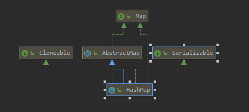

# HashMap

## HashMap简介

HashMap基于哈希表的Map接口实现。是以key-value存储形式存在。线程不安全。key和value都可以为null，无序

JDK1.8之前由数组+链表组成，数组是HashMap主体，链表则主要是为了解决哈希冲突（两个对象调用的hashCode方法计算的哈希码值一致导致计算的数组索引值相同）而存在的（“拉链法”解决冲突），JDK1.8之后，当链表长度大于阈值（或者红黑树的边界值，默认为8）并且当前**数组的长度大于64时**，此时此索引位置上的所有数据改为使用红黑树存储。

补充：为了提高效率，将链表转换为红黑树前会判断，即使阈值大于8，但是数组长度小于64，此时并不会将链表变为红黑树，而是选择进行数组扩容。

## HashMap集合底层的数据结构

JDK1.8之前，数组+链表

JDK1.8之后，数组+链表+红黑树

~~~java
//在jdk1.8之前创建该对象，会创建一个长度为16的Entry[] table用来存储键值对数据。jdk1.8之后不是在构造方法创建了，而是在第一次调用put方法时才进行创建，创建Node[] table
Map<String,String> map=new HashMap<>();
map.put("1","1");

~~~

问题？

1、哈希表底层采用何种算法计算hash值？还有哪些算法可以计算出hash值

底层采用的key的hashCode方法的值结合数组长度进行无符号右移（>>>)、按位异或(^)计算hash值，按位与(&)计算出索引

~~~java
static final int hash(Object key) {
  	int h;
  	return (key == null) ? 0 : (h = key.hashCode()) ^ (h >>> 16);
 }
//其中n为数组长度
(n - 1) & hash
~~~

还可以采用：平方取中法，取余数、伪随机数法

2、当两个对象的hashCode相等时会怎么样？

会产生哈希碰撞，若key值内容相同则替换旧的value，不然就连接到链表后面，链表长度超过阈值8转为红黑树


说明：

1、size表示HashMap中K-V的实时数量，不是数组的长度

2、threshold（临界值）=capacity（容量）*loadFactor（加载因子）。这个值是当前已占用数组长度的最大值。size超过这个临界值就重新resize（扩容），扩容后的HashMap容量是之前容量的两倍

## HashMap继承关系



## HashMap集合类的成员

### 成员变量

1、序列化版本号

~~~java
private static final long serialVersionUID = 362498820763181265L;
~~~

2、集合的初始化容量（必须是2的n次幂）

~~~java
    /**
     * The default initial capacity - MUST be a power of two.
     */
    static final int DEFAULT_INITIAL_CAPACITY = 1 << 4; // aka 16
~~~

问题？为什么大小必须是2的n次幂

存储高效，尽量减少碰撞，在（n-1)&hash求索引的时候更均匀

问题？如果传入的容量默认不是2的幂

~~~java
//对传入容量进行右移位运算后进行或运算
//一共进行5次或运算，可以将当前数字中二进制最高位1的右边全部变成1，最后+1后返回
static final int tableSizeFor(int cap) {
    	//这里-1的目的是使得找到的目标值大于或等于原值
        int n = cap - 1;
        n |= n >>> 1;
        n |= n >>> 2;
        n |= n >>> 4;
        n |= n >>> 8;
        n |= n >>> 16;
        return (n < 0) ? 1 : (n >= MAXIMUM_CAPACITY) ? MAXIMUM_CAPACITY : n + 1;
    }
~~~

3、默认的负载因子

~~~java
static final float DEFAULT_LOAD_FACTOR = 0.75f;
~~~

4、集合最大容量

~~~java
static final int MAXIMUM_CAPACITY = 1 << 30;
~~~

5、链表转红黑树的阈值

~~~java
static final int TREEIFY_THRESHOLD = 8;
~~~

为什么是8？TreeNode占用空间是普通Node的两倍，空间和时间的权衡，同时如果为8，log（8）=3小于链表的平均8/2=4

6、红黑树转链表的阈值

~~~java
static final int UNTREEIFY_THRESHOLD = 6;
~~~

7、链表转红黑树时数组的大小的阈值，即数组大小大于这个数字时，链表长度大于8才会转为红黑树

~~~java
static final int MIN_TREEIFY_CAPACITY = 64;
~~~

8、table用来初始化数组（大小是2的n次幂）

~~~java
transient Node<K,V>[] table;
~~~

9、用来存放缓存（遍历的时候使用）

~~~java
transient Set<Map.Entry<K,V>> entrySet;
~~~

10、HashMap中存放元素的个数（重点）

~~~java
transient int size;
~~~

11、记录HashMap的修改次数

~~~java
transient int modCount;
~~~

12、临界值（如果存放元素大小大于该值，则进行扩容）

~~~java
int threshold;
~~~

13、哈希表的加载因子（重点）

~~~java
final float loadFactor
~~~

说明：

**loadFactor**加载因子，可以表示HashMap的舒米程度，影响hash操作到同一个数组位置的概率，默认0.75，不建议修改

### 构造方法

1、构造一个空的HashMap，默认初始容量（16）和默认负载因子（0.75）

```java
    public HashMap() {
        this.loadFactor = DEFAULT_LOAD_FACTOR; // all other fields defaulted
    }
```

2、构造一个具有指定的出是容来那个和默认负载因子（0.75）的HashMap

~~~java
    public HashMap(int initialCapacity) {
        this(initialCapacity, DEFAULT_LOAD_FACTOR);
    }
~~~

3、构造一个具有指定初始容量和负载因子的HashMap

~~~java
    public HashMap(int initialCapacity, float loadFactor) {
        if (initialCapacity < 0)
            throw new IllegalArgumentException("Illegal initial capacity: " +
                                               initialCapacity);
        if (initialCapacity > MAXIMUM_CAPACITY)
            initialCapacity = MAXIMUM_CAPACITY;
        if (loadFactor <= 0 || Float.isNaN(loadFactor))
            throw new IllegalArgumentException("Illegal load factor: " +
                                               loadFactor);
        this.loadFactor = loadFactor;
        //根据初始值返回一个2的n次数字，赋给阈值，在put方法中会对此值进行重新运算
        this.threshold = tableSizeFor(initialCapacity);
    }
~~~

4、包含另一个Map的构造函数

~~~java
    public HashMap(Map<? extends K, ? extends V> m) {
        this.loadFactor = DEFAULT_LOAD_FACTOR;
        putMapEntries(m, false);
    }
    final void putMapEntries(Map<? extends K, ? extends V> m, boolean evict) {
        int s = m.size();
        if (s > 0) {
            if (table == null) { // pre-size
                //+1的目的是获取更大的容量，减少数组的扩容次数
                float ft = ((float)s / loadFactor) + 1.0F;
                int t = ((ft < (float)MAXIMUM_CAPACITY) ?
                         (int)ft : MAXIMUM_CAPACITY);
                if (t > threshold)
                    threshold = tableSizeFor(t);
            }
            else if (s > threshold)
                resize();
            for (Map.Entry<? extends K, ? extends V> e : m.entrySet()) {
                K key = e.getKey();
                V value = e.getValue();
                putVal(hash(key), key, value, false, evict);
            }
        }
    }
~~~

### 成员方法

#### 增加方法（putVal）

1）先判断数组是否未初始化，如果没有初始化，则进行一次初始化操作（扩容），同时将数组大小赋给n

2）找到具体的桶，并判断此位置是否有元素，如果没有元素，则创建一个Node直接插入

3）如果出现冲突

​		1）如果为红黑树节点，调用红黑树方法插入数据

​		2）如果为普通节点，插入链表末尾，并且长度达到临界值时，将链表转为红黑树

4）如果桶中存在重复的键，将该键替换新值value

5）size大于阈值threshold，进行扩容

~~~java
public V put(K key, V value) {
    return putVal(hash(key), key, value, false, true);
}

final V putVal(int hash, K key, V value, boolean onlyIfAbsent,
                   boolean evict) {
    	//初始化一个tab以及一个Node
        Node<K,V>[] tab; Node<K,V> p; int n, i;
    	//此处才进行tab的初始化。tab为空或者数组大小为0，对数组进行初始化操作，并将数组大小赋给n
        if ((tab = table) == null || (n = tab.length) == 0)
            n = (tab = resize()).length;
    	//通过hash与数组大小-1的与运算计算出所在桶位置的元素p，如果p为null，创建一个
    	//新节点直接插入，如果出现冲突，进入分支判断
        if ((p = tab[i = (n - 1) & hash]) == null)
            tab[i] = newNode(hash, key, value, null);
        else {
            Node<K,V> e; K k;
            //如果插入的元素的hash值与p相等以及p的key与要插入的key相同，将p（原位置节点）赋给e；
            if (p.hash == hash &&
                ((k = p.key) == key || (key != null && key.equals(k))))
                e = p;
            //p为红黑树节点，则调用putTreeVal插入数据，如果为覆盖，则e为旧节点
            else if (p instanceof TreeNode)
                e = ((TreeNode<K,V>)p).putTreeVal(this, tab, hash, key, value);
            else {
                //链表节点
                for (int binCount = 0; ; ++binCount) {
                    //找到链表的尾结点，此时e==null，p为链表的最后一个节点
                    if ((e = p.next) == null) {
                        //在末尾处创建一个节点赋给p.next，此时e仍为null
                        p.next = newNode(hash, key, value, null);
                        //如果找到当前节点时已经循环了7次，即该链表在插入元素大小为8,将链表转为红黑树
                        if (binCount >= TREEIFY_THRESHOLD - 1) // -1 for 1st
                            //链表转红黑树，传入tab数组以及该键的hash值（可计算出数组的具体索引）
                            treeifyBin(tab, hash);
                        break;
                    }
                    //如果找到了具有相同key的元素，也停止寻找
                    if (e.hash == hash &&
                        ((k = e.key) == key || (key != null && key.equals(k))))
                        break;
                    p = e;
                }
            }
            //若此时e不为null，说明找到了一个具有相同key的值
            if (e != null) { // existing mapping for key
                //保存一下旧节点的value值
                V oldValue = e.value;
                //是否要改变之前存在值（默认为false）或者之前存在的值为null，将value进行一个覆盖
                if (!onlyIfAbsent || oldValue == null)
                    e.value = value;
                //回调相关方法，HashMap该方法默认实现为空，LinkedHashMap在此会进行一些处理
                afterNodeAccess(e);
                //返回旧值，不会进行下面的修改次数以及元素个数增加操作
                return oldValue;
            }
        }
    	//记录下map的修改次数
        ++modCount;
        //如果元素个数大于了阈值，进行扩容操作
        if (++size > threshold)
            resize();
        afterNodeInsertion(evict);
        return null;
    }
~~~

#### 链表转红黑树（treeifyBin）

~~~java
    final void treeifyBin(Node<K,V>[] tab, int hash) {
        int n, index; Node<K,V> e;
        //如果tab数组为空或者tab数组大小小于链表转红黑树的最小要求值，则进行扩容操作
        if (tab == null || (n = tab.length) < MIN_TREEIFY_CAPACITY)
            resize();
        //拿到当前要转换的桶的起始节点
        else if ((e = tab[index = (n - 1) & hash]) != null) {
            //初始化头结点和尾结点
            TreeNode<K,V> hd = null, tl = null;
            //循环将链表结点转化为红黑树结点
            do {
                //利用链表结点来创建一个树结点
                TreeNode<K,V> p = replacementTreeNode(e, null);
                //如果tl为null，表示红黑树还没有结点，将p赋给头结点
                if (tl == null)
                    hd = p;
                //将p节点与尾结点相连
                else {
                    p.prev = tl;
                    tl.next = p;
                }
                //更新尾节点
                tl = p;
            } while ((e = e.next) != null);
            if ((tab[index] = hd) != null)
                //将各个树结点转化为红黑树
                hd.treeify(tab);
        }
    }
~~~

#### 扩容方法（resize）

数组初始化以及数组元素个数大于阈值时进行扩容操作，一部分索引会增加原数组长度大小的长度（用到了高位1），一部分仍保持原索引（高位为0）

~~~java
    final Node<K,V>[] resize() {
        //将旧数组进行保存
        Node<K,V>[] oldTab = table;
        //保存旧数组的长度
        int oldCap = (oldTab == null) ? 0 : oldTab.length;
        //保存旧数组的阈值
        int oldThr = threshold;
        //定义新的长度和阈值
        int newCap, newThr = 0;
        if (oldCap > 0) {
            //数组已经达到最大容量，直接返回
            if (oldCap >= MAXIMUM_CAPACITY) {
                threshold = Integer.MAX_VALUE;
                return oldTab;
            }
            //新数组长度为旧数组长度*2
            else if ((newCap = oldCap << 1) < MAXIMUM_CAPACITY &&
                     oldCap >= DEFAULT_INITIAL_CAPACITY)
                //阈值同样*2
                newThr = oldThr << 1; // double threshold
        }
        else if (oldThr > 0) // initial capacity was placed in threshold
            newCap = oldThr;
        else {
            // zero initial threshold signifies using defaults，默认的初始化操作
            newCap = DEFAULT_INITIAL_CAPACITY;
            newThr = (int)(DEFAULT_LOAD_FACTOR * DEFAULT_INITIAL_CAPACITY);
        }
        if (newThr == 0) {
            float ft = (float)newCap * loadFactor;
            newThr = (newCap < MAXIMUM_CAPACITY && ft < (float)MAXIMUM_CAPACITY ?
                      (int)ft : Integer.MAX_VALUE);
        }
        //将新的阈值赋给成员变量
        threshold = newThr;
        //创建一个新的数组，大小为newCap
        @SuppressWarnings({"rawtypes","unchecked"})
            Node<K,V>[] newTab = (Node<K,V>[])new Node[newCap];
        table = newTab;
        //将旧数组元素放入到新数组中
        if (oldTab != null) {
            for (int j = 0; j < oldCap; ++j) {
                Node<K,V> e;
                if ((e = oldTab[j]) != null) {
                    oldTab[j] = null;
                    if (e.next == null)
                        newTab[e.hash & (newCap - 1)] = e;
                    else if (e instanceof TreeNode)
                        ((TreeNode<K,V>)e).split(this, newTab, j, oldCap);
                    else { // preserve order
                        Node<K,V> loHead = null, loTail = null;
                        Node<K,V> hiHead = null, hiTail = null;
                        Node<K,V> next;
                        do {
                            next = e.next;
                            if ((e.hash & oldCap) == 0) {
                                if (loTail == null)
                                    loHead = e;
                                else
                                    loTail.next = e;
                                loTail = e;
                            }
                            else {
                                if (hiTail == null)
                                    hiHead = e;
                                else
                                    hiTail.next = e;
                                hiTail = e;
                            }
                        } while ((e = next) != null);
                        if (loTail != null) {
                            loTail.next = null;
                            newTab[j] = loHead;
                        }
                        if (hiTail != null) {
                            hiTail.next = null;
                            newTab[j + oldCap] = hiHead;
                        }
                    }
                }
            }
        }
        return newTab;
~~~

