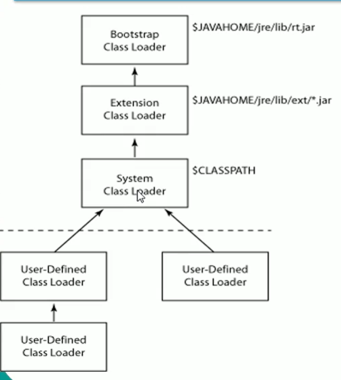
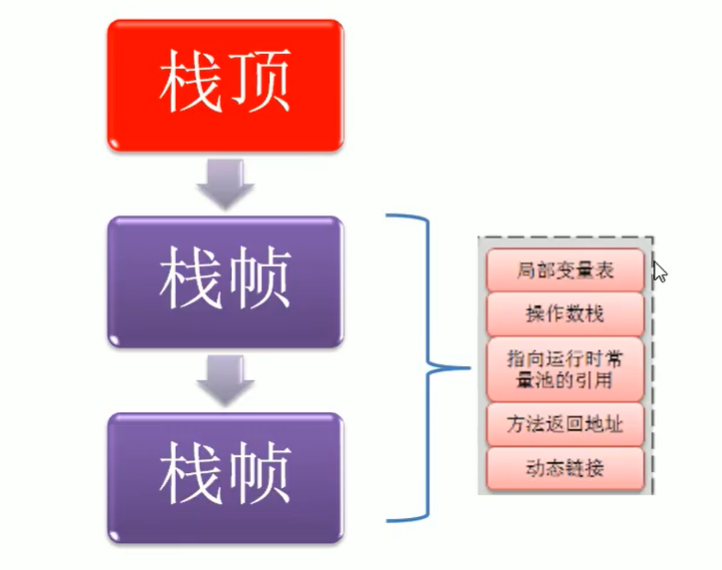
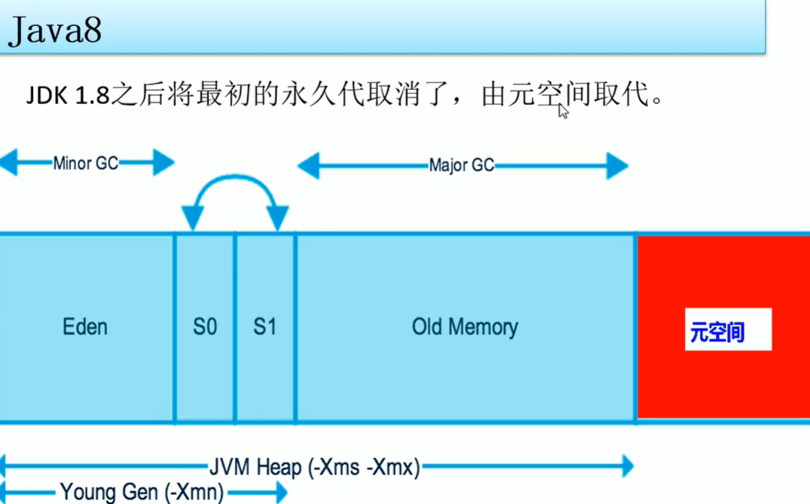
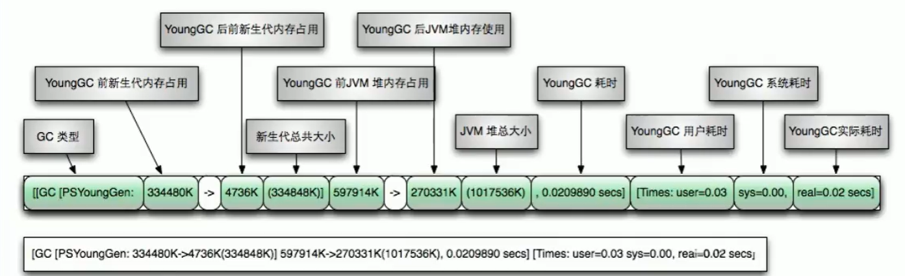
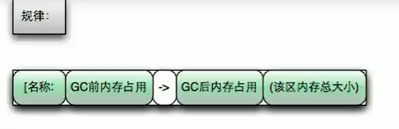
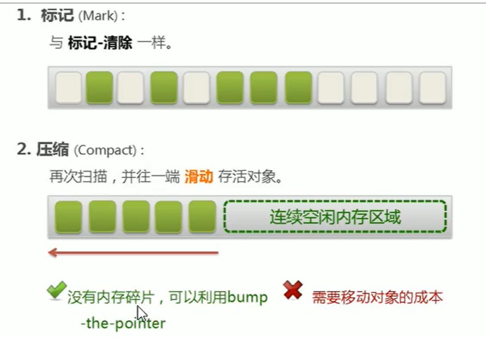
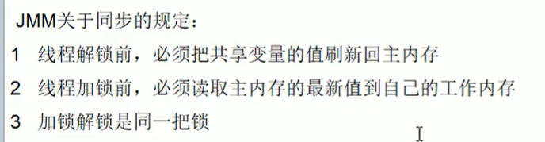

# JVM体系结构概述

Java  Virtual Machine运行在操作系统之上的，它与硬件没有直接的交互

## 类加载器ClassLoader

负责加载class文件，class文件在**文件开头由特定的文件标示**，将class文件字节码内容加载到内存中，并将这些内容转换成方法区中的运行时数据结构并且ClassLoader只负责class文件的加载，至于它是否可以运行，则由Execution Engine决定

## 四种类加载器（3+1）

虚拟机自带的加载器（3）

1、启动类加载器（Bootstrap） c++

2、扩展类加载器（Extension） Java

3、应用程序类加载器（AppClassLoader）Java  也叫系统类加载器，加载当前应用的classpath的所有类

用户自定义加载器（1）

java.lang.ClassLoader的子类，用户可以定制类的加载的方式

## 双亲委派

当一个类收到了类加载请求，他首先不会尝试自己去加载整个类，而是把整个请求委派给父类去完成，每一个层次类加载器都是如此，因此所有的加载请求都应该传送到启动类加载器中，只有当父类加载器反馈自己无法整个请求的时候（在它的加载路径下没有找到所需加载的Class），子类加载器才会尝试自己去加载

采用双亲委派的一个好处是比如加载位于rt.jar包中的类java.lang.Object，不管是哪个加载器加载整个类，最终都是委托给顶层的启动类加载器进行加载，这样就保证了使用不同的类加载器最终得到的都是同样一个Object对象。

## 沙箱安全机制

## 执行引擎

Execution Engine执行引擎负责解释命令，提交操作系统执行。

## 本地方法接口与本地方法栈

## PC寄存器

每个线程都有一个程序计数器，是线程私有的，就是一个指针，指向方法区中的方法字节码（**用来存储指向下一条指令的地址，也即将要执行的指令代码**），由执行引擎读取下一条指令，是一个非常小的内存空间，几乎可以忽略不记。

这块内存区域很小，它是**当前线程所执行的字节码的行号指示器**，字节码解释器通过改变整个计数器的值来选取下一条需要执行的字节码指令。

如果执行的是一个Native方法，那这个计数器是空的。

用以完成分支、循环、跳转、异常处理、线程恢复等基础功能。不会发生内存溢出（OutOfMemory=OOM）错误。

## 方法区

存储了每一个类的结构信息，例如运行时常量池、字段和方法数据、构造函数和普通方法的字节码内容。

方法区是规范，在不同虚拟机里实现是不一样的，java7以前永久代（PermGen space），java8以后元空间（Metaspace）

## 栈（Stack）

栈管运行，堆管存储

栈也叫栈内存，主管Java程序的运行，是在线程创建时创建，它的生命周期是跟随线程的生命期，线程结束栈内存也就释放，对于栈来说不存在垃圾回收问题，只要线程以结束该栈就Over，生命周期和线程一致，是线程私有的。

栈里有什么？

**8种基本类型的变量+对象的引用变量+实例方法都是在函数的栈内存中分配**

栈帧中主要保存3类数据

本地变量：输入参数和输出参数以及方法内的变量

栈操作：记录出栈、入栈操作

栈帧数据：类文件、方法等等。

StackOverFlowError

## 栈+堆+方法区的交互关系

HotSpot是使用指针的方式来访问对象

Java堆中会存放类元数据的地址

reference存储的就直接是对象的地址

## Heap堆

一个JVM实例只存在一个堆内存，堆内存大小可以调节。类加载器读取了类文件后，需要把类、方法、常变量放到堆内存中，保存所有引用类型的真实信息，以方便执行器执行，堆内存分为三部分

1、Young Generation Space 新生区           Young/New

2、Tenure Generation Space 养老区          Old/Tenure

3、Permanent Space 			永久区			Perm

java8将永久区换为元空间

## 内存分配与回收策略

复制->清空->交换

## 永久代

永久代和元空间是方法区的实现，

永久存储区是一个常驻内存区域，用于存放JDK自身所携带的Class ，Interface的元数据，也就是说它存储的是运行环境必须的类信息，被装载进此区域的数据是不会被垃圾回收器回收掉的，关闭JVM才会释放此区域锁占用的内存

# 堆参数调优

**Java7**

**Java8**

## 元空间和永生代

永生带使用的JVM的堆内存，但是java8以后的**元空间并不在虚拟机中而是使用本机物理内存**

因此，默认情况，元空间的大小仅受本地内存限制。类的元数据放入native memory，字符串池和类的静态变量放入java堆中，这样可以加载多少类的元数据就不再由MaxPermSize控制，而由系统的实际可用空间来控制。

## 堆内存调优简介01

|                      |                                        |
| -------------------- | -------------------------------------- |
| -Xms                 | 设置初始分配大小，默认为物理内存的1/64 |
| -Xmx                 | 最大分配内存，默认为物理内存的1/4      |
| -XX：+PrintGCDetails | 输出详细的GC处理日志                   |

~~~java
    public static void main(String[] args) {
        long maxMemory = Runtime.getRuntime().maxMemory();//返回Java虚拟机试图使用的最大内存量
        long totalMemory = Runtime.getRuntime().totalMemory();//返回Java虚拟机中的内存总量
        System.out.println("-Xmx:MAX_MEMORY="+maxMemory+"(字节)、"+(maxMemory/(double)1024/1024)+"MB");
        System.out.println("-Xms:TOTAL_MEMORY="+totalMemory+"(字节)、"+(totalMemory/(double)1024/1024)+"MB");
    }
~~~

实际应用中初始与最大分配内存一样大，避免GC和应用增强内存。

（OOM）OutOfMemoryError：Java heap Space

## YoungGC

## FullGC

## GC

### 如何判断哪些对象需要回收

#### 引用计数算法

为对象添加一个引用计数器，当对象增加一个引用时计数器加 1，引用失效时计数器减 1。引用计数为 0 的对象可被回收。
在两个对象出现循环引用的情况下，此时引用计数器永远不为 0，导致无法对它们进行回收。正是因为循环引用的存在，因此 Java 虚拟机不使用引用计数算法。

#### 可达性分析算法

以 GC Roots 为起始点进行搜索，可达的对象都是存活的，不可达的对象可被回收。
Java 虚拟机使用该算法来判断对象是否可被回收，GC Roots 一般包含以下内容：
1、虚拟机栈中局部变量表中引用的对象
2、本地方法栈中 JNI 中引用的对象
3、方法区中类静态属性引用的对象
4、方法区中的常量引用的对象

## GC四大算法

### 总体概述

JVM在进行GC时，并非每次都对上面三个内存区域一起回收的，大部分时候回收的都是指新生代

因此GC按照回收的区域又分了两种类型，一种使普通GC（minor GC），一种是全局GC（major GC or Full GC）

#### MinorGC和FullGC的区别

**普通GC（minor GC）**：只针对新生代区域的GC，指发生在新生代的垃圾收集动作，因为大多数Java对象存活率都不高，所以MinorGC非常频繁，一般回收速度也比较快。

**全局GC（majorGC or Full GC）**：指发生在老年代的垃圾收集动作，出现了MajorGC，经常会伴随至少以此的Minor GC（但并不是绝对的）。MajorGC的速度一般要比Minor GC慢上10倍以上。

### 分代收集算法

### 次数上频繁收集Young区

复制算法

### 次数上较少手机Old区

标记清除或标记清除整理

### 基本不动元空间

### 复制算法（Copying）

**年轻代**中使用的是MinorGC，这种GC采用的是复制算法（Copying）

#### 原理

MinorGC会把Eden中的所有活的对象都移到Survivor区域中，如果Survivor区中放不下，那么剩下的活的对象就被移到Old generation中，**也即一旦收集后，Eden区就变成空的了。**

将内存划分为大小相等的两块，每次只使用其中一块，当这一块内存用完了就将还存活的对象复制到另一块上面，然后再把使用过的内存空间进行一次清理。

主要不足是只使用了内存的一半。

现在的商业虚拟机都采用这种收集算法回收新生代，但是并不是划分为大小相等的两块，而是一块较大的 Eden 空间和两块较小的 Survivor 空间，每次使用 Eden 和其中一块 Survivor。在回收时，将 Eden 和 Survivor 中还存活着的对象全部复制到另一块 Survivor 上，最后清理 Eden 和使用过的那一块 Survivor。
HotSpot 虚拟机的 Eden 和 Survivor 大小比例默认为 8:1，保证了内存的利用率达到 90%。如果每次回收有多于
10% 的对象存活，那么一块 Survivor 就不够用了，此时需要依赖于老年代进行空间分配担保，也就是借用老年代的空间存储放不下的对象。

HotSpot JVM把年轻代分为了三部分：一个Eden区和两个Survior区（分别叫from和to）。默认比例8：1：1，一般情况下，新创建的对象都会被分配到Eden区（一些大对象特殊处理），这些对象经过第一次Minor GC后，如果仍然存活，将会被移到Survior区，对象在Survivor区每熬过以此MinorGC，年龄就会增加1岁，当它的年龄增加到一定程度时，就会被移动到年老代中。因为年轻代的对象基本都是朝生夕死的（90%以上），所以在**年轻代的垃圾回收算法使用的是复制算法**，复制算法的基本思想就是将内存分为两块，每次只用其中一块，就将还活着的对象复制到另外一块上面。**复制算法不会产生内存碎片。**

#### 劣势

1、它浪费了一半的内存，这太要命了。

2、如果对象的存活率很高，我们可以极端一点，假设是100%存活，那么我们需要将所有对象都复制一遍，并将所有引用地址重置一边。复制这一工作所花费的时间，当对象存活率达到一定程度时，将会便的不可忽视。所以从上述描述不难看出，复制算法要想使用，**最起码对象的存活率要非常低**才行，而且最重要的是，我们必须要克服50%内存的浪费。

### 标记清除（Mark-Sweep）

#### 原理

**老年代**一般是由标记清除或者是标记清除与标记整理的混合实现

算法分成标记和清除两个阶段，先标记出要回收的对象，然后统一回收这些对象。

程序运行期间，若可以使用的内存被耗尽的时候，GC线程就会被触发并将程序暂停，随后将要回收的对象标记一遍，最终统一回收这些对象，完成标记清理工作接下来便让应用程序恢复运行。

#### 劣势

1、效率低（递归与全堆对象遍历），GC时需停止应用程序。

2、空闲内存不连续。

### 标记压缩（Mark-Compact）

#### 原理

#### 劣势

耗时严重

### 总结

# JMM（Java内存模型）

JMM（Java内存模型Java Memory Model，简称JMM）本身是一种抽象的概念并不真实存在，它描述的使一组规则或规范，通过这组规范定义了程序中各个变量（包括实例字段、静态字段和构成数组对象的元素）的访问方式

**优先级**：静态块>构造块>构造方法

## 可见性

## 原子性

## 有序性