# MySQL总体概览

**插件式的存储引擎架构将查询处理和其它的系统任务以及数据的存储提取相分离。**这种架构可以根据业务的需求和实际需要选择合适的存储引擎。

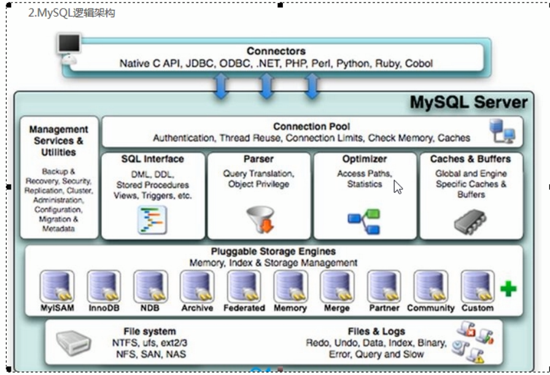

连接层

​	最上层是一些客户端和连接服务，包含本地sock通信和大多数基于客户端/服务器工具实现的类似于tcp/ip的通信。主要完成一些类似于连接处理、授权认证、及相关的安全方案。在该层上引入了线程池的概念，为通过认证安全接入的客户端提供线程。同样在该层上可以实现基于SSL的安全链接。服务器也会为安全接入的每个客户端验证它所具有的操作权限。

服务层

​	第二层架构主要完成大多数的核心功能，如SQL接口，并完成缓存的查询，SQL的分析和优化及部分内置函数的执行，所有跨存储引擎的功能也在这一层实现，如过程、函数等。在该层，服务器会解析查询并创建响应的内部解析树，并对其完成响应的优化如确定查询表的顺序，是否利用索引等，最后生成相应的执行操作。如果是select语句，服务器还会查询内部的缓存。如果缓存空间足够大，这样在解决大量读操作环境中能够很好的提升系统的性能

引擎层

​	存储引擎层，存储引擎真正负责了MySQL中数据的存储和读取，服务器通过API与存储引擎进行通信，不同的存储引擎具有的功能不同，这样我们可以根据自己的实际需要进行选取。主要使用的有MyISAM和InnoDB

存储层

​	数据存储层，主要是将数据存储在运行于裸设备的文件系统之上，并完成与存储引擎的交互。

# 存储引擎

## 对比

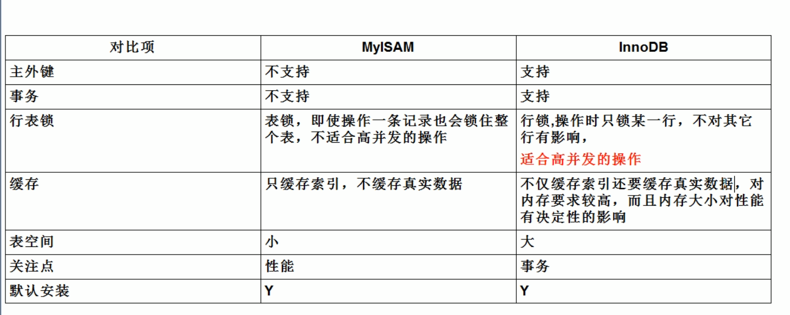

# 索引优化分析

## 是什么

### 性能下降SQL慢、执行时间长、等待时间长

查询语句写的烂

索引失效

关联查询太多join（设计缺陷或不得已的需求）

服务器调优及各个参数设置（缓冲、线程数等）

### SQL执行顺序

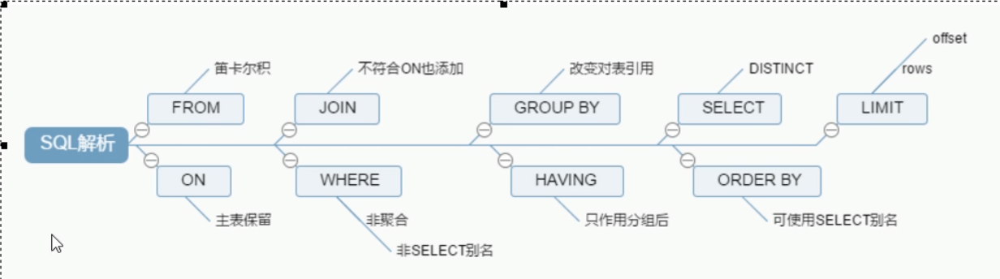

### 七种Join连接

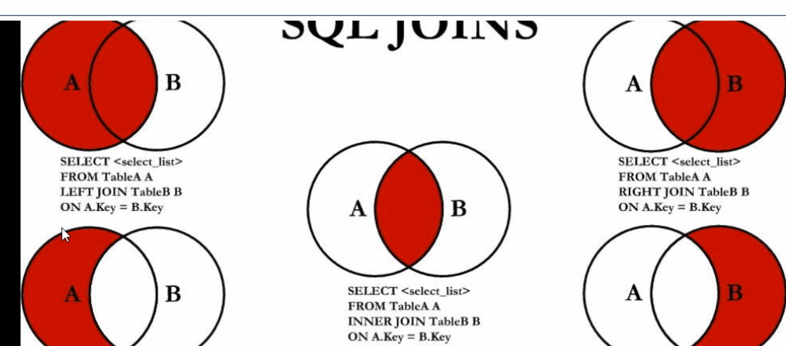

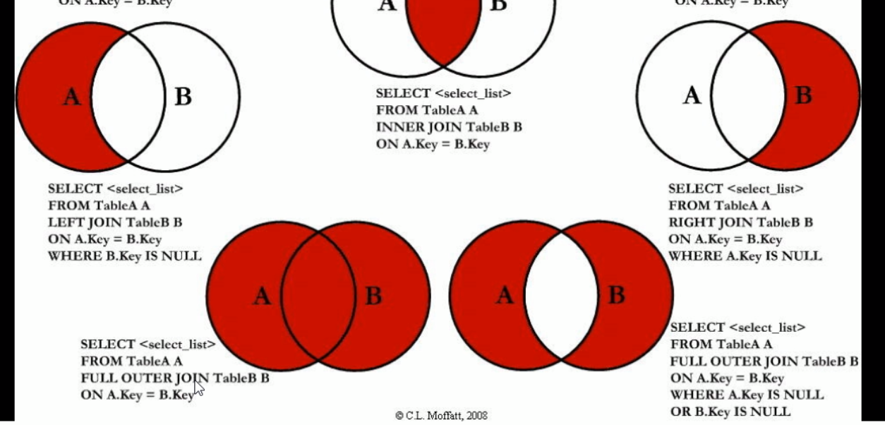

## 索引简介

### 官方定义

索引（Index）是帮助MySQL高效获取数据的数据结构。可以得到索引的本质：索引是数据结构

索引的目的在于提高查询效率，可以类比字典。

### 通俗理解

排好序的快速查找数据结构

#### 详解

在数据之外，**数据库系统还维护着满足特定查找算法的数据结构**，这些数据结构以某种方式引用（指向）数据，这样就可以在这些数据结构上实现高级查找算法。这种数据结构，就是索引。

#### interpretation：

数据本身之外，数据库还维护着一个满足特定查找算法的数据结构，这些数据结构以某种方式指向数据，这样就可以在这些数据结构的基础上实现高级查找算法，这种数据结构就是索引。

### **常用索引**

我们平常锁说的索引，如果没有特别指明，都是指B树（多路搜索树，并不一定是二叉的）结构组织的索引。

## 优势

降低数据库IO成本

降低CPU消耗

## 劣势

索引也是一张表，该表保存了主键与索引字段，并指向实体表的记录，所以索引列也是要占用空间的

大大提高了查询速度，会降低更新表的速度。

索引只是提高效率的一个因素，需要花时间研究建立最优秀的索引或优化查询。

## 索引分类

单值索引：即一个索引只包含单个列，一个表可以有多个单列索引。

唯一索引：索引列的值必须唯一，但允许有空值

复合索引：即一个索引包含多个列

基本语法：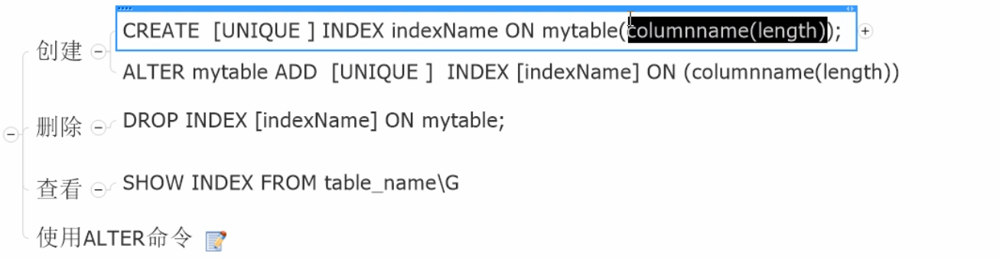

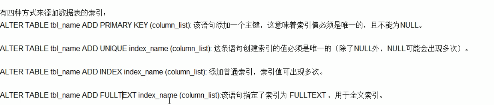

## 索引结构

BTree索引

检索原理

## 哪些情况需要建立索引

主键自动建立唯一索引

频繁作为查询条件的字段应该创建索引

查询中与其它表关联的字段，外键关系建立索引

频繁更新的字段不适合创建索引

where条件里用不到的字段不创建索引

单键/组合索引选择问题？（在高并发下倾向创建组合索引）

查询中排序的字段，排序字段若通过索引去访问将大大提高排序速度

查询中统计或者分组字段

## 哪些情况不要创建索引

表记录少

经常增删改的表

索引效率

## 性能分析

### Mysql Query Optimizer

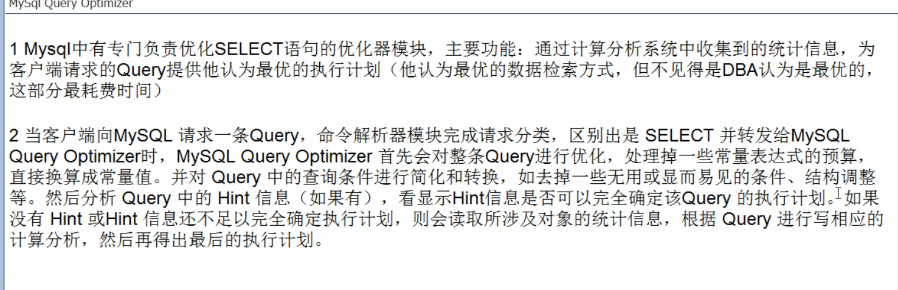

### MySQL常见瓶颈

CPU：CPU在饱和的时候一般发生在数据装入内存或从磁盘上读取数据的时候

IO：磁盘I/O瓶颈发生在装入数据远大于内存容量的时候

服务器硬件的性能瓶颈：top，free，iostat，vmstat来查看系统的性能状态

### Explain

#### 是什么？

使用EXPLAIN关键字可以模拟优化器执行SQL查询语句，从而知道MySQL是如何处理你的SQL语句的。分析你的查询语句或是表结构的性能瓶颈

#### 做什么？

表的读取顺序

数据读取操作的操作类型

哪些索引可以使用

哪些索引被实际使用

表之间的引用

每张表有多少行被优化器查询

#### 怎么用

explain+SQL语句

#### 表头包含信息：

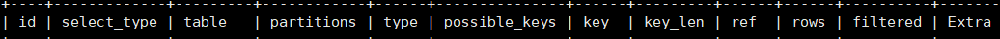

##### id

select查询的序列号，包含一组数字，表示查询中执行select子句或操作表的顺序。

三种情况：id相同，执行顺序由上到下；id不同，如果使子查询，id的序号会递增，id值越大的优先级越高，越先被执行；id相同不同同时存在，可以认为是一组，从上往下顺序执行，在所有组中，id值越大，优先级越高，越先执行。

##### select_type

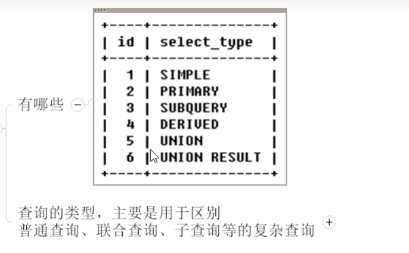

##### table

显示这一行数据是关于哪张表的

##### type

显示查询使用了何种类型

从最好到最差依次是：

system>const>eq_ref>ref>range>index>ALL

system：表只有一行记录（等于系统表），这是const类型的特例，平时不会出现，这个也可以忽略不计

const：表示通过索引一次就找到了，const用于比较primary key或者unique索引。因为只匹配一行数据，所以很快如将主键置于where列表中，MySQL就能将该查询转换为一个常量。

eq_ref: 唯一性索引扫描，对于每个索引键，表中只有一条记录与之匹配。常见于主键或唯一索引扫描。

ref：非唯一性索引扫描，返回匹配某个单独值的所有行，本质上也是一种索引访问，它返回所有匹配某个单独值的行，然而，他可能会找到多个符合条件的行，所以他应该属与查找和扫描的混合体

range: 只检索给定范围的行，使用一个索引来选择行。key列显示使用了哪个索引。

index：Full Index Scan 扫描全部索引

ALL：遍历全表

##### possible_keys\key

possible_keys: 显示可能应用在这张表中的索引，一个或多个。查询设计到的字段上若存在索引，则该索引将被抛出，**但不一定被实际查询使用**。

key: 实际使用的索引。如果为null，则没有使用索引。查询中若使用了覆盖索引，则该索引仅出现在key列表中

key_len: 表示索引中使用的字节数，可通过该列计算查询中使用的索引的长度。在不损失精确性的情况下，长度越短越好。key_len显示的值为索引字段的最大可能长度，并非实际使用长度，即key_len是根据表定义计算而得，不是通过表内检索出的。

##### ref

显示索引的哪一列被使用了，如果可能的话，是一个常数。哪些列或常量被用于查找索引列上的值

##### rows

根据表统计信息及索引的选用情况，大致估算出找到所需的记录所需要读取的行数。

##### Extra

包含不适合在其他列显示但十分重要的信息

**1、Using filesort：**说明mysql会对数据使用一个外部的索引排序，而不是按照表内的索引顺序进行读取。MySQL中无法利用索引完成的排序操作称为“文件排序”

**2、Using temporary:** 使用了临时表保存了中间结果，MySQL在对查询结果排序时使用临时表，常见于排序order by 和分组查询group by。

**3、Using index**：表示响应的select操作使用了覆盖索引（Covering Index），避免访问了表的数据行，效率不错！如果同时出现using where，表明索引被用来执行索引键值的查找；如果没有同时出现using where，表明索引用来读取数据而非执行查找动作。

Covering Index：覆盖索引 select的数据列只用从索引中就可以获得，不必读取数据行，MySQL可以利用索引返回select列表中的字段，而不必根据索引再次读取数据文件，换句话说查询列要被所建的索引覆盖。

4、Using where：表明使用了where过滤

5、Using join buffer：使用了连接缓存

6、impossible where：where子句的值总是false，不能用来获取任何元组

## 索引优化

### 索引分析

尽可能减少join语句中的NestdLoop的循环总次数：**“永远用小结果驱动大的结果集”。**

优先优化NestedLoop的内层循环；

保证Join语句中被驱动表上的Join条件字段已被索引；

当无法保证被驱动表的Join条件字段被索引且内存资源充足的前提下，不要太吝啬JoinBuffer的设置。

### 索引失效（应该避免）

案例：

1、全值匹配我最爱

**2、最佳左前缀原则**：如果索引了多列，要遵守最左前缀法则。指的是查询从索引的最左前列开始并且不跳过中间的索引列。

3、不在索引列上做任何操作（计算、函数、（自动or手动）类型转换），会导致索引失效而转向全表扫描

4、存储引擎不能使用索引中范围条件右边的列

5、尽量使用覆盖索引（只访问索引的查询（索引列和查询列一致）），减少select *

6、mysql在使用不等于（！=或者<>）的时候无法使用索引会导致全表扫描

7、is null, is not null也无法使用索引

8、like以通配符开头（'%abc...')mysql索引失效会变成全表扫描的操作

9、字符串不加单引号索引失效

10、少用or，用它来连接时会导致索引失效

小总结：

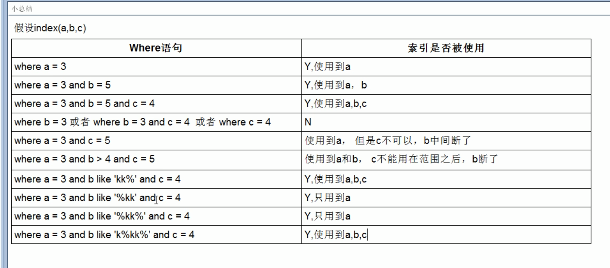

### 一般性建议

对于单键索引，尽量选择针对当前query过滤性更好的索引

在选择组合索引的时候，当前Query中过滤性最好的字段在索引字段顺序中，位置越靠前越好

在选择组合索引的时候，尽量选择可以能够包含当前query中的where字句中更多字段的索引

尽可能通过分析统计信息和调整query的写法来达到选择合适索引的目的

口诀

# 查询截取分析

1、慢查询的开启并捕获

2、explain+慢SQL分析

3、show profile查询SQL在MySQL服务器里面的执行细节和生命周期情况

4、SQL数据库服务器的参数调优

## 查询优化

**永远小表驱动大表**

exists:将主查询的数据放到子查询中做条件验证，根据验证结果（TRUE or FALSE）来决定主查询的数据结果是否得以保留

### **order by关键字优化**

1、order by子句，尽量使用Index方式排序，避免使用FileSort方式排序

MySQL支持两种排序方式：FileSort和Index，Index效率高，它指MySQL扫描索引本身完成排序。FileSort方式效率较低。

order by满足两种情况，会使用Index方式排序：1、order by语句使用索引最左前列  2、使用where子句与Order by 子句条件列组合满足索引最左前列

2、尽可能在索引列上完成排序操作，遵照索引建的最佳左前缀。

3、如果不在索引列上，filesort由两种算法：单路排序和双路排序

双路排序：两次扫描磁盘。即从磁盘读取排序字段，在buffer进行排序，再从磁盘取其它字段。

单路排序：从磁盘读取查询需要的所有列，按照order by列在buffer对它们进行排序，然后扫描排序后的列表进行输出，它的效率更快一些，避免了第二次读取数据。并且把随机IO变成了顺序IO，但是它会使用更多的空间，因为它把每一行都保存在内存中了。

单路排序存在的问题：

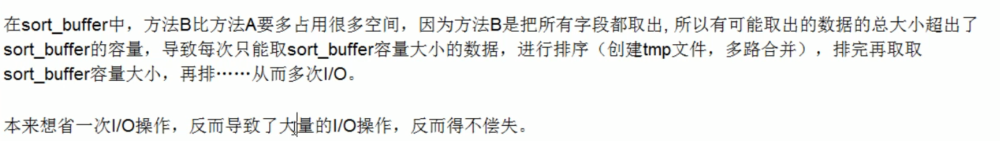

增大sort_buffer_size参数的设置

增大max_length_for_sort_data

小总结：

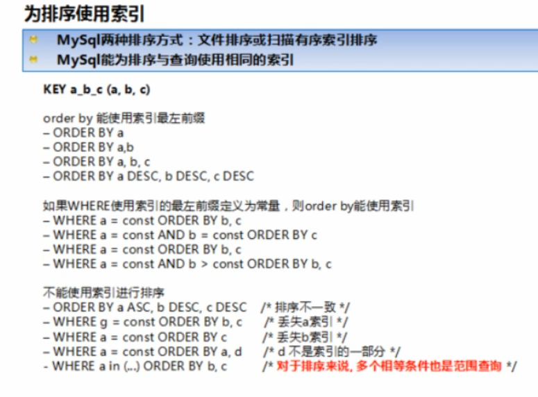

### group by关键字优化

## 慢查询日志

查询慢查询日志是否开启：show variables like“%slow_query_log%”;

开启：set global slow_query_log=1开启只对当前数据库生效

## 批量数据脚本

## show profile

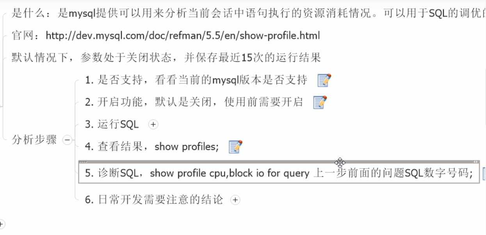

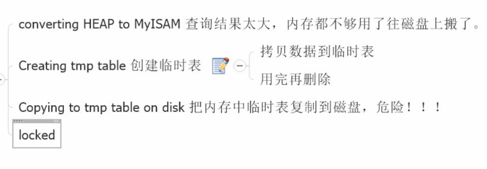

## 全局查询日志

**不要在生产环境开启这个功能**

开启

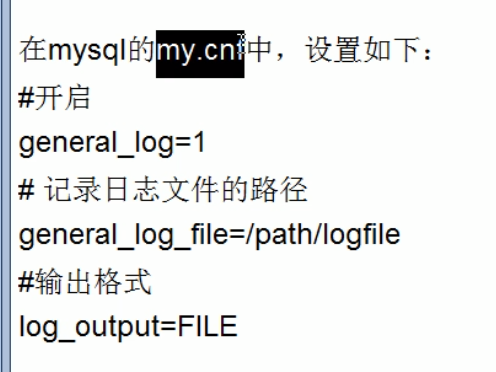

命令启用

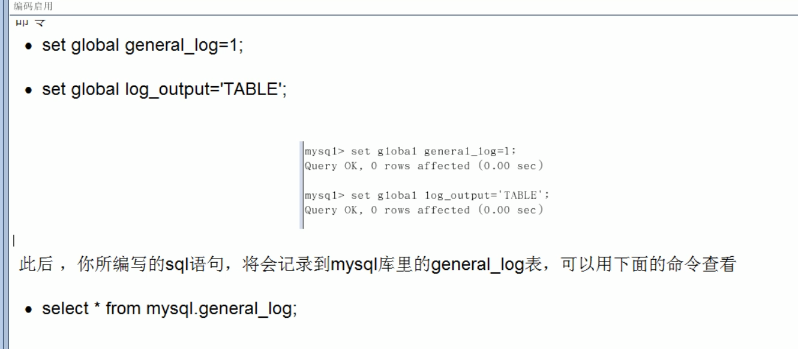

# MySQL锁机制

## 表锁

偏向MyISAM存储引擎，开销小，加锁快；无死锁；锁定力度大，发生锁冲突的概率最高，并发度最低。

MyISAM在执行查询语句（select）前，会自动给涉及的所有表加读锁，在执行增删改操作前，会自动给涉及的表加写锁。

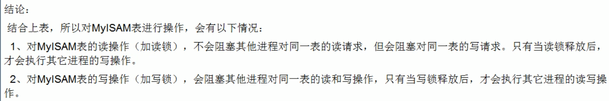

简而言之，就是读锁会阻塞写，但是不会阻塞读。而写锁则会把读和写都阻塞。

如何分析表锁定

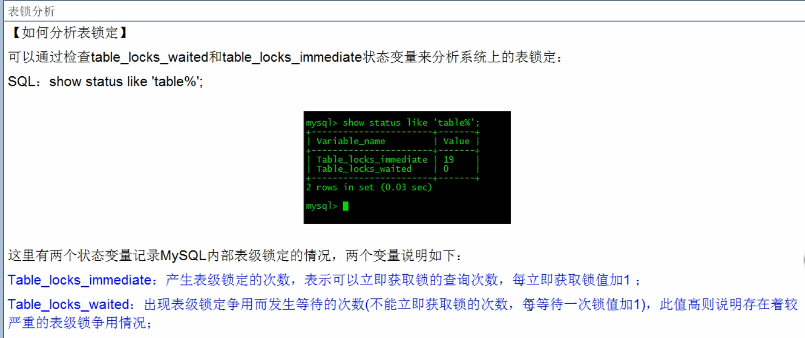

此外，MyIsam的读写锁调度是写优先，这也是myisam不适合做写为主表的引擎。因为写锁后，其他线程不能做任何操作，大量的更新会使查询很难得到锁，从而造成永远阻塞。

## 行锁

偏向InnoDB存储引擎，开销大，加锁慢；会出现死锁；锁定粒度小，发生锁冲突的概率最低，并发度也最高。

InnoDB与MyISAM的最大不同有两点：一是支持事务（TRANSACTION)；二使采用了行级锁。

索引失效会导致行锁变为表锁

间隙锁：

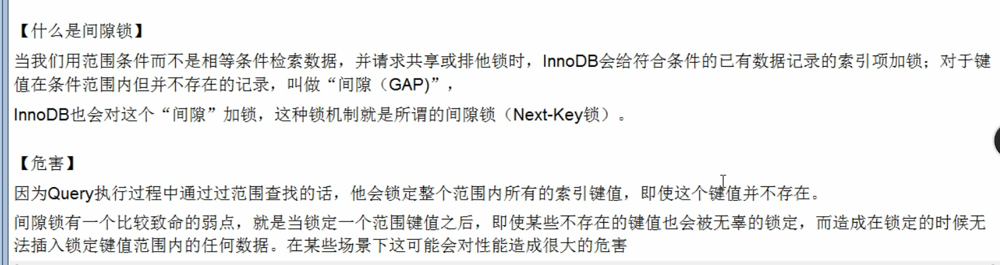

总结：

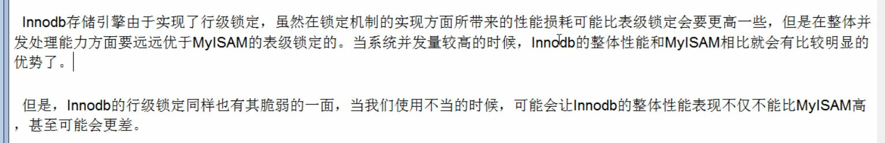

行锁分析

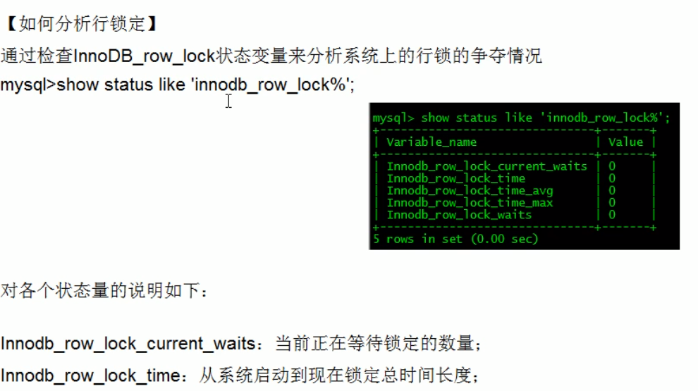

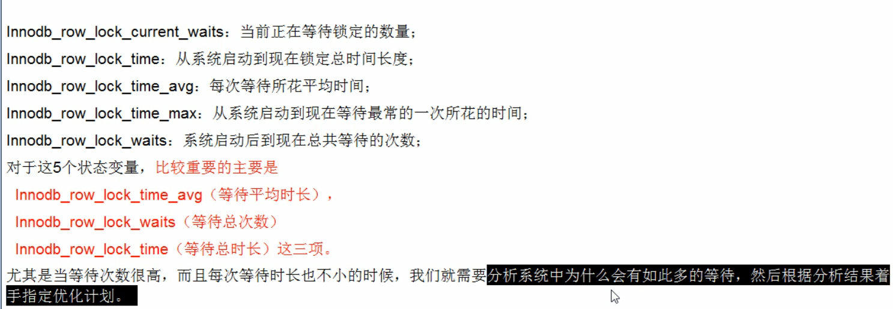

优化建议：

尽可能让所有数据检索都通过索引来完成，避免无索引行锁升级为表锁。

合理设计索引，尽量缩小锁的范围。

尽可能较少检索条件，避免间隙锁。

尽量控制事务大小，减少锁定资源量和长度。

尽可能低级别事务隔离

# 主从复制

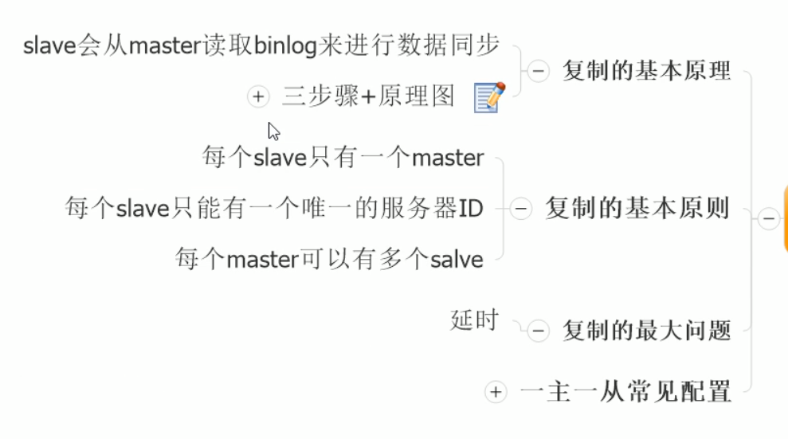

三步骤：

1、master将改变记录到二进制日志（binary log），这些记录叫做二进制日志事件，binary log events

2、slave将master的binary log events拷贝到它的中继日志（relay log）

3、slave重做中继日志中的事件，将改变应用到自己的数据库中。MySQL复制是异步且串行化的。

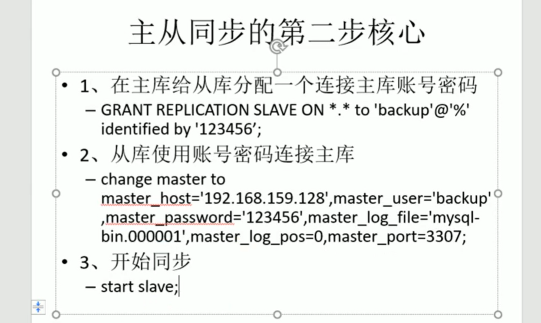
