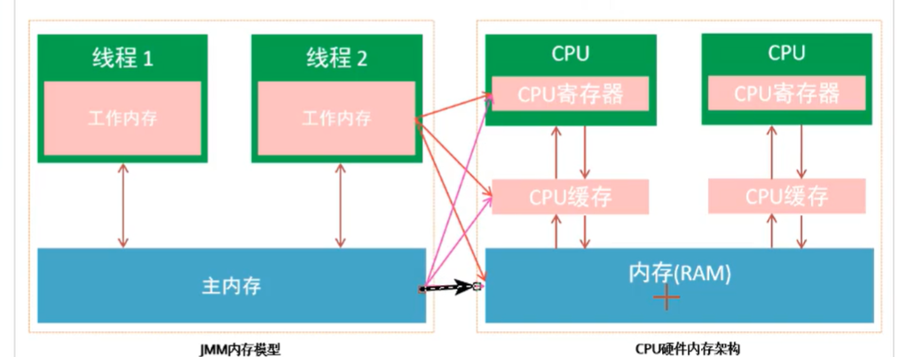
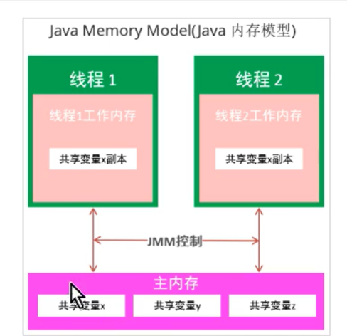
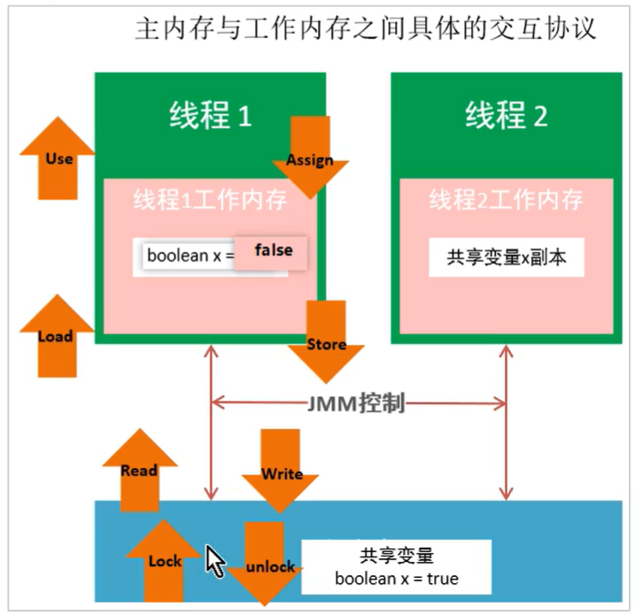
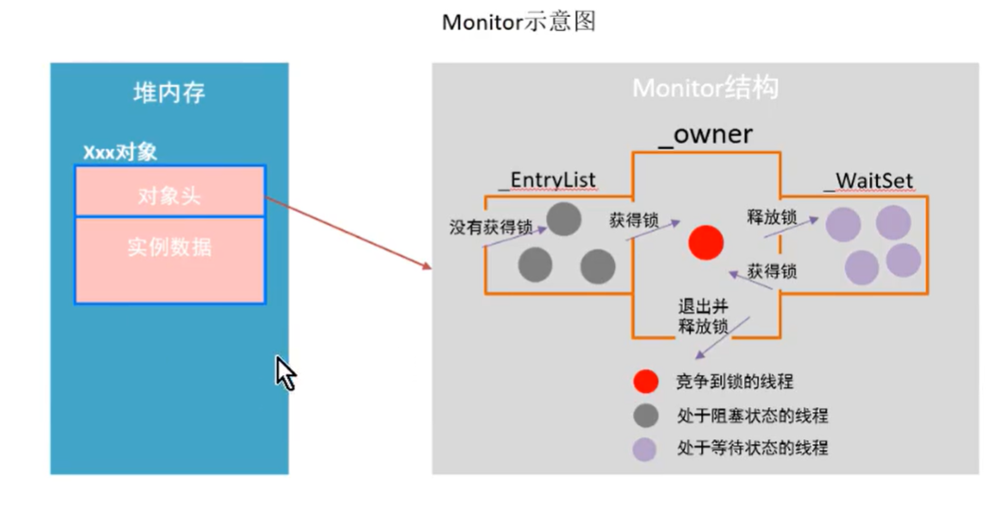
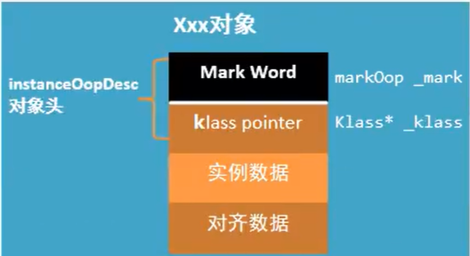
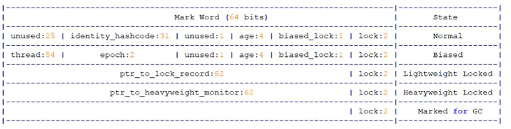
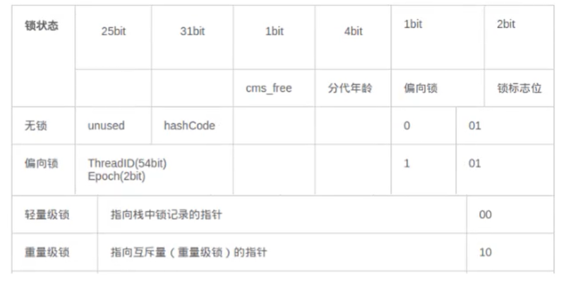
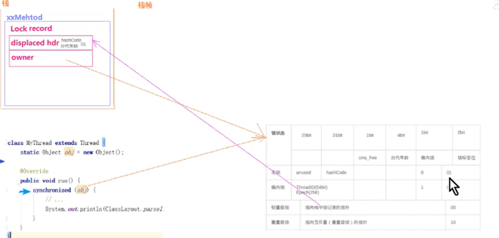

# 并发编程的三个问题

## 可见性

可见性指一个线程对共享变量进行修改，另一个线程立即可以得到修改后的最新值

## 原子性

在一次或多次操作中不被中断的全部执行或者都不执行

## 有序性

程序代码在执行过程中的先后顺序，由于Java在编译期以及运行期的优化，实际执行的顺序与代码编码顺序确实不一样

# JAVA内存模型（JMM）

## 计算机结构

冯诺依曼体系：

输入设备，输出设备，运算器，控制器，存储器。

## JAVA内存模型

Java内存模型，是java虚拟机规范所定义的一种内存模型，用于屏蔽底层不同计算机的区别

Java内存模型是一套规范，描述了Java程序中各种变量（线程共享变量）的访问规则，以及在JVM中将变量存储到内存和从内存中读取变量这样的底层细节

主内存：所有线程共享，都能访问，共享变量都存储于主内存

工作内存：每一个线程有自己的工作内存，工作内存只存储该线程对共享变量的副本。线程对变量的所有的操作（读、取）都必须在工作内存中完成，而不能直接读写主内存中的变量，不同线程之间也不能直接访问对方工作内存的变量

作用：是一套在多线程读写共享数据时，对共享数据的可见性、有序性、和原子性的规则和保障

JMM内存模型与CPU硬件内存架构的关系

JMM内存模型只是一种抽象的概念

## 主内存与工作内存之间的交互

Java内存模型定义了8中原子操作来完成这个过程

注意

1、如果对一个变量执行lock操作，将会清空工作内存中此变量的值

2、对一个变量进行unlock操作之前，必须把此变量同步到主内存中

小结：

lock->read->load->use->assign->store->write-unlock

# synchronized保证三大特性

## 保证原子性

对同步代码块部分添加synchronized，保证同一时间只有一个线程操作number++

## 保证可见性

lock原语过程中会刷新主内存的值到工作内存中

## 保证重排序

as-if-serial语义：不管编译器和CPU如何重排序，必须保证单线程的情况下程序的结果是正确的

synchronized保证同步代码块是单线程运行，即使重排序最终结果一致

# synchronized的特性

## 可重入特性

一个线程可以多次重复多次获取同一把锁。

可以避免死锁，内部锁对象中会有一个计数器记录线程获取几次锁

## 不可中断特性

### 什么是不可中断

一个线程获得锁后，另一个线程想要获得锁，必须处于阻塞或者等待状态，如果第一个线程不释放锁，第二个线程会一直阻塞或等待，不可被中断。

# synchronized原理

JVM规范对mointorenter的描述

每一个对象都会和一个monitor关联。监视器被占用时会被锁住，其他线程无法来获取该monitor

当JVM执行到某个线程某个方法内部的monitorenter时，它会尝试去获取当前对象对应的monitor的所有权。过程如下：

1、若monitor进入数为0，线程可以进入monitor，并将monitor的进入数量置为1。当前线程成为monitor的的owner

2、若线程已经拥有monitor的所有权，允许它重入monitor，则进入monitor的进入数+1

3、若其它线程已经占有monitor的所有权，那么当前尝试获取monitor的所有权的线程会被阻塞，直到monitor的进入数变为0，才能重新尝试获取monitor的所有权

synchronized的锁对象会关联一个monitor，这个monitor不是我们主动创建的，是JVM的线程执行到这个同步代码块，发现锁对象没有monitor就会创建，monitor内部有两个重要的成员变量owner和recursion

monitorexit

1、能执行monitorexit指令的线程一定是拥有当前对象的monitor所有权的线程

2、执行monitorexit时会将monitor的计数减1，若为0，退出monitor，允许阻塞的线程尝试获取

synchronized出现异常会释放锁

## synchronized和lock的区别

1、关键字和接口

2、synchronized会自动释放锁，Lock必须手动释放锁

3、synchronized是不可中断的，Lock可以中断也可以不中断

4、通过Lock可以知道线程是否拿到锁，而synchronized不能

5、synchronized能锁住方法和代码块，而Lock只能锁住代码块

6、Lock可以使用读锁提高多线程效率

7、synchronized是非公平，ReentrantLock可以控制是否公平

## JVM源码

### monitor监视器锁

HotSpot虚拟机中，monitor是由ObjectMonitor实现的

~~~c++
ObjectMonitor(){
    _header        = null;
    _count         = 0;
    _waiters       = 0;
    _recursions    = 0;//线程的重入次数
    _object        =null;//存储该monitor的对象
    _owner         =null;//标识拥有该monitor的线程
    _WaitSet       =null;//处于wait状态的线程，会被加入到_waitSet
    _WaitSetLock   =null;
    _Responsible   =null;
    _succ          =null;
    _cxq           =null;//多线程竞争锁时的单向列表
    FreeNext       =null;
    _EntryList     =null;//处于等待锁block状态的线程，会被加入到该列表
    _SpinFreq      =0;
    _SpinClock     =0;
    OwnerIsThread  =0;
   }
~~~

1、_owner：初始时为null，当有线程占用该monitor时，owner标记为该线程的唯一标识，当线程释放monitor时，owner又恢复为null，owner是一个临界资源，JVM通过CAS操作保证线程安全

2、_cxq：竞争队列，所有请求锁的线程首先会被放入在这个队列中（单向链接）。_cxq是一个临界资源，JVM通过CAS操作修改_cxq队列，修改前_cxq的旧值填入了node的next字段，_cxq指向新值（新线程）。因此_cxq是一个后进先出的栈

3、_EntrySet：cxq队列中有资格成为候选资源的线程会被移动代该队列中。

4、_WaitSet：因为调用wait方法而被阻塞的线程会被放入到该队列中

每一个java对象都可以与一个监视器monitor关联，可以把它理解为一把锁，当一个线程想要执行一段同步方法或代码块时，该线程首先需要获取到synchronized修饰的对象对应的monitor

monitor并不是随着对象创建而创建的。通过synchronized修饰符告诉JVM需要为我们的某个对象创建关联的monitor对象。每个线程都存在两个ObjectMonitor对象列表，分别为free和used列表。同时JVM也维护着globallocklist。当线程需要ObjectMonitor对象时，首先从线程自身的free表中申请，若存在则使用，若不存在则从globallocklist中申请。

结构

### monitor竞争

1、执行monitor时，会调用InterpreterRuntime.cpp

~~~c++
InterpreterRuntime:monitorenter(JavaThread* thread,BasicObjectLock* elem)
.....
if(UseBiasedLocking){
    ObjectSynchronizer::fast_enter(h_obj,elem->lock(),true,CHECK);
}else{
    ObjectSynchronizer::slow_enter(h_obj,elem->lock(),CHECK);
}
~~~

2、对于重量级锁，monitorenter函数中调用ObjectSynchronizer::slow_enter

3、最终调用ObjectMonitor::enter方法

~~~c++
void ATTR ObejctMonitor::enter(TRAPS){
    Thread * const Self=Thread;
    void * cur;
    
    //通过CAS操作尝试把monitor的_owner字段设置为当前线程
    cur=Atomic::cmpxchg_ptr(Self,&_owner,NULL);
    if(curr==null){
        assert(_recursion==0,"invariant");
        assert(_owner==Self,"invariant");
        return;
    }
    
    //线程重入
    if(curr==Self){
        __recursion++;
        return;
    }
    
    //当前线程第一次进入该monitor，设置_recursion为1，_owner为当前线程
    if(Self->is_lock_owned((address)curr)){
        assert(_recursion==0,"internal state error");
        _recursion=1;
        _owner=Self;
        OwnerIsThread=1;
    }
    ....
    for(;;){
        jt->set_suspend_equivalent();
        //获取锁失败，则等待锁释放
        EnterI(THREAD);
        ....
    }
    
}
~~~

以上代码概括如下：

1、通过CAS尝试把monitor的_owner字段设置为当前线程

2、如果之前的_owner指向当前线程，执行_recursion++

3、如果第一次进入，设置_owner和_recursion

4、获取锁失败，等待锁释放

### monitor等待

以上源码可知等待锁是调用的是ObjectMonitor的EnterI方法

~~~c++
void ATTR ObjectMonitor::EnterI(TRAPS){
    Thread * Self=THREAD;
    //再次尝试获取锁
    if(TryLock(Self)>0){
        
    }
    //再自旋挣扎下
    if(TrySpin(Self)>0){
        
    }
    ...
    //当前线程被封装成ObjectWaiter对象node，状态设置为TS_CXQ;
    ObjectWaiter node(Self);
    Self->ParkEvent->reset();
    node._prev=(ObjectWaiter *) 0xBAD;
    node.TState=ObjectWaiter::TS_CXQ;
    
    //通过CAS把node节点push到_cxq列表中
    ObjectWaiter *nxt;
    for(;;){
        node._next=nxt=_cxq;
        if(Atomic::cmpxchg_ptr(&node,&_cxq,nxt)==nxt) break;
        //再尝试抢锁
        if(TryLock(Self)>0){
            
        }
    }
    
    ...
    for(;;){
        //线程在被挂起前做一下挣扎，看能不能获得锁
        if(TryLock(Self)>0) break;
        assert(_owner!=Self,"invariant");
        //通过park将当前线程挂起，等待被唤醒
        Self->ParkEvent->park();
       	if(TryLock(Self)>0) break;
    }
    ...
}
~~~

当线程被唤醒时，会从挂起的点开始执行，再次尝试获取锁

~~~c++
int ObjectMonitor::TryLock(Thread * Self){
    for(::){
        void *own=_owner;//获取当前对象的_owner属性
        if(own!=null) return 0;
        if(Atomic::cmpxchg_ptr(Self,&_owner,NuLL)==NULL){
            assert(_recursions==0,"invariant");
            assert(_owner==Self,"invariant");
            return 1;
        }
        if(true) return -1;
    }
}
~~~

代码概括如下：

1、当前线程被封装成ObjectWaiter对象node，状态设置成ObjectWaiter::TS_CXQ.

2、在for循环中，通过CAS把node节点push到_cxq列表中，因为同一时刻可能有多个线程把自己的node节点push到_cxq列表中

3、node节点push到_cxq列表之后，通过自旋尝试获取锁，如果还是没有获取到锁，则通过park将当前线程挂起，等待被唤醒。

4、当该线程被唤醒时，会从挂起的点继续执行，再次尝试获取锁

### monitor释放

当某个持有锁的线程执行完同步代码块，会进行锁的释放，给其它线程机会执行同步代码库，在HotSpot中，通过退出monitor的方式实现锁的释放，并通知被阻塞的线程，具体实现在ObjectMonitor的exit方法中

~~~c++
void ATTR ObjectMonior::exit(bool not_suspended,TRAPS){
    Thread *Self=THREAD;
    ...
    //重入锁
    if(_recursions!=0){
        _recursion--;
        TEVENT(Inflated exit - recursion);
        return;
    }
    
    ObjectWaiter *w=NULL;
    int QMode=Knob_QMode;
    //qmode=2;直接绕过EntryList队列，从cxq队列中获取线程用于竞争锁
    if(QMode==2&&_cxq!=NULL){
        w=_cxq;
        ExitEpilog(Self,w);
        return
    }
    //qmode=3，cxq队列插入EntryList尾部
    if(Qmode==3&&_cxq!=NULL){
        w=_cxq;
        for(;;){
            ObjectWaiter *u=(ObjectWaiter *) Atomic::cmpxchg_ptr(NULL,&_cxq,w);
            if(u==w) break;
            w=u;
        }
        Object * q=NULL;
        Object *p;
        for(p=w;p!=NULL;p=p->next){
            guarantee(p->TState==ObjectWaiter::TS_CXQ,"");
            p->TState=ObejctWaiter::TS_ENTER;
            p->prev=q;
            q=p;
        }
        ....
    }
    //qmode=4,cxq队列插入到EntryList头部
    if(Qmode=4&&_cxq!=null){
        ....
    }
    ...
    w=_EntryList;
    if(w!=null){
        ..
        ExitEpilog(Self,w);
        return;
    }
    
}
~~~

1、退出同步代码块时会让_recursion减1，当_recurison的值减为0时，说明线程释放了锁

2、根据不同策略（由QMode指定），从cxq或EntryList中获取头节点，通过ObjectMonitor::ExitEpilog方法唤醒该节点封装的所有线程，唤醒操作最终由unpark完成

~~~c++
void ObjectMonitor::ExitEpilog(Thread *Self,ObjectWaiter *Wakee){
    ParkEvent *Trigger=Wakee->_event;
    ...
    Trigger->unpark();
}
~~~

### monitor是重量级锁

ObjectMonitor的函数会调用Atomic::cmpxchg_ptr,Atomic_inc_ptr等内核函数，执行同步代码块，没有竞争到锁的对象会park()挂起（进入阻塞态），需要操作系统内核参与，由用户态到内核态的切换会消耗大量系统资源，是一个重量级锁

# JDK6 synchronized优化

## CAS

Compare  And Swap（比较相同再交换），原子操作，由CPU支持，可以保证共享变量赋值时的原子操作。尽可能保证线程不被阻塞

悲观锁与乐观锁

悲观锁每次获取数据时都会去上锁，会导致别的线程阻塞，性能较差

乐观锁获取数据时默认不上锁，如果数据赋值失败则重复获取锁

CAS获取共享变量时，为了保证该变量的可见性，需要使用volatile修饰。结合CAS和volatile可以实现无锁并发，适用于竞争不激烈，多核CPU场景下

sychronized锁升级的过程

无锁->偏向锁->轻量级锁->重量级锁

## Java对象的布局

在JVM中，对象在堆内存中断存储布局可以划分为对象头、实例数据和对其填充

### 对象头

当一个线程尝试用synchronized修饰的代码块时，它首先要获得锁，锁存在于对象头中

HotSpot采用instanceOopDesc和arrayOopDesc来描述对象头，arrayOop对象用来描述数组类型

instanceOopDesc继承与oopDesc

~~~c++
class oopDesc{
    friend class VMStructs;
  private:
    volatile markOop _mark;
    union _metadata{
        klass*   _klass;
        narrowKlass _compressed_klass;
    }_metadata;
    
    static BarrierSet* _bs;
   ....
}
~~~

在普通实例对象中，oopDesc的定义包含两个成员 "_mark"和"_metadata"

_mark表示对象标记，属于markOop类类型，记录了对象和锁有关的信息

_metadata表示类元信息，类元信息存储的是对象指向它类元数据的首地址

对象头由两部分组成，一部分用于存储自身的运行时数据，称之为MarkWord，另外一部分是类型指针。

#### MarkWord

MarkWord用于存储对象自身的运行时数据，如哈希码，GC分代年龄，锁状态标志，线程持有的锁，偏向线程ID，偏向时间戳等等，占用内存大小与虚拟机位长一致，类型为markOop

#### klass pointer

该指针指向它的类元数据，64为虚拟机用64为存储，为了节约内存可以使用--XX:+UseCompressedOops开启指针压缩，开启该选项后，下列指针会被压缩为32位

1、每个Class的属性指针（静态变量）

2、每个对象的属性指针（即对象变量）

3、普通对象数组的每个元素指针

一些特殊类型的指针JVM不会优化，比如指向元空间的Class对象指针、本地变量、堆栈元素、入参、返回值和NULL指针等

### 实例数据

类中定义的成员变量

### 对齐填充

保证对象的大小必须为8字节的整数倍

## 偏向锁

线程第一次获取锁没有竞争直接获取，将偏向为置为1，并且保存当前线程的ID，一旦出现竞争，立即撤销偏向锁

### 流程

1、检测markword是否为可偏向状态，即偏向位是否为1，锁标志为是否为01

2、若为可偏向状态，测试线程ID是否为当前线程，是，执行同步代码块

3、线程ID不为当前线程ID，通过CAS操作将MarkWord的线程ID替换为当前线程ID，执行同步代码块

### 撤销

1、偏向锁的撤销动作必须等待全局安全点

2、暂停拥有偏向锁的线程，判断对象是否处于被锁定状态

3、撤销偏向锁，恢复到无锁（标志位为01）或轻量级锁（标志位为00）的状态

### 好处

偏向锁适用于一个线程反复获得同一锁的情况

## 轻量级锁

相对于monitor而言的轻量级锁，不是用来代替重量级锁的，引入的目的是在多线程交替执行同步代码块的情况下，尽量避免重量级锁引起的性能消耗，如果多个线程在同一时刻进入临界区，会导致轻量级锁膨胀为重量级锁

### 原理

当多个线程竞争偏向锁或关闭偏向锁会导致偏向锁升级为轻量级锁，步骤如下：

1、判断当前对象是否无锁状态（hashcode、0、01），如果是，则JVM首先会在当前线程的栈帧中建立一个名为锁记录（Lock Record）的空间，用于存储锁对象目前的Mark Word的拷贝，将对象的MarkWord赋值到栈帧中的Lock Record中，将Lock Record中的owner指向当前对象

2、JVM利用CAS尝试将对象的MarkWord更新为指向LockRecord的指针，如果成功表示竞争到锁，则将锁标志为变成00，执行同步操作

3、如果失败则将判断当前对象的MarkWord是否指向当前线程的栈帧，如果是则执行同步代码块，否则膨胀为重量级锁

### 释放

轻量级锁的释放也是通过CAS操作进行的

1、取出在获取轻量级锁保存在Displaced Mark Word中的数据

2、用CAS操作将取出的数据替换当前对象的MarkWord中，如果成功，则说明释放锁成功

3、如果CAS操作替换失败，说明有其它线程尝试获取锁，则需要将轻量级锁膨胀为重量级锁

### 好处

在多线程交替执行同步代码块的情况下，避免重量级锁引起的性能消耗

## 自旋锁

轻量级锁会自动自旋一段时间来获取锁

## 锁消除

如果JVM判断当前对象不会被其他线程访问到，会将锁消除

## 锁粗化

如果JVM判断连续的一段细小操作都对同一个对象加锁，JVM会将同步代码块的范围放大，放大这串操作的外面。

# 平时对synchronized的优化

## 减少synchronized的范围

## 降低synchronized的锁粒度