# Tomcat基础

## web概念

1、软件架构

​	1.C/S：客户端/服务器端

​	2.B/S：浏览器/服务器端

2、资源分类

​	1、静态资源：所有用户访问后，得到的结果都是一样的，成为静态资源，静态资源可以被浏览器解析

​		如：html，css，JavaScript，jpg

​	2、动态资源：每个用户访问相同资源后，得到的结果可能不一样，成为动态资源，动态资源被访问后，需要先转换为静态资源，再返回给浏览器，通过浏览器进行解析

​		如：servlet/jsp,php

3、网络通信三要素

​	1、IP：电子设备（计算机）在网络中的唯一标识

​	2、端口：应用程序在计算机的唯一表示：0-65536

​	3、传输协议：规定了数据传输的规则

​			1、基础协议：

​					1.tcp：安全协议，三次握手，速度稍慢

​					2.udp：不安全协议，速度快

## 常见的web服务器

### 概念

1、服务器：安装了服务器软件的计算机

2、服务器软件：接受用户请求，处理请求，做出响应

3、web服务器软件：接收用户请求，处理请求，做出响应

在web服务器软件中，可以部署web项目，让用户通过浏览器来访问这些项目

### 类型

## Tomcat历史

1、由Sun公司的软件架构师James Duncan Davidson开发，名为“JavaWebServer”

2、1999年，在Davidson帮助下，该项目与apache软件基金会旗下的JServ项目合并，并发布第一个版本（3.x），即使现在的Tomcat，该版本实现了Servlet2.2和JSP1.1规范

3、2001年，Tomcat发布了4.0版本，作为里程碑式的版本，Tomcat完全重新设计了其架构，并实现了servlet2.3和JSP1.2规范

## Tomcat目录

bin：该目录下存放的是二进制可执行文件

conf：这是一个非常非常重要的目录，这个目录下有四个最为重要的文件：

Ø  server.xml：配置整个服务器信息。例如修改端口号，添加虚拟主机等；下面会详细介绍这个文件；

Ø  tomcatusers.xml：存储tomcat用户的文件，这里保存的是tomcat的用户名及密码，以及用户的角色信息。可以按着该文件中的注释信息添加tomcat用户，然后就可以在Tomcat主页中进入Tomcat Manager页面了；

Ø  web.xml：部署描述符文件，这个文件中注册了很多MIME类型，即文档类型。这些MIME类型是客户端与服务器之间说明文档类型的，如用户请求一个html网页，那么服务器还会告诉客户端浏览器响应的文档是text/html类型的，这就是一个MIME类型。客户端浏览器通过这个MIME类型就知道如何处理它了。当然是在浏览器中显示这个html文件了。但如果服务器响应的是一个exe文件，那么浏览器就不可能显示它，而是应该弹出下载窗口才对。MIME就是用来说明文档的内容是什么类型的！

Ø  context.xml：对所有应用的统一配置，通常我们不会去配置它。

lib：Tomcat的类库，里面是一大堆jar文件。如果需要添加Tomcat依赖的jar文件，可以把它放到这个目录中，当然也可以把应用依赖的jar文件放到这个目录中，这个目录中的jar所有项目都可以共享之，但这样你的应用放到其他Tomcat下时就不能再共享这个目录下的Jar包了，所以建议只把Tomcat需要的Jar包放到这个目录下；

logs：这个目录中都是日志文件，记录了Tomcat启动和关闭的信息，如果启动Tomcat时有错误，那么异常也会记录在日志文件中。

temp：存放Tomcat的临时文件，这个目录下的东西可以在停止Tomcat后删除！

webapps：存放web项目的目录，其中每个文件夹都是一个项目；如果这个目录下已经存在了目录，那么都是tomcat自带的。项目。其中ROOT是一个特殊的项目，在地址栏中没有给出项目目录时，对应的就是ROOT项目。http://localhost:8080/examples，进入示例项目。其中examples就是项目名，即文件夹的名字。

work：运行时生成的文件，最终运行的文件都在这里。通过webapps中的项目生成的！可以把这个目录下的内容删除，再次运行时会生再次生成work目录。当客户端用户访问一个JSP文件时，Tomcat会通过JSP生成Java文件，然后再编译Java文件生成class文件，生成的java和class文件都会存放到这个目录下。

LICENSE：许可证。

NOTICE：说明文件。

# Tomcat架构

## Http工作原理

HTTP协议是浏览器与服务器之间数据传送协议，作为应用层协议，HTTP是基于TCP/IP协议来传送数据的。

服务器主要作用：

接受连接，解析HTTP格式的数据包，执行请求，生成HTTP格式的数据包

## Tomcat整体架构

### Http服务器请求处理

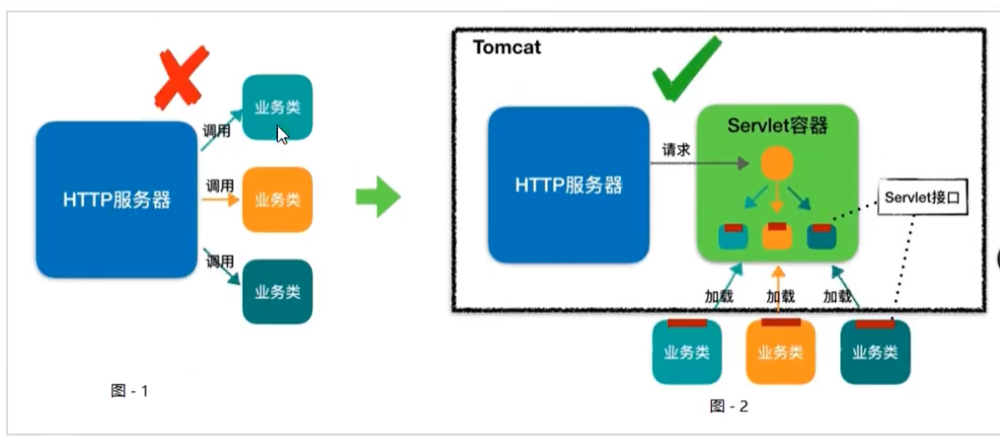

图1：表示HTTP服务器直接调用具体业务类，它们是紧耦合的

图2：HTTP服务器不直接调用业务类，而是把请求交给容器来处理，容器通过servlet接口调用业务类。因此Servlet接口Servlet容器的出现，达到了HTTP服务器与业务类解耦的目的。而Servlet接口和Servlet容器这一整套规范叫做Servlet规范。Tocmat按照Servlet规范的要求实现了Servlet容器，同时他们也具有HTTP服务器的功能，作为JAVA程序员，如果我们要实现新的业务功能，只需要实现一个Servlet，并把它注册到Tomcat（Servlet容器）中，剩下的事情就由Tomcat帮我们处理了。

### Servlet容器工作流程

为了解耦，HTTP服务器不直接调用Servlet，而是把请求交给Servlet容器来处理，那Servlet容器又是如何工作的呢？

当客户请求某个资源时，HTTP服务器会调用一个ServletRequest对象把客户的请求信息封装起来，然后调用Servlet容器的service方法，Servlet容器拿到请求后，根据请求的URL和Servlet的映射关系，找到相应的Servlet，如果Servlet还没有被加载，就用反射机制创建这个Servlet，并调用Servlet的init方法来完成初始化，接着调用Servlet的service方法来处理请求，把ServletResponse对象返回给HTTP服务器，HTTP服务器会把相应发送给客户端。

Servlet容器的作用：定位->加载->调用

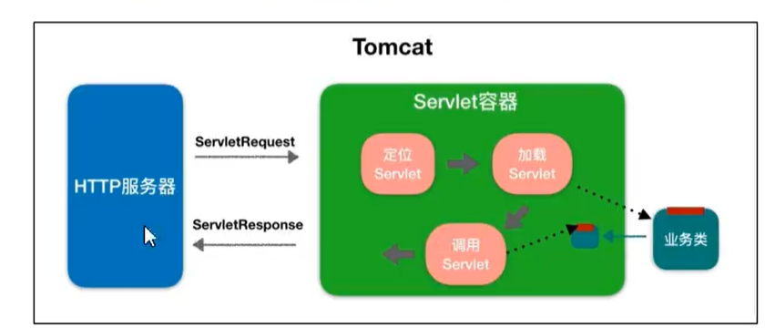

### Tomcat整体架构

我们知道如果要设计一个系统，首先是要了解需求，我们已经了解了Tomcat要实现两个核心功能：

1、处理Socket连接，负责网络字节流与Request和Response对象的转化。

2、加载和管理Servlet，以及具体处理Request请求

因此Tomcat设计了两个核心组件连接器（Connector）和容器（Container）来分别做这两件事情。连接器负责对外交流，容器负责内部处理。

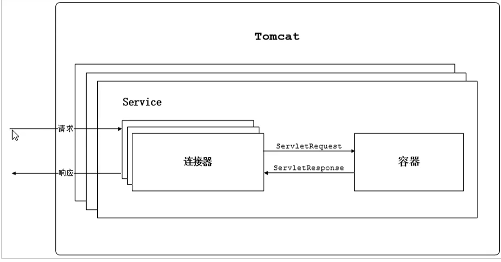

## 连接器-Coyote

### 架构介绍

Coyote是Tomcat的连接器框架的名称，是Tomcat服务器提供的供客户端访问的外部接口。客户端通过

Coyote与服务器建立连接、发送请求并接受相应。

Coyote封装了底层的网络通信（Socket请求及相应处理），为Catalina容器提供了统一的接口，使Catalina容器与具体的请求协议及IO操作方式完全解耦。Coyote将Socket入数转换封装为Request对象，交由Catalina容器进行处理，处理请求完成后，Catalina通过Coyote提供的Response对象将结果写入输出流。

Coyote作为独立的模块，只负责具体协议和IO的相关操作，与Servlet规范实现没有直接关系，因此即便是Request和Response对象也并未实现Servlet规范对应的接口，而是在Catalina中将他们进一步封装为ServletRequest和SevletResponse

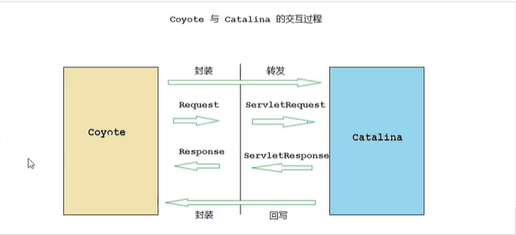

### IO模型与协议

在Coyote中，Tomcat支持的多种I/O模型和应用层协议，具体包含哪些IO模型和应用层协议，请看下表

TOmcat支持的IO模型（自8.5/9.0版本起，Tomcat移除了对BIO的支持）：

IO模型                              描述

NIO                               非阻塞I/O，采用Java NIO类库实现

NIO2							 异步I/O，采用JDK 7最新的NIO2类库实现

APR                                ~~~~

应用层协议						描述

HTTP/1.1                          这是大部分web应用采用的访问协议

AJP                                   用于和Web服务器集成（如Apache），以实现对静态资源的优化以及集群部署

HTTP/2							 HTTP2.0大幅度的提升了Web性能。下一代的HTTP协议，自8.5以及9.0版本之后支持

Tomcat为了实现支持多种I/O模型和应用层协议，一个容器可能对接多个连接器，就好比一个房间有多个们，但是单独的连接器或者容器都不能对外提供服务，需要把它们组装起来才能工作，组装后这个整体叫做Service组件，这里请你注意，Service本身没有做什么重要的事情，只是在连接器和容器外面多包了一层，把它们组装在一起，Tomcat内可能有多个Service，这样的设计也是出于灵活性的考虑。通过在Tomcat中配置多个Service，可以实现通过不同的端口号来访问同一台机器上部署的不同应用。

### 连接器组件

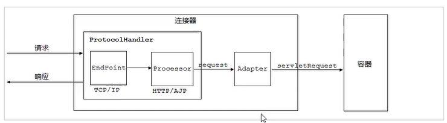

连接器中的各个组件的作用如下：

**EndPoint**

1）EndPoint：Coyote通信端点，即通信监听的接口，是具体Socket接收和发送处理器，是对传输层的抽象，因此EndPoint用来实现TCP/IP协议的。

2）Tomcat并没有EndPoint接口，而是提供了一个AbstractEndpoint，里面定义了两个内部类：Acceptor和SocketProcessor，Acceptor用于监听Socket连接请求，SocketProcessor用于处理接收到的Socket请求，它实现Runnable接口，在Run方法里调用协议处理组件Processor进行处理。为了提高处理能力，SocketProcessor被提交到线程池来执行，而这个线程池叫做执行器（Executor）。

**Processor**

Processor：Coyote协议处理接口，如果说EndPoint是用来实现TCP/IP协议的，那么Processor用来实现HTTP协议，Processor接收来自EndPoint的Socket，读取字节流解析成request，response对象，并通过Adapter将其提交到容器处理，Processor是对应用层协议的抽象

**ProtocolHandler**

ProtocolHandler：Coyote协议接口，通过Endpoint和Processor，实现针对具体协议的处理能力。Tomcat按照协议和I/O提供了6个实现类

**Adapter**

由于协议不同，客户端发送过来的请求信息也不尽相同，Tomcat定义了自己的Request类来“存放”这些请求信息。ProtocolHandler接口负责解析请求并生成Tomcat Request类，但是这个Request对象不是标准的ServletRequest，也就意味着，不能用Tomcat Request作为参数来调用容器，Tomcat设计者的解决方案是引入CoyoteAdapter，这是适配器模式的经典运用，连接器调用CoyoteAdapter的Service方法，传入的是Tomcat Request对象，CoyoteAdapter负责将Tomcat Request转成ServletRequest，再调用容器的Service方法。

## 容器-Catalina

Tomcat是一个由一些列可配置的组件构成的Web容器，而Catalina是Tomcat的servlet容器。

Catalina是Servlet容器实现，包含了之前讲到的所有的容器组件，以及后续章节涉及到的安全、会话、集群、管理、等Servlet容器架构的各个方面。它通过松耦合的方式集成Coyote，以完成按照请求协议进行数据读写。同时，它还包括我们的启动入口、Shell程序等。

### Catalina地位

Tomcat的模块分层结构图，如下：

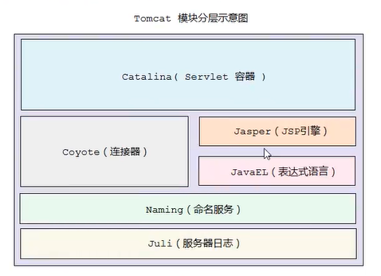

Tomcat本质上就是一款Servlet容器，因此Catalina才是Tomcat的核心，其他模块都是为Catalina提供支撑的。比如：通过Coyote模块提供连接通信，Jasper模块提供JSP引擎，Naming提供JNDI服务，Juli提供日志服务。

### Catalina结构

Catalina的主要组件结构如下：

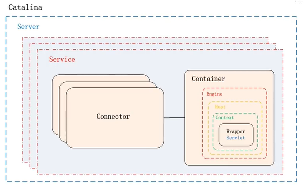

如上图所示，Catalina负责管理Server，而Server表示着整个服务器。Server下面有多个服务Service，每个服务都包含着多个连接器组件Connector（Coyote实现）和一个容器组件Container。在Tomcat启动的时候，会初始化一个Catalina的实例

Catalina各个组件的职责：

| 组件      | 职责                                                         |
| --------- | ------------------------------------------------------------ |
| Catalina  | 负责解析Tomcat的配置文件，以此来创建服务器Server组件，并根据命令来对其进行管理 |
| Server    | 服务器表示整个Catalina Servlet容器以及其它组件，负责组装并启动Servlet引擎，Tocmat连接器，Server通过实现Lifecycle接口，提供了一种优雅的启动和关闭整个系统的方式 |
| Service   | 服务是Server的内部组件，一个Server可以包含多个Service。它将若干个Connector组件绑定到一个Container（Engine）上 |
| Connector | 连接器，负责与客户端的通信，它负责接收客户请求，然后转给相关的容器处理，最后向客户返回响应结果 |
| Container | 容器，负责处理用户的servletrequest请求，并返回对象给web用户的模块 |

### Container结构

Tomcat设计了四种容器，分别是Engine、Host、Context和Wrapper。这4种容器不是平行关系，而是父子关系。Tomcat通过一种分层的结构，使得Servlet容器具有很好的灵活性

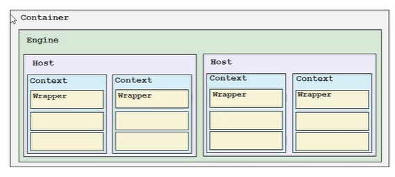

| 容器    | 描述                                                         |
| ------- | ------------------------------------------------------------ |
| Engine  | 表示整个Catalina的Servlet引擎，用来管理多个虚拟站点，一个Service最多只能有一个Engine，但是一个引擎可包含多个Host |
| Host    | 代表一个虚拟主机，或者说一个站点，可以给Tomcat配置多个虚拟主机地址，而一个虚拟主机下可包含多个context |
| Context | 表示一个web应用程序，一个Web应用可包含多个Wrapper            |
| Wrapper | 表示一个Servlet，Wrapper作为容器中的最底层，不能包含子容器   |

可以通过Tomcat的server.xml配置文件来加深对Tomcat容器的理解。Tomcat采用了组件化的设计，它的构成组件都是可配置的，其中最外层的是Server，其它组件按照一定格式要求配置在这个顶层容器中

~~~xml
<Server>
    <Service>
    	<Connector/>
        <Connector/>
        <Engine>
            <Host>
            	<Context></Context>
            </Host>
        </Engine>
    </Service>
</Server>
~~~

那么，Tomcat是如何管理这些容器的，这些容器是父子关系，形成一个树形结构，即设计模式中的组合模式，Tomcat就是用组合模式来管理这些容器的。具体实现方法是，所有容器组件都实现了Container接口，因此组合模式可以使得用户对单容器对象和组合容器对象的使用具有一致性。这里但容器对象指的是最底层的Wrapper，组合容器对象指的是上面的Context、Host或者Engine

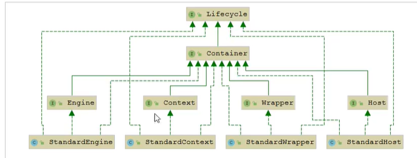

## Tomcat启动流程

### 启动流程

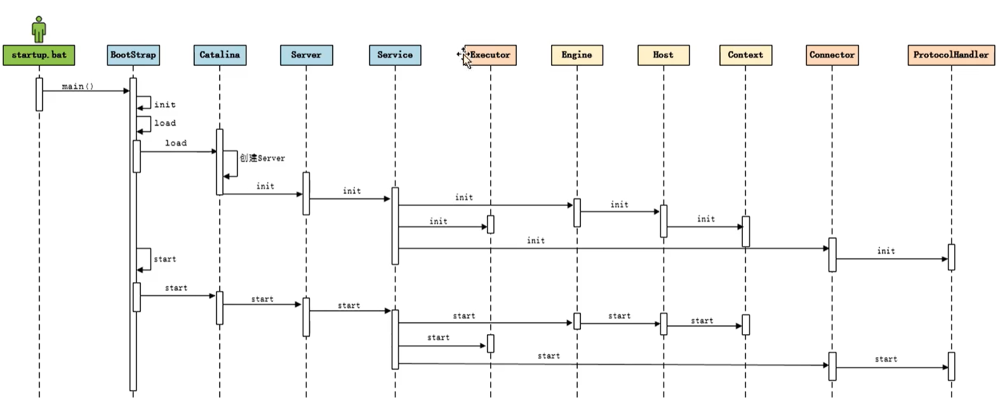

步骤

1）启动tomcat，需要调用bin/startup.bat,在该脚本中，调用了catalina.bat

2）在catalina.bat脚本文件中，调用BootStrap中的main方法

3）在BootStrap的main方法中调用了init方法，来创建Catalina及初始化类加载器

4）在BootStrap的main方法中调用了load方法，其中又调用了Catalina的load方法

5）在Catalina的load方法中，需要进行一些初始化的工作，并需要构造Digester对象，用于解析xml

6）然后再调用后续组件的初始化操作

加载Tomcat的配置文件，初始化容器组件，监听对应的端口号，准备接受客户端请求。

### 源码解析

#### Lifecycle

由于所有的组件均存在初始化、启动、停止等生命周期管理的特性，所以Tomcat在设计的时候，基于生命周期管理抽象成了一个接口Lifecycle，而组件Server、Service、Container、Executror、Connector组件，都实现了一个生命周期的接口，从而具有了以下生命周期中的核心方法：

1）init（）：初始化组件

2）start（）：启动组件

3）stop（）：停止组件

4）destroy（）：销毁组件

LifecycleBase采用了模板方法的设计模式

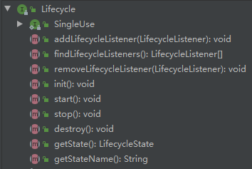

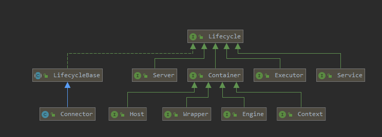

#### 各组件的默认实现

上面我们提到的Server、Service、Engine、Host、Context都是接口，下图罗列了这些接口的默认实现类。当前对于Endpoint组件来说，在Tomcat中没有对应的Endpoint接口，但是有一个抽象类AbstractEndpoint，其下有三个实现类：NioEndpoint、Nio2Endpoint、AprEndpoint，这三个实现类，分别对应于前面讲解连接器Coyote时，提到的连接器支持的三种IO模型：NIO、NIO2、APR，Tomcat8.5版本中，默认采用的是NioEndpoint

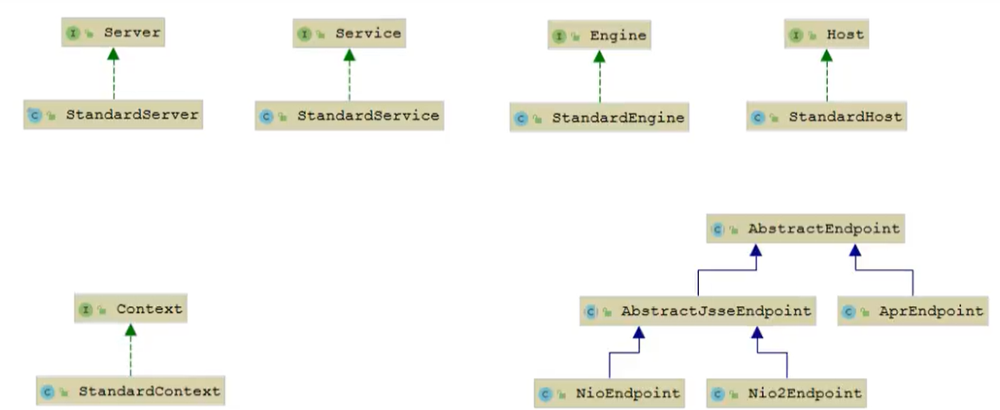

ProtocolHandler：Coyote协议接口，通过封装Endpoint和Processor，实现针对具体协议的处理功能，Tomcat按照协议和IO提供了6个实现类

AJP协议：

1）AjpNioProtocol：采用NIO的IO模型

2）AjpNio2Protocol：采用NIO2的IO模型

3）AjpAprProtocol：采用APR的IO模型，需要依赖APR库

HTTP协议：

1）Http11NioProtocol：采用NIO的IO模型，是默认使用的协议

2）Http11Nio2Protocol：采用NIO2的IO模型。

3）Http11AprProtocol：采用APR的IO模型，需要依赖APR库

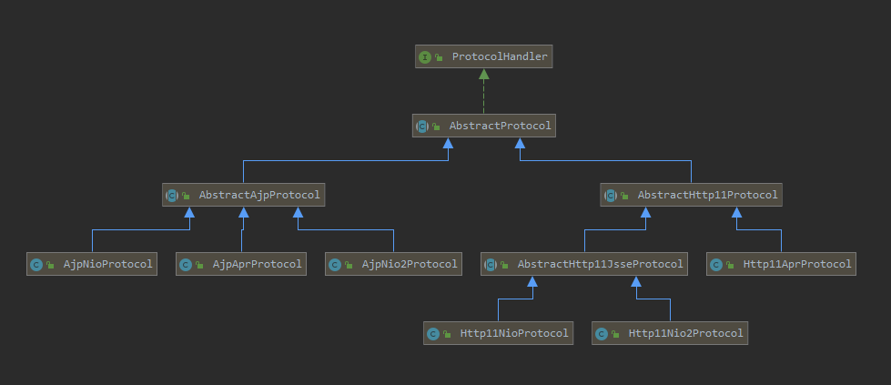

#### 源码入口

~~~text
目录：org.apache.catalina.startup

MainClass:BootStrap--->main(String[] args)
~~~

#### 总结

从启动流程图中以及源码中，我们可以看出Tomcat的启动过程非常标准化，统一按照生命周期管理接口LifeCycle的定义进行启动，首先调用init（）方法进行组件的逐级初始化操作，然后再调用start（）方法进行启动

每一级的组件除了完成自身的处理外，还要负责调用子组件相应的生命周期管理方法，组件与组件之间是松耦合的，因为我们可以很容易的通过配置文件进行修改和替换

## Tomcat请求处理流程

### 请求流程

Tomcat是如何确定每一个请求应该由哪个Wrapper容器里的Servelt来处理的呢？Tomcat是用Mapper组件来完成这个任务的。

Mapper组件的功能就是将用户请求的URL定位到一个Servlet，它的工作原理是：Mapper组件里保存了Web应用的配置信息，其实就是容器组件与访问路径的映射关系，比如Host容器里配置的域名、Context容器里的Web应用路径，以及Wrapper容器里Servlet映射的路径，可以将这些配置信息想象成一个多层次的Map

当一个请求到来时，Mapper组件通过解析请求URL里的域名和路径，再到自己保存的Map里去查找，就能定位到一个Servlet，请注意，一个请求URL最后只会定位到一个Wrapper容器，也就是一个Servlet

### 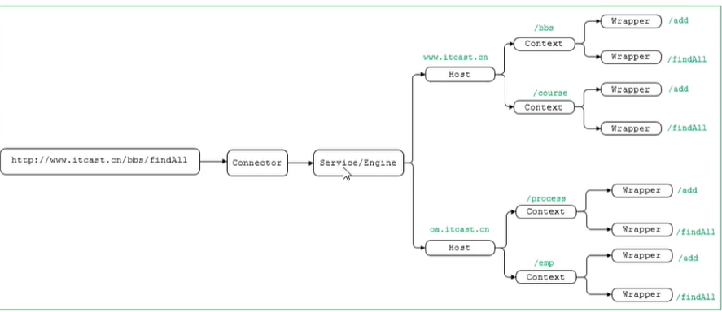

从Tomcat的设计架构层面来分析Tomcat的请求处理

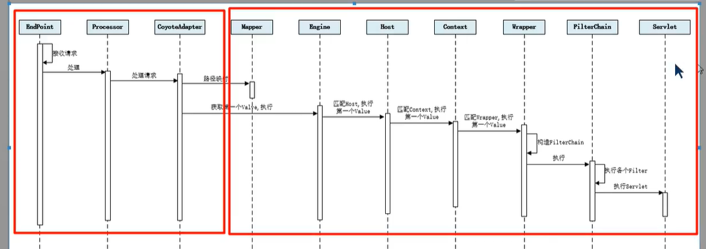

步骤如下：

1）Connector组件Endpoint中的Acceptor监听客户端socket连接并接受socket

2）将连接交给线程池Executor处理，开始执行请求响应任务。

3）Processor组件读取消息报文，解析请求头、请求体、请求头、封装成Reqeust对象

4）Mapper组件根据请求行URL值和请求头的Host值匹配由哪个Host容器、Context容器、Wrapper容器处理请求

5）CoyoteAdaptor组件负责将Connector组件和Engine容器关联起来，把生成的Request对象和响应的Response对象传递到Engine对象中，调用Pipeline

6）Engine容器的管道开始处理，管道中包含若干个Valve、每个Valve负责部分处理逻辑。执行完Valve后会执行基础的Valve--StandardEngineValve，负责调用Host容器的Pipeline

7）Host容器的管道开始处理，流程类似，最后执行Context容器的Pineline

8）Context容器的管道开始处理，流程类似，最后执行Wrapper容器的Pipeline

9）Wrapper容器的管道开始处理，流程类似，最后执行Wrapper容器对应的Servlet对象的处理方法

### 请求流程源码分析

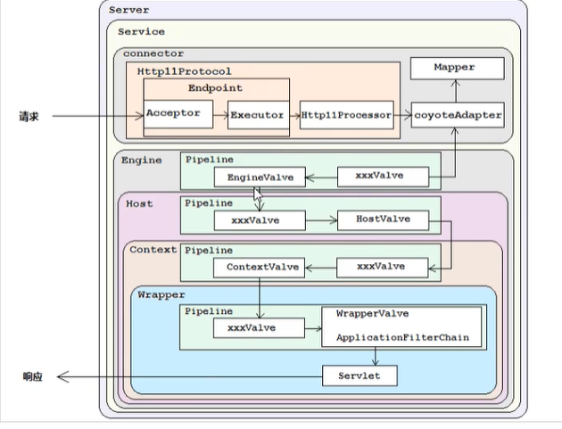

在Tomcat中，每个Container组件采用责任链模式来完成具体的请求处理

在Tomcat中定义了Pipeline和Valve两个接口，Pipeline用于构建责任链，后者代表责任链上的每个处理器。Pipeline中维护了一个基础的Valve，它始终位于Pipeline的末端（最后执行），封装了具体的请求处理和输出相应的过程。当然，也可以调用addValve（）方法，为Pipeline添加其他的Valve，后添加的Valve位于基础的Valve之前，并按照添加顺序执行。Pipeline通过获得首个Valve来启动整个链条的执行

# Jasper

# Tomcat服务器配置

Tomcat服务器的配置主要集中于tomcat/conf下的catalina.policy、catalina.properties、context.xml、server.xml、tomcat-users.xml、web.xml文件

## server.xml

server.xml是tomcat服务器的核心配置文件，包含了Tomcat的Servlet容器（Catalina）的所有配置。

**Server**

Server是server.xml的根元素，用于创建一个Server实例，默认使用的实现类是StandardServer

~~~xml
<Server port="8005" shutdown="SHUTDOWN">
	...
</Server>
~~~

port：Tomcat监听关闭服务器的端口

shutdown：关闭服务器的指令字符串

 

Server内嵌的子元素为 Listener、GlobalNamingResources、Service

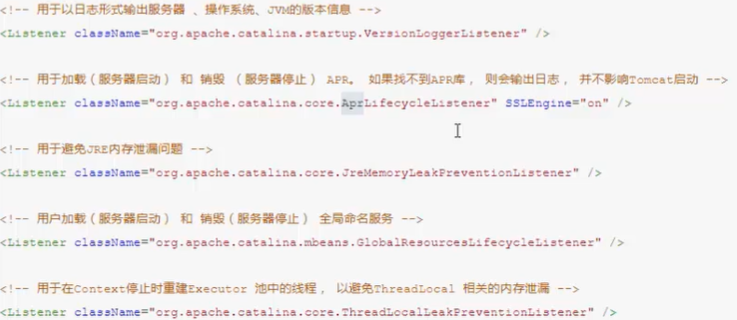

**Service**

该元素用于创建Service实例，默认使用StandardService。默认情况下，Tomcat指定了Service的名称，值为“Catalina”。Service可以内嵌的元素为：Listener、Executor、Connector、Engine，其中：Listener用于为Service添加生命周期监听器，Executor用于配置Service共享线程池，Connector用于配置Service包含的链接器，Engine用于配制Service中链接器对应的Servlet容器引擎。

~~~xml
<Service name="Catalina">
	...
</Service>
~~~

一个Server服务器，可以包含多个Service服务。

**Executor**

默认情况下，Service并未添加共享线程池配置。如果我们想添加一个线程池，可以在<Service>下添加如下配置：

~~~xml
<Executor name="tomcatThreadPool"
          namePrefix="catalina-exec-"
          maxThread=""
          minSpareThreads=""
          maxIdleTime=""
          maxQueueSize=""
          prestartminSpareThreads=""
          threadPriority=""
          className=""/>
~~~

属性说明：

| 属性                    | 含义                                                         |
| ----------------------- | ------------------------------------------------------------ |
| name                    | 线程池名称，用于Connector中指定                              |
| namePrefix              | 所创建的每个线程的名称前缀，一个单独的线程名称为namePrefix+threadNumber |
| maxThreads              | 池中最大线程数                                               |
| minSpareThreads         | 活跃线程数，也就是核心线程数，这些线程不会被销毁，会一直存在 |
| maxIdleTime             | 线程空闲时间，超过该时间后，空闲线程会被销毁，默认值为6000（1分钟），单位ms |
| maxQueueSize            | 在被执行前最大线程排队数目，默认为Int的最大值                |
| prestartminSpareThreads | 启动线程池时是否启动minSpareThreads部分线程。                |
| threadPriotiry          | 线程池中线程优先级，默认值为5，值从1到10                     |
| className               | StandardThreadExecutor，如果想使用自定义线程池首先需要实现org.apache.catalina.Executor接口 |

如果不配置共享线程池，那么Catalina各组件在用到线程池时会独立创建

**Connector**

Connector用于创建链接器实例。默认情况下，server.xml配置了两个链接器，一个支持HTTP协议，一个支持AJP协议，因此大多数情况下，我们并不需要新增链接器配置，只是根据需要对已有链接器进行优化

~~~xml
<Connector port="8080" protocol="HTTP/1.1" connectionTimeout="" redirect=""/>

<Connector port="8009" protocol="AJP/1.3" redirectPort="8443" />
~~~

属性说明：

1）port：端口号，Connector用于创建服务端Socket并进行监听，以等待客户端请求链接。如果该属性设置为0，Tomcat将会随机选取一个可用的端口号给当前的Connector使用。

2）protocol：当前Connector支持的访问协议。默认为HTTP/1.1，并采用自动切换机制选择一个基于JAVA NIO的链接器或者基于本地APR的链接器

如果不希望采用上述自动切换的机制，而是明确指定协议，可以使用以下值

Http协议：

~~~text
org.apache.coyote.http11.HttpNioProtocol,非阻塞式Java NIO链接器
org.apache.coyote.http11.HttpNio2Protocol,非阻塞式Java NIO2链接器
org.apache.coyote.http11.Http11AprProtocol,APR链接器
~~~

 3）connectTimeOut：Connector接收链接后的等待超时时间，单位为ms，-1表示不超时

4）redirectPort：当前Connector不支持SSL请求，接收到了一个请求，并且也符合security-constraint约束，需要SSL传输，Catalina自动将请求重定向到指定的端口

5）executor：指定共享线程池的名称，也可以通过maxThreads、minSpareThreads等属性配置内部线程池

6）URIEncoding：用于指定编写URI的字符编码，Tomcat8.x版本默认的编码为UTF-8

**Engine**

Engine作为Servlet引擎的顶级元素，内部可以嵌入：Cluster、Listener、Realm、Valve和Host

~~~xml
<Engine name="Catalina" defaultHost="localhost">
	...
</Engine>
~~~

属性说明：

1）name：用于指定Engine的名称，默认为Catalina。该名称会影响一部分Tomcat的存储路径（如临时文件）

2）defaultHost：默认使用的虚拟主机名称，当客户端请求指向的主机无效时，将交由默认的虚拟主机处理，默认为localhost

**Host**

Host元素用于配置一个虚拟主机，它支持以下嵌入元素：Alias、Cluster、Listener、Valve、Realm、Context。如果在Engine下配置Realm，那么此配置将在当前Engine下的所有Host中共享。同样，如果在Host中配置Realm，则在当前Host下的所有Context中共享。Context中的Realm优先级>Host的Realm优先级>Engine中的Realm优先级

~~~xml
<Host name="localhost" appBase="webapps" unpackWARS="true" autoDeploy="true">
	...
</Host>
~~~

属性说明：

1）name：当前Host通用的网络名称，必须与DNS服务器上的注册信息一致。Engine中包含的Host必须存在一个名称与Engine的defaultHost设置一致。

2）appBase：当前Host的应用基础目录，当前Host上部署的Web应用均在该目录下（可以是绝对目录，相对路径）。默认为webapps

3）unpackWARS：设置为true，Host在启动时会将appBase目录下war包解压为目录。设置false，Host将直接从war文件启动

4）autoDeploy：控制tomcat是否在运行时定期检测并自动部署或新增或变更的web应用。

通过给Host添加别名，我们可以实现同一个Host

**Context**

Context用于配置一个Web应用，默认的配置如下：

~~~xml
<Context docBase="myApp" path="/myApp">
	....
</Context>
~~~

属性说明：

1）docBase：web应用目录或者War包的部署路径，可以视绝对路径，也可以是相对于Host appBase的相对路径

2）path：Web应用的Context路径。如果我们Host名为localhost，则该web应用访问的根路径为：http://localhost/myApp

它支持的内嵌元素为：CookieProcessor，Loader，Manager，Realm，Resources，WatchedResource，JarScanner，Valve

## Tomcat-users.xml

该配置文件中，主要配置的是Tomcat的用户，角色等信息，用来控制Tomcat中manager，host-manager的访问权限