## 

# Linux

## 基本

### 入门

Linux：Linux is not Unix

Linux里面一切皆是文件

Linux里面没有后缀名这一说

Linux与Windows对比

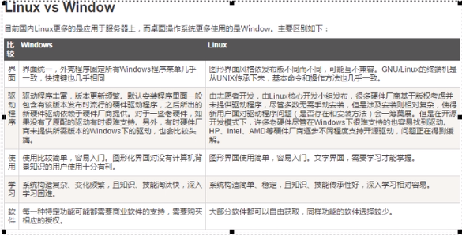

### 查看SSH服务

/etc/init.d/sshd

### 启动SSH

/etc/init.d/sshd start

### 运行级别

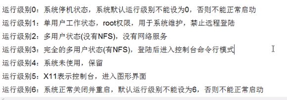

### 启动过程

1. 内核引导

   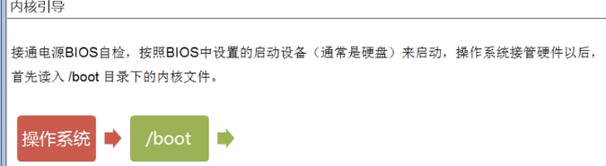

2. 运行init

   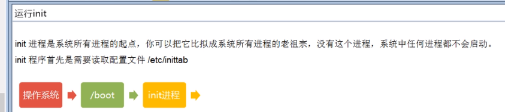

   RunLevel

   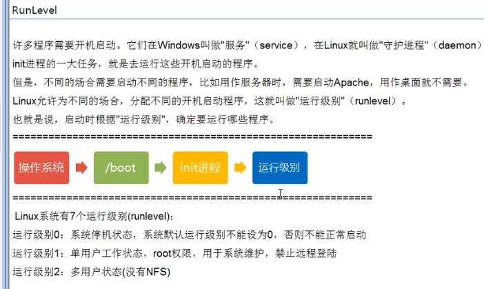

3.系统初始化

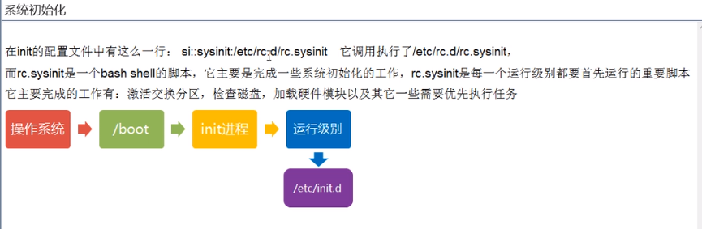

4.建立终端

5.用户登录系统

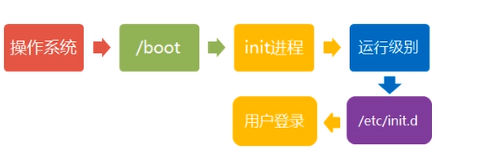

### 关机

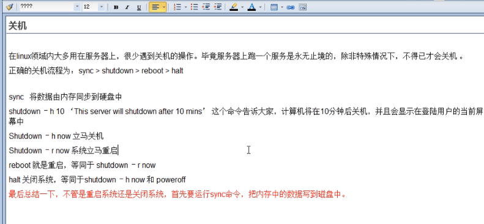

## 命令

### VI和VIM的三大模式

#### 1、一般模式

​	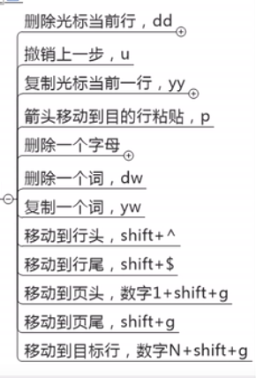

#### 2、编辑模式

​	i ：当前光标前

​	a：当前光标后

​	o：下一行

#### 3、指令模式

​		冒号

/:

?:

### 用户与用户组

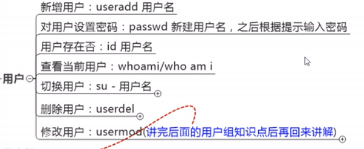

- [ ] 

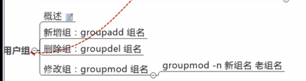

### 常用基本命令

#### 1、时间日期类

#### 2、文件目录类

##### ls

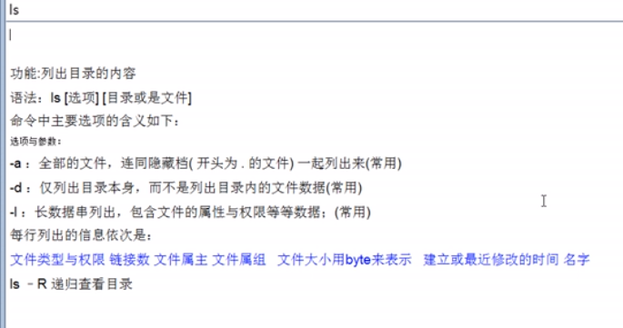

##### mkdir

-p 创建多级目录

##### rmdir

删除空文件目录

##### touch

创建文件

##### cd

切换目录

##### cp

复制

##### rm

-r 代表删除这个下面的一切

-f 表示不需要用户确认，直接执行 

##### mv

移动文件与目录或修改名称

##### cat

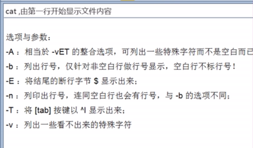

##### tac

与cat相反

##### more

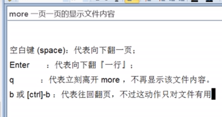

##### less

##### tail

看文件后几行 tail -n #文件

##### head

看文件头几行 head -n #文件

##### history

所敲命令历史

##### 重定向命令

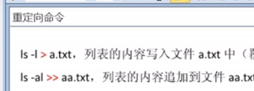

#### 3、文件权限类

#### 4、网络配置类

ifconfig

#### 5、磁盘分区类

##### fdisk -l

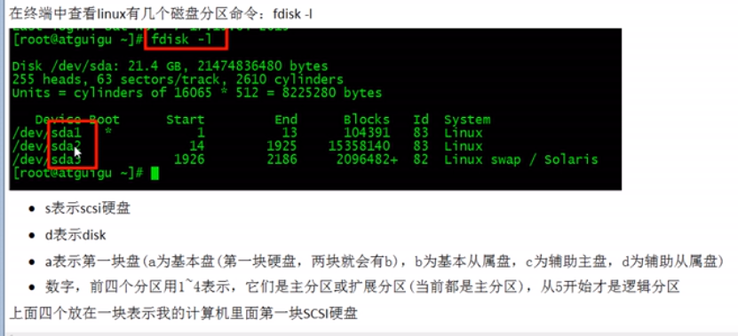

##### 挂载/卸载概念

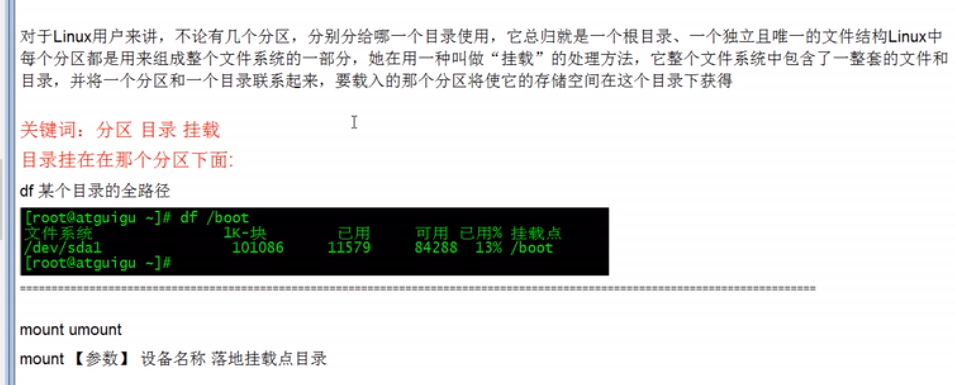

##### 磁盘

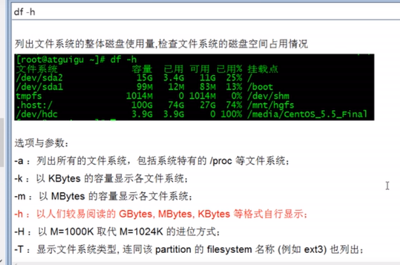

#### 6、搜索查找类

##### find

find #目录 -name #名字

##### grep

#### 7、进程和线程类

##### ps

ps -ef

ps -aux

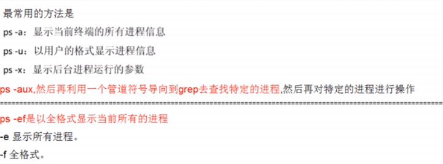

##### netstat

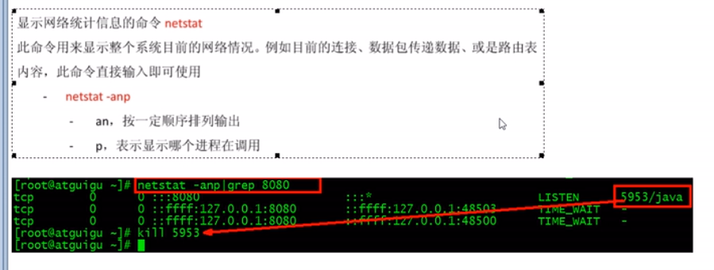

#### 8、压缩和解压类

##### 第一组（gzip+gunzip）

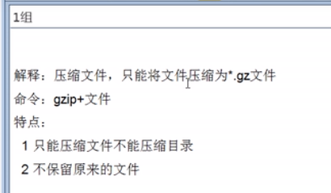

##### 第二组(最重要)

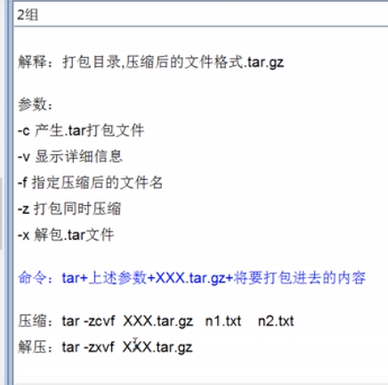

##### 第三组

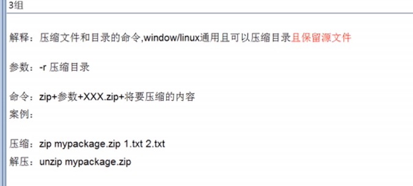

## Linux文件与目录结构

### 目录结构

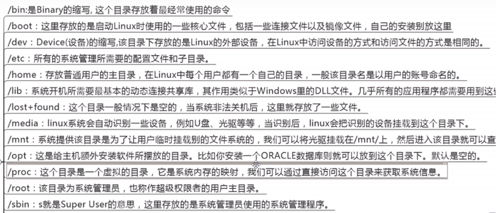

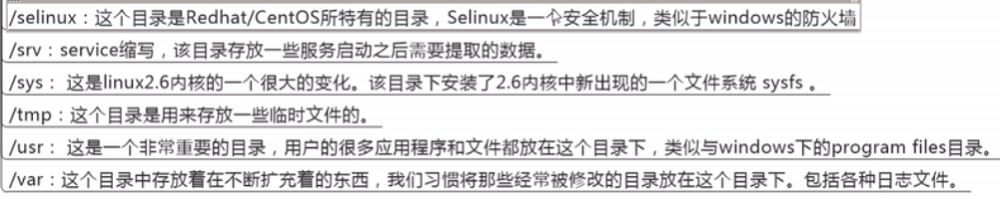

### 文件属性

#### 文件概述

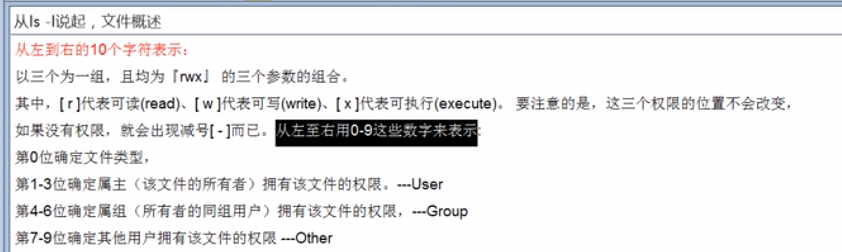

作用到文件或目录的区别

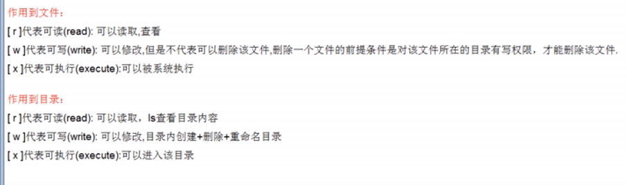

#### 0首位表示类型

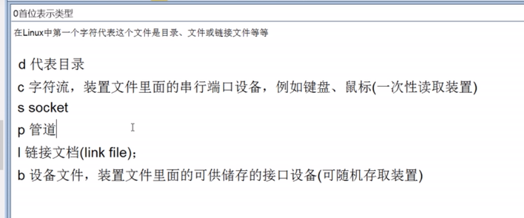

#### 文件详细说明

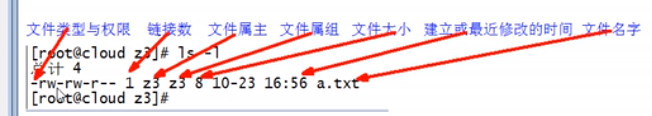

### 文件权限类

#### chmod

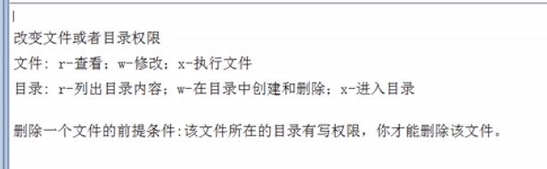

## RPM

### 是什么？

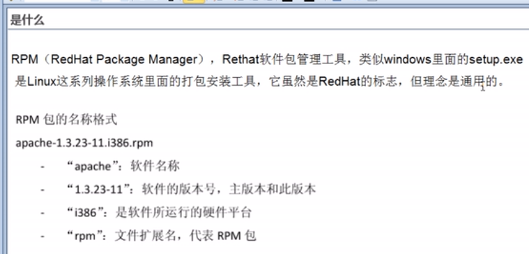

### 查询

rpm -qa: 查询所安装的所有rpm软件包 ex：rpm -qa|more；rpm-qa|grep X

rpm -q 软件包名：查询软件包是否安装

rpm -qi 软件包名：查询软件包信息

rpm -ql 软件包名：查询软件包中的文件

### 安装

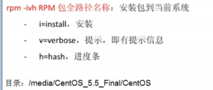

### 卸载

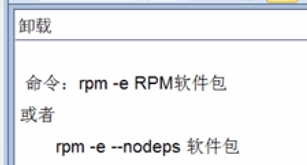

