# Redis

## Redis五大数据类型

String：基本类型，一个key对应一个value；二进制安全，可以包含任何数据，jpg图片或者序列化对象；一个redis中字符串value最多可以是512M

Hash：（类似于Java的Map）：是一个String类型的field和value的映射表，hash特别适合存储对象；类似于Map<String,Object>

List：Redis列表是简单的字符串列表，底层实际是个链表

Set：Set是String类型的无序集合，它是通过HashTable实现的

Zset（sorted set）：和Set不同的是每个元素都会关联一个double类型的分数。

## 获取常见命令

http://redisdoc.com

### Redis键（key）

常用：

1：keys * //查看所有key

2：exists key #名字 //判断某个key是否存在

3：move key #db //把当前key移动到某个数据库

4：expire key #秒钟 //为给定的key设置过期时间

5：ttl key //查看还有多少秒过期，-1表示永不过期，-2表示已过期

6：type key //查看你的key是什么类型

### Redis字符串（String）

单值单value

常用：

1：set/get/del/append/strlen   //设置/获得/删除/追加/获得长度

2：Incr/decr/incrby/decrby   //加1/减1/加X/减X   只能对数字进行操作

3：getrange/setrange  //getrange:获取指定区间范围的值,(0,-1)表示获取全部    

​											setrange:设置某位置的值

4：setex（set with expire）/setnx(set if not exist)  

5：mset/mget/msetnx //设置多个/获得多个

### Redis列表（List）

单值多value

常用

1：lpush/rpush/lrange   //压栈/反向压栈/获取范围内

2：lpop/rpop   //取栈顶、取栈底

3：lindex  //按照索引下标获得元素（从上到下）

4：llen  //获得长度

5：lrem key //删N个value

6：ltrim key 开始index 结束index //截取指定范围的值再赋给key

7：rpoplpush 源列表 目的列表

8：lset key index value //给下标设定值

9：linsert key before/after 值1 值2  //在值1前/后插入值2

### Redis集合（Set）

单值多value

1：sadd/smembers/sismember  //加入/查看/查看具体值是否存在

2：scard  //获取集合里面的元素个数

3：srem key value  //删除集合中元素

4：srandmember key  某个整数 //（随机出几个数）

5：spop key  //随机出栈

6：smove key1 key2 key1里的某个值  //将k1里的某个值赋给k2

7：数学集合类：差集：sdiff key1 key2       //在key1中存在而在key2中不存在

​							 交集：sinter key1 key2    //key1和key2都存在的值（交集）

​							 并集：sunion key1 key2  //key1和key2的并集

### Redis哈希（Hash）

key-value模式，但是value是一个键值对

常用

1：hset/hget/hmset/hmget/hgetall/hdel 

2：hlen 

3：hexist key  key中值 //判断key中某个值是否存在

4：hkeys/hvals   //获取所有key/获取所有value

5：hincrby/hincrbyfloat  //给对象的某个值递增

6：hsetnx  //某key不存在才设置

### Redis有序集合Zset（sorted set）

在set基础上，加一个score值。

1：zdd/zrange （withscores）

2：zrangebyscore key   开始score 结束score （带‘（’不包含 ）、（limit可截取）、（withscores）  //在score范围列出

3：zrem key 

4：zcard/zcount key score区间/zrank key values值/zscore key    //统计所有值个数/统计score区间内值/获取下标值/获得值的对应分数

5：zrevrank key values  //逆序获得下标值

6：zrevrange（与zrange取值相反）

7：zrevrangebyscore key (zrangebyscore相反)

## 解析配置文件

常见redis.conf的配置

redis.conf 配置项说明如下：
1. Redis默认不是以守护进程的方式运行，可以通过该配置项修改，使用yes启用守护进程
    daemonize no
2. 当Redis以守护进程方式运行时，Redis默认会把pid写入/var/run/redis.pid文件，可以通过pidfile指定
    pidfile /var/run/redis.pid
3. 指定Redis监听端口，默认端口为6379，作者在自己的一篇博文中解释了为什么选用6379作为默认端口，因为6379在手机按键上MERZ对应的号码，而MERZ取自意大利歌女Alessia Merz的名字
    port 6379
4. 绑定的主机地址
    bind 127.0.0.1
5. 当 客户端闲置多长时间后关闭连接，如果指定为0，表示关闭该功能
       timeout 300
6. 指定日志记录级别，Redis总共支持四个级别：debug、verbose、notice、warning，默认为verbose
     loglevel verbose
7. 日志记录方式，默认为标准输出，如果配置Redis为守护进程方式运行，而这里又配置为日志记录方式为标准输出，则日志将会发送给/dev/null
     logfile stdout
8. 设置数据库的数量，默认数据库为0，可以使用SELECT <dbid>命令在连接上指定数据库id
     databases 16
9. 指定在多长时间内，有多少次更新操作，就将数据同步到数据文件，可以多个条件配合
     save <seconds> <changes>
       Redis默认配置文件中提供了三个条件：
       save 900 1
       save 300 10
       save 60 10000
      分别表示900秒（15分钟）内有1个更改，300秒（5分钟）内有10个更改以及60秒内有10000个更改。
10. 指定存储至本地数据库时是否压缩数据，默认为yes，Redis采用LZF压缩，如果为了节省CPU时间，可以关闭该选项，但会导致数据库文件变的巨大
       rdbcompression yes
11. 指定本地数据库文件名，默认值为dump.rdb
        dbfilename dump.rdb
12. 指定本地数据库存放目录
        dir ./
13. 设置当本机为slav服务时，设置master服务的IP地址及端口，在Redis启动时，它会自动从master进行数据同步
        slaveof <masterip> <masterport>
14. 当master服务设置了密码保护时，slav服务连接master的密码
        masterauth <master-password>
15. 设置Redis连接密码，如果配置了连接密码，客户端在连接Redis时需要通过AUTH <password>命令提供密码，默认关闭
        requirepass foobared
16. 设置同一时间最大客户端连接数，默认无限制，Redis可以同时打开的客户端连接数为Redis进程可以打开的最大文件描述符数，如果设置 maxclients 0，表示不作限制。当客户端连接数到达限制时，Redis会关闭新的连接并向客户端返回max number of clients reached错误信息
        maxclients 128
17. 指定Redis最大内存限制，Redis在启动时会把数据加载到内存中，达到最大内存后，Redis会先尝试清除已到期或即将到期的Key，当此方法处理 后，仍然到达最大内存设置，将无法再进行写入操作，但仍然可以进行读取操作。Redis新的vm机制，会把Key存放内存，Value会存放在swap区
        maxmemory <bytes>
18. 指定是否在每次更新操作后进行日志记录，Redis在默认情况下是异步的把数据写入磁盘，如果不开启，可能会在断电时导致一段时间内的数据丢失。因为 redis本身同步数据文件是按上面save条件来同步的，所以有的数据会在一段时间内只存在于内存中。默认为no
        appendonly no
19. 指定更新日志文件名，默认为appendonly.aof
         appendfilename appendonly.aof
20. 指定更新日志条件，共有3个可选值： 
        no：表示等操作系统进行数据缓存同步到磁盘（快） 
        always：表示每次更新操作后手动调用fsync()将数据写到磁盘（慢，安全） 
        everysec：表示每秒同步一次（折衷，默认值）
        appendfsync everysec
21. 指定是否启用虚拟内存机制，默认值为no，简单的介绍一下，VM机制将数据分页存放，由Redis将访问量较少的页即冷数据swap到磁盘上，访问多的页面由磁盘自动换出到内存中（在后面的文章我会仔细分析Redis的VM机制）
         vm-enabled no
22. 虚拟内存文件路径，默认值为/tmp/redis.swap，不可多个Redis实例共享
         vm-swap-file /tmp/redis.swap
23. 将所有大于vm-max-memory的数据存入虚拟内存,无论vm-max-memory设置多小,所有索引数据都是内存存储的(Redis的索引数据 就是keys),也就是说,当vm-max-memory设置为0的时候,其实是所有value都存在于磁盘。默认值为0
         vm-max-memory 0
24. Redis swap文件分成了很多的page，一个对象可以保存在多个page上面，但一个page上不能被多个对象共享，vm-page-size是要根据存储的 数据大小来设定的，作者建议如果存储很多小对象，page大小最好设置为32或者64bytes；如果存储很大大对象，则可以使用更大的page，如果不 确定，就使用默认值
         vm-page-size 32
25. 设置swap文件中的page数量，由于页表（一种表示页面空闲或使用的bitmap）是在放在内存中的，，在磁盘上每8个pages将消耗1byte的内存。
         vm-pages 134217728
26. 设置访问swap文件的线程数,最好不要超过机器的核数,如果设置为0,那么所有对swap文件的操作都是串行的，可能会造成比较长时间的延迟。默认值为4
         vm-max-threads 4
27. 设置在向客户端应答时，是否把较小的包合并为一个包发送，默认为开启
        glueoutputbuf yes
28. 指定在超过一定的数量或者最大的元素超过某一临界值时，采用一种特殊的哈希算法
        hash-max-zipmap-entries 64
        hash-max-zipmap-value 512
29. 指定是否激活重置哈希，默认为开启（后面在介绍Redis的哈希算法时具体介绍）
        activerehashing yes
30. 指定包含其它的配置文件，可以在同一主机上多个Redis实例之间使用同一份配置文件，而同时各个实例又拥有自己的特定配置文件
        include /path/to/local.conf

## Redis持久化

### RDB（Redis DataBase）

#### 是什么？

在指定的时间间隔内将内存中的数据集快照写入磁盘，

也就是行话讲的Snapshot快照，它恢复时时将	快照文件直接读入内存里

Redis会单独创建（fork）一个子进程来进行持久化，会先将数据写入到一个临时文件中，待持久化过程都结束了，再用这个临时文件替换上次持久化好的文件。整个过程中，主进程是不进行任何IO操作的，这就确保了极高的性能如果需要进行大规模数据的恢复，且对于数据恢复的完整性不是非常敏感，那RDB方式要比AOF方式更加的高效。RDB的缺点是最后一次持久化后的数据可能丢失。

#### Fork

fork的作用是复制一个与当前进程一样的进程。新进程的所有数据（变量、环境变量、程序计数器等） 数值都和原进程一致，但是是一个全新的进程，并作为原进程的子进程

#### Rdb保存的是dump.rdb文件

#### 配置文件

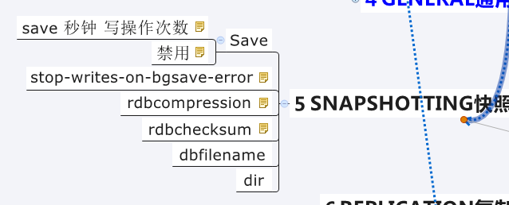

#### 何时保存RDB文件

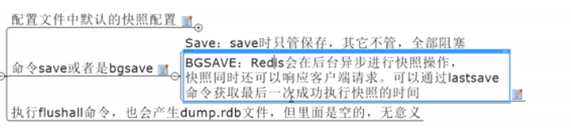

#### 小总结

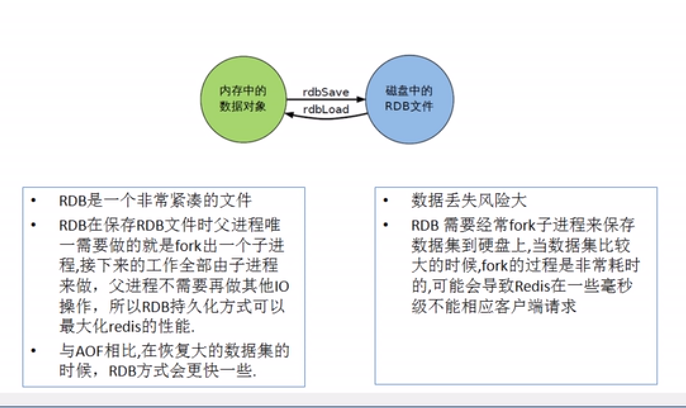

### AOF（Append Only File）

#### 是什么？

以日志的形式来记录每个写操作。

#### AOF保存的是append.aof文件

#### 配置文件

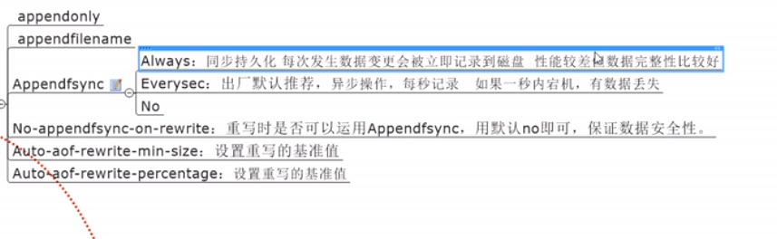

#### AOF启动/修复/恢复

正常恢复

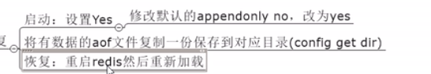

异常恢复

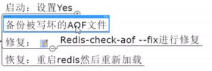

#### Rewrite

AOF采用文件追加方式，文件会越来越大，为避免出现此种情况，新增了重写机制，当AOF文件的大小超过所设定的阈值时，Redis就会启动AOF文件的内容压缩，只保留可以恢复数据的最小指令集，可以使用命令bgrewriteaof

重写原理：

触发机制：

Redis会记录上次重写时AOF大小，默认配置是当AOF文件大小是上次rewrite后大小的一倍且文件大于64M时触发

#### 优势

1、每秒同步

2、每修改同步

3、不同步

#### 劣势

相同数据集的数据而言aof文件要远大于rdb文件，恢复速度慢

aof运行效率要马奴役rdb，每秒同步策略效果较好，不同步效率和rdb效果相同

#### 小总结

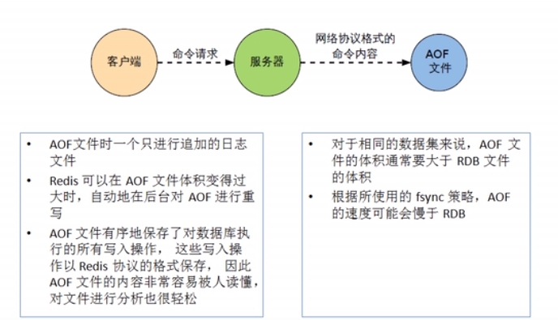

### 两种模式总结

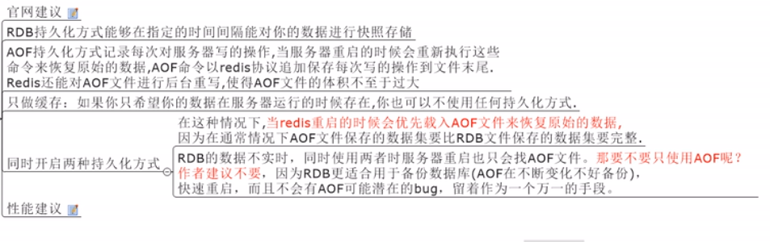

## Redis的事务

### 是什么？

可以一次执行多个命令，本质是一组命令的集合。一个事务中的所有命令都会序列化，按顺序地串行化执行而不会被其它命令插入，不许加塞

### 能干嘛

一个队列中，一次性、顺序性、排他性的执行一系列命令

### 怎么玩？

常用命令

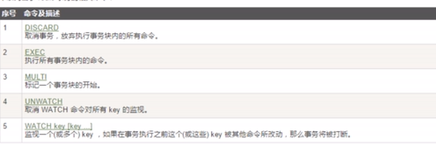

Case1：正常执行

Case2：放弃事务

Case3：全体连坐

Case4：冤头债主

Case5：watch监控

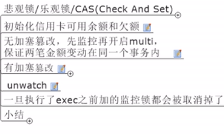

#### 小结

### 三阶段

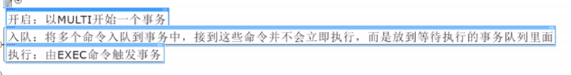

### 三特性

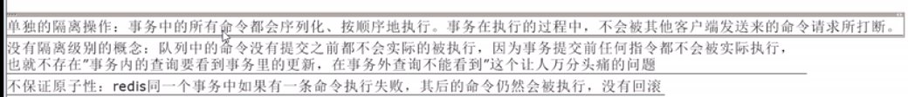

## Redis的复制（Master/Slave）

### 是什么

主从复制，主机数据更新后根据配置和策略，自动同步到备机的master/slaver机制，Master以写为主，Slave以读为主

### 能干嘛

读写分离

容灾恢复

### 怎么玩

1、配从（库）不配主（库）

2、从库配置：slaveof 主库IP 主库端口

​		1：每次与master断开之后，都需要重新连接，除非配置进redis.conf文件

​		2：Info replication

3、修改配置文件细节操作

​		1：拷贝多个redis.conf文件

​		2：开启daemonize yes

​		3：Pid文件名字

​		4：指定端口

​		5：Log文件名字

​		6：Dump.rbd名字

4、常用三招

​		1：一主二仆

​		2：薪火相传

​		3：反客为主

### 复制原理

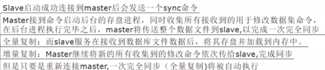

### 哨兵模式（sentinel）

