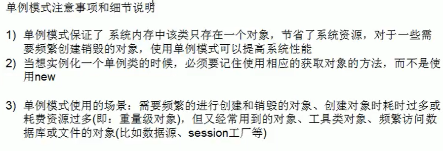
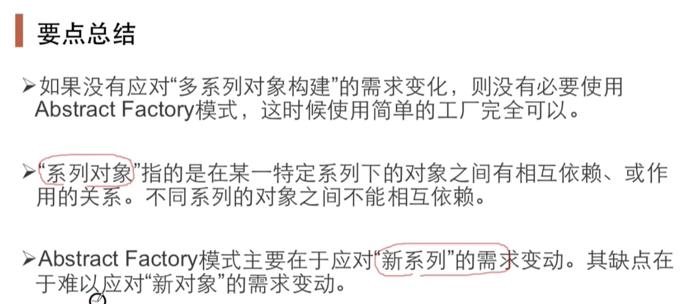
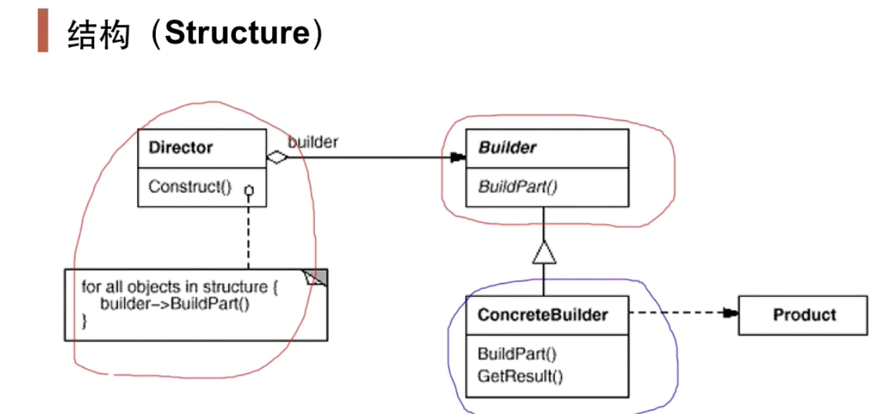
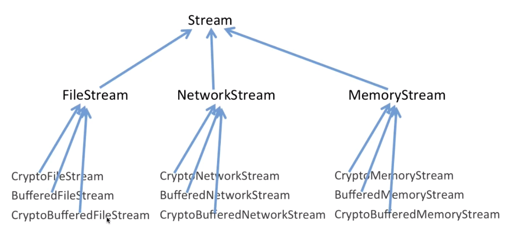
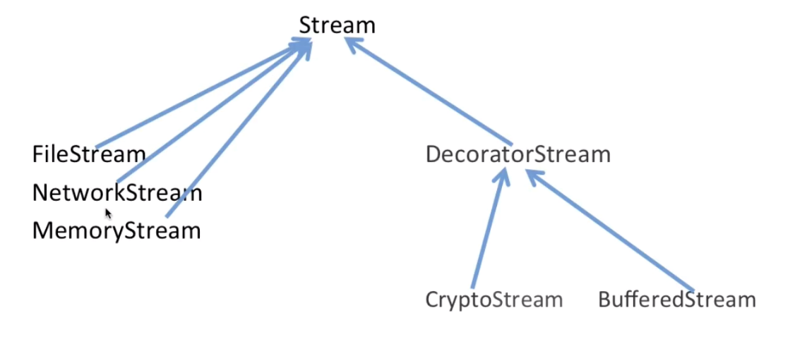
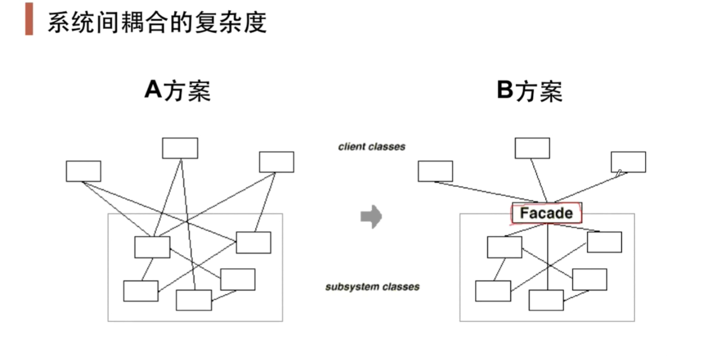

# Java设计模式

目的：代码重用性、可读性、可扩展性、可靠性、使程序呈现高内聚，低耦合的特点。

## 七大设计原则

### 单一职责

**一个类应该只负责一项职责**

1、降低类的复杂度，一个类只负责一项职责。

2、提高类的可读性，可维护性

3、降低变更引起的风险

4、通常情况下，我们应当遵守**单一职责原则**，只有逻辑足够简单，才可以在代码级别违反单一职责原则，只有类中方法数量足够少，可以在方法级别保持单一职责原则。

### 接口隔离

客户端不应该依赖它不需要的接口，即一个类对另一个类的依赖应该建立在最小的接口上。

### 依赖倒置

1、高层模块不应该依赖底层模块，二者都应该依赖其抽象

2、抽象不应该依赖细节，细节应该依赖细节

3、依赖倒置的中心思想是面向接口变成

4、基于这样的设计理念：相对于细节的多变性，抽象的东西要稳定的多。以抽象为基础搭建的架构比以细节为基础搭建的架构要稳定的多。在java中，抽象指的是接口或抽象类，细节就是具体的实现类

5、使用接口或抽象类的目的是制定好的规范，而不涉及任何具体的操作，把展现细节的任务交给他们的实现类去完成。

依赖关系传递的三种方式

1、接口传递            2、构造方法传递            3、setter方式传递

### 里氏替换

任何基类可以出现的地方，子类一定可以出现

在使用继承时，子类中尽量不要重写父类的方法。

若子类无意重写了父类方法，出现错误，改性方案通用的做法是使原来的父类和子类都继承一个更通俗的基类。

### 开闭原则

1、开闭原则是编程中最基础、最重要的设计原则

2、一个软件实体如类，模块和函数应该对扩展开放，对修改关闭。用抽象构建框架，用实现扩展细节。

3、当软件需要变化时，尽量通过扩展软件实体的行为来实现变化，而不是通过修改已有的代码来实现变化。

4、编程中遵循其它原则， 以及使用设计模式的目的就是遵循**开闭原则**

### 迪米特法则

1、一个对象应该对其他对象保持最少的了解

2、类与类关系越密切，耦合度越大

3、迪米特法则又叫最少知道法则，即一个类对自己依赖的类知道的越少越好

4、迪米特法则还有个更简单的定义：只与**直接的朋友通信**

迪米特法则的核心是降低类之间的耦合，但是注意，由于每个类都减少了不必要的依赖，因此迪米特法则只是要求降低类间（对象间）耦合关系，并不是要求完全没有依赖关系

### 合成复用原则

原则是尽量使用合成/聚合的方式，而不是使用继承

## 设计原则核心思想

1、找出应用中可能需要变化之处，把他们独立出来，不要和那些不需要变化的代码混在一起。

2、针对接口编程，而不是针对实现编程

3、为了交互对象之间的松耦合设计而努力

## UML基本介绍

UML（统一建模语言）是一种用于软件系统分析和设计的语言工具。


UML分类

1、例图    2、静态结构图：**类图**，对象图、包图、组件图、部署图  3、动态行为图

说明：类图是描述类与类之间的关系的，是UML图中最核心的


### 类图介绍

类图用于描述系统中的类（对象）本身的组成和类（对象）之间的各种静态关系，主要有依赖，泛化（继承）、实现、关联、聚合与组合。

#### 依赖关系

只要是在类中用到了对方，那么他们之间就存在依赖关系，如果没有对方，连编译都通过不了

1、类中用到了对方  2、如果是类的成员属性  3、如果是方法的返回类型   4、是方法接收的参数类型   5、方法中使用到

#### 泛化关系

泛化关系实际就是继承关系，它是依赖关系的特例

#### 实现关系

A类实现B类，即存在实现关系，也是依赖关系的特例

#### 关联关系

就是类与类之间的联系，也是依赖关系的特例。关联具有导航性，即双向关系或单向关系。

#### 聚合关系

聚合关系表示的是整体和部分的关系，整体与部分可以分开。聚合关系是关联关系的特例。通常通过setter方法

#### 组合关系

组合关系也是整体和部分的关系，但是整体和部分不可分开。

## 重构关键技法

静态->动态，早绑定->晚绑定，继承->组合，编译时依赖->运行时依赖，紧耦合->松耦合

## 设计模式分类

### 传统分类

1、创建型模式：单例模式、抽象工厂模式、原型模式、建造者模式、工厂模式

2、结构型模式：适配器模式、桥接模式、装饰者模式、组合模式、外观模式、享元模式、代理模式

3、行为型模式：模板方法模式、命令模式、访问者模式、迭代器模式、观察者模式、中介者模式、备忘录模式、解释器模式、状态模式、策略模式、职责链模式

### 其它分类

“组建协作模式”：模板方法、策略模式、观察者模式

### “对象性能”模式

#### 单例模式

动机：在软件系统中，经常有这样一些特殊的类，必须保证它们在系统中只存在一个实例，才能确保它们的逻辑正确性、以及良好的效率。

应该是类的设计者的责任，而不是使用者的责任

模式定义：

保证一个类仅有一个实例，并提供一个该实例的全局访问点。

**1）饿汉式（静态常量）**

类装载时完成实例化，避免线程同步问题，易造成内存浪费。

**2）饿汉式（静态代码块）**

优缺点与上面一样

**3）懒汉式（线程不安全）**

线程不安全

4）懒汉式（线程安全，同步方法）

效率低，每个线程获得实例都需要进行同步

5）懒汉式（线程安全，同步代码块）

实际上并不能解决线程安全问题

**6）双重检查**

完美解决上述问题

**7）静态内部类**

类加载时不会初始化，需要实例化时，调用getInstance方法，才会装载到该类，完成实例化

**8）枚举**

推荐使用



#### 享元模式

动机：

1、在软件系统采用纯粹的对象方案的问题在于大量细粒度的对象会很快充斥在系统中，从而带来很高的运行时代价-主要指内存需求方面的代价

2、如何在避免大量细粒度对象问题的同时，让外部客户程序仍然能够透明地使用面向对象的方式进行操作

模式：利用共享技术有效地支持大量细粒度的对象。

要点总结：

1、面向对象很好地解决了抽象性的问题，但是作为一个运行在机器中的程序实体，我们需要考虑对象的代价问题。FlyWeight主要解决面向对象的代价问题，一般不涉及面向对象的抽象性问题

2、FlyWeight采用对象共享的做法来降低系统中对象的个数，从而降低细粒度对象给系统带来的内存压力。

### “对象创建“模式

通过“对象创建”模式绕开new，来避免对象创建（new）过程中所导致的紧耦合（依赖具体类），从而支持对象创建的稳定。它是接口抽象之后的第一步工作

典型：

Factory Method

Abstract Factory

Prototype

Builder

#### 工厂设计模式

简单工厂模式是由一个工厂对象决定出创建出哪一种产品的实例，封装了实例化对象的行为。

工厂方法模式将对象的实例化推迟到子类。

工厂方法：

让需要工厂的类不再依赖具体的工厂，而是工厂的接口，具体的工厂延迟到运行时才知道，而不是编译时指定。

定义一个用于创建对象的接口，即工厂的接口，让子类来决定实例化哪个类，（通过构造函数或者set指定均可）工厂方法使得一个类的实例化延迟。

抽象工厂模式：动机是为了实现一系列相互依赖的对象的创建工作。即提供一个接口，让该接口负责创建以系列”相关或者相互依赖的对象“，无需指定他们具体的类。

提供一个接口，让该接口负责创建一系列“相关或者相互依赖的对象”，无需指定它们具体的类

抽象工厂模式要点总结：



#### 原型模式

动机：

在软件系统中，经常面临着“某些结构复杂的对象”的创建工作，由于需求的变化，这些对象经常面临着剧烈的变化，但是它们缺拥有比较一致的接口。

创建具有相同属性的对象，传统方法较好理解，简单易操作，但是创建对象总是需要重新获取原始对象属性，效率低，总是需要初始化对象，而不是动态地获得对象运行时状态，不够灵活。

改进思路：Object有clone()方法，实现clone的Java类需实现一个接口Cloneable，表示该类能够复制且具有复制的能力=》原型模式

使用原型实例指定创建对象的种类，然后通过拷贝这些原型来创建新的对象。允许一个对象再创建另一个可定制的对象，无需知道细节。工作原理是将一个原型对象传给那个要发动创建的类，这个要发动创建的类通过请求原型对象拷贝它们自己来实施创建。即对象.clone()

Spring中原型bean的创建，就是原型模式的运用

浅拷贝：默认的clone方法进行浅拷贝，对数据类型是引用的类型直接传递其引用值，而不会新创建一个引用对象。

深拷贝：对数据类型是引用的类型也要进行拷贝，实现方式主要有重写clone方法或通过对象的序列化来实现。

缺点是需要给每一个类配备一个克隆方法，这对全新的类来说不是很难，但对已有的类进行改造时，需要修改其源码，违背了ocp原则。

要点总结：

1、Prototype模式同样用于隔离类对象的使用者和具体类型（易变类）之间的耦合关系，它同样要求这些易变类具有稳定的接口

2、Prototype模式对于“如何创建易变类的实体对象”采用“原型克隆”的方法来做，它使得我们可以非常灵活地动态创建“拥有某些稳定接口”的新对象——所需工作仅仅是注册一个新类的对象（即原型），然后在任何需要的地方clone

3、Prototype模式中的Clone方法可以通过利用某些框架的序列化与反序列化来实现深拷贝

#### 建造者模式

动机：

在软件系统中，有时候面临着“一个复杂对象”的创建工作，其通常由各个部分的子对象用一定的算法构成，由于需求的变化，这个复杂对象的各个部分经常面临着剧烈的变化，但是将它们组合在一起的算法却相对稳定。

模式定义：

将一个复杂对象的构建与其表示相分离，使得同样构建过程（稳定）可以创建不同的表示（变化）。

普通方法将产品和创建产品的过程封装在一起，耦合性较强。

改进思路：将产品和产品的建造过程解耦=》建造者模式

将对象的表示和构建相分离，使得同样的构建过程可以创建不同的表示



要点总结：

1、Build模式主要用于“分步骤构建一个复杂的对象”。在这其中“分步骤”是一个稳定的算法，而复杂对象的各个部分则经常变化

2、变化点在哪里，封装哪里-Builder模式主要在于应对“复杂对象”各个部分的频繁需求变动，其缺点在于难以应对“分步骤构建算法”的需求变动

#### 抽象工厂模式对比建造者模式

抽象工厂模式实现对产品家族的创建，一个产品家族是这样的一系列产品：具有不同分类维度的产品组合，采用抽象工厂模式不需要关心构建过程，只关心什么产品由什么工厂生产即可，而建造者模式是要求按照指定的蓝图构造产品，它的主要目的是通过组装零配件而生产一个新产品。

### ”单一职责“模式

#### 装饰者模式

动机：

在某些情况下过度的使用继承来扩展对象的功能，由于继承为类型引入静态特质，使得这种扩展方式缺乏灵活性，随着子类增多，各种子类的组合使得代码规模极具膨胀

模式的定义：

动态（组合）的给一个对象增加一些额外的职责，就增加功能而言，装饰者模式比生成子类更为灵活



动态地将新功能附加到对象上。一个类既继承被装饰类，被装饰类又作为其属性。

~~~java
public class CyptoStream extends Stream{
    Stream stream;
    //运行时动态装配，编译时并不能知道具体的stream
    public CyptoStream(Stream stream){
        this.stream=stream;
    }
    
    public char read(){
        //额外操作
        stream.read();
    }
    public char write(){
        //额外操作
        stream.write();
    }
} 
~~~



所有具体增强的类在编译时并不能被确定，而是在运行时动态确定的，增强属性是一个抽象，继承了被增强类，同时含有被增强类的属性。

自己理解：继承了被装饰类，自身有装饰类属性，通过覆盖有意义的方法对其进行增强。即增强了被装饰类，使代码重用。

要点总结：

1、采用组合而非继承的手法，Decorator模式实现了在运行时动态扩展对象功能的能力，而且可以根据需要扩展多个功能。

2、Decorator在接口上表现为is-a Component的继承关系，即Decorator类继承了Component类所具有的接口，但在实际上又表现为has a Component的组合关系，即Decorator类又使用了另外一个Component类

#### 桥模式

动机：

由于某些类型的固有的实现逻辑，使得它们具有两个变化的维度乃至多个维度的变化

模式定义：

将抽象部分（业务功能）与实现部分（平台实现）分离，使它们都可以独立地变化。

要点总结：

1、Bridge模式使用“对象间的组合关系”解耦了抽象和实现之间固有的绑定关系，使得抽象和实现可以沿着各自的维度来变化。所谓抽象和实现沿着各自维度的变化，即“子类化”它们。

2、Bridge模式有时候类似于多继承方案，但是多继承方案往往违背单一职责原则（即一个类只有一个变化的原因），复用性比较差，Bridge模式是比多继承方案更好的解决方法

3、Bridge模式的应用一般在“两个非常强的变化维度”，有时一个类也有多于两个的变化维度，这时可以使用Bridge的扩展模式

### ”接口隔离“模式

在组件构建过程中，某些接口之间直接的依赖常常会带来很多问题、甚至根本无法实现。采用添加一层间接（稳定）接口，来隔离本来互相紧密关联的接口是一种常见的解决方案。

典型模式：

Facade（门面模式）

Proxy（代理模式）

Adapter（适配器模式）

Mediator（中介者模式）

#### 门面模式



要点总结：

从客户程序的角度来看，Facade模式简化了整个组件系统的接口，对于组件内部与外部客户程序来说，达到了一种”解耦“的效果，内部子系统的任何变化不会影响到Facade接口的变化

Facade设计模式更注重从架构的层次去看整个系统，而不是单个类的层次，Facade很多时候更是一种架构设计模式

Facade设计模式并非一个集装箱，可以任意地放进任何多个对象，Facade模式中的组件的内部应该是”相互耦合关系比较大的一系列组件“，而不是一个简单的功能集合。

#### 代理模式

为一个对象提供一个替身，以控制对这个对象的访问。即通过代理对象访问目标对象。这样做的好处是：可以在目标对象实现的基础上，增强额外的功能操作，即扩展目标对象的功能。

被代理的对象可以是远程对象、创建开销大的对象或需要安全控制的对象。

主要有三类：静态代理，动态代理，cglib代理（在内存动态的创建代理，而不需要实现接口）

##### 静态代理

静态代理在使用时，需要定义接口或者父类，被代理对象（即目标对象）与代理对象一起实现相同的接口或者是继承相同父类。

优点：在不修改目标对象的功能前提下，能通过代理对象对目标功能的扩展

缺点：因为代理对象需要与目标对象实现一样的接口，所以会有很多代理类，一旦接口增加方法，需要维护。

##### 动态代理

在运行时，动态创建一组指定的接口的实现类对象（在运行时，创建了实现了指定的一组接口的对象）

代理对象不需要实现接口，但是目标对象要实现接口，否则不能代理，代理对象的生成是利用JDK的API，动态的在内存中构建代理对象。

```java
        /**
         * 1:classLoader 用于加载生成的代理对象到方法区
         * 2:interfaces 要让代理对象实现的接口
         * 3:invocationHandler 调用处理器,代理对象调用任何方法都会调用其invoke方法
         */
Proxy.newProxyInstance(ClassLoader classloader,Class<?>[] interfaces,InvocationHandler h)
```

##### Cglib代理

即使目标对象没有实现相应接口，也可以进行代理

#### 适配器模式

动机：在软件系统中，由于应用环境的变化，常常需要将”一些现存的对象“放在新的环境中应用，但是新环境要求的接口是这些现存对象所不满足的。

模式定义：将一个类的接口转换为客户希望的另一个接口。Adapter模式使得原来由于接口不兼容而不能一起工作的那些类可以一起工作。

将某个类的接口转换成客户端期望的另一个接口表示，主要目的是兼容性，让原本因接口不匹配不能一起工作的两个类可以协同工作，别名为包装器（wrapper），主要分为：类适配器，对象适配器，接口适配器。

**对象适配器**：持有被适配器的类而不继承，实现dst类接口。

接口适配器：用一个抽象类实现接口全部方法，空实现，子类选择性覆盖。

要点总结：

Adapter模式主要应用于”希望复用一些现存的类，但是接口又与复用环境要求不一致的情况“，在遗留代码复用、类库迁移等方面非常有用

#### 中介者模式

动机：在软件构建过程中，经常会出现多个对象互相关联交互的情况，对象之间常常会维持一种复杂的引用关系，如果遇到一些需求的更改，这种直接的引用关系将面临不断的变化。

用一个中介对象来封装（封装变化）一系列的对象交互。中介者使各个对象不需要显示的相互引用（编译时依赖->运行时依赖），从而使其耦合松散（管理变化），而且可以独立地改变它们之间的交互。

要点总结：

1、将多个对象间复杂的关联关系解耦，Mediator模式将多个对象间的控制逻辑进行集中管理，变”多个对象互相关联“为”多个对象和一个中介者关联“，简化了系统的维护，抵御了可能的变化。

2、随着控制逻辑的复杂化，Mediator具体对象的实现可能相当复杂。这时候可以对Mediator对象进行分解处理。

3、Facade模式是解耦系统间（单向）的对象关联关系；Mediator模式是解耦系统内各个对象之间（双向）的关联关系。

### 组合模式

创建了对象组的树形结构，将对象组合成树状结构以表示“整体部分”的层次关系

解决这样的问题：当我们要处理的对象可以生成一颗树形结构，而我们要对树上的节点和叶子节点进行操作时，它能够提供一致的方式，而不用考虑它是节点还是叶子节点

### “组建协作”模式

#### 模板模式

定义一个操作中的**算法骨架（稳定）**，而将一些步骤延迟延迟到子类中。Template Method使得子类可以不改变（复用）一个算法的结构即可重定义该算法的某些特定步骤。

#### 策略模式

定义一系列算法，把它们一个个封装起来，并且使它们可互相替换。该模式使得算法可独立于使用它的客户程序而变化。（扩展、子类化）

要点总结：

Strategy及其子类为组件提供了一系列可重用的算法，从而可以使得类型在运行时方便地根据需要在各个算法之间进行切换

Strategy模式提供了用条件判断语句以外的另一种选择，消除判断语句，就是在解耦合。含有许多条件判断语句的代码通常都需要Strategy模式。（如果判断语句情况一定不变，可以不优化）

如果Strategy对象没有实例变量，那么各个上下文可以共享同一个Strategy对象，从而节省对象开销。

#### 观察者模式

定义对象间的一种一对多（变化）的依赖关系，以便当一个对象的状态发生改变时，所有依赖它的对象都得到通知并自动更新

要点总结：

使用面向对象的抽象，Observer模式使得我们可以独立地改变目标与观察者，从而使二者之间的依赖关系达到松耦合

目标发送通知时，无需制定观察者，通知会自动传播

观察者自己决定是否需要订阅通知，目标对象对此一无所知

观察者模式是基于事件的UI框架中非常常用的设计模式，也是MVC模式的一个重要组成部分

### "状态变化"模式

在组件构建过程中，某些对象的状态经常面临变化，如何对这些变化进行有效管理？同时又维持高层模块的稳定？“状态变化”模式为这一问题提供了一种解决方案

#### 状态模式

动机：

在软件构建过程中，某些对象的状态如果改变，其行为也会随之而发生变化，比如文档处于只读状态，其支持的行为和读写状态支持的行为就可能完全不同

模式定义：

允许一个对象在其内部状态改变时改变它的行为。从而使对象看起来似乎修改了其行为。

要点总结：

1、State模式将所有与一个特定状态相关的行为都放入一个State的子类对象中，在对象状态切换时，切换相应的对象；但同时维持State接口，这样实现了具体操作与状态转换之间的解耦。

2、为不同的状态引入不同的对象使得状态转换变得更加明确，而且可以保证不会出现状态不一致的情况，因为转换是原子性的-即要么彻底转换过来，要么不转换。

3、如果State对象没有实例变量，那么各个上下文可以共享同一个State对象，从而节省对象开销。

它主要用来解决对象在多种状态转换时，需要对外输出不同的行为的问题，状态和行为是一一对应的，状态之间可以相互转换

当一个对象的内在状态改变时，允许改变其行为，这个对象看起来像是改变了其类

#### 备忘录设计模式

动机：在软件构建过程中，某些对象的状态在转换过程中，可能由于某种需要，要求程序能够回溯到对象之前处于某个点时的状态。如果使用一些公共接口来让其他对象得到对象的状态，便会暴露对象的细节实现。

模式定义：

在不破坏封装性的前提下，捕获一个对象的内部状态，并在该对象之外保存这个状态。这样以后就可以将该对象恢复到原先保存的状态。

要点总结：

1、备忘录存储原发器（Originator）对象的内部状态，在需要时恢复原发器状态

2、Memento模式的核心是信息隐藏，即Originator需要向外隐藏信息，保持其封装性。但同时又需要将状态保持到外界（Memento）

### 职责链模式

1）职责链模式又叫责任链模式，为请求创建了一个接收者对象的链，这种模式对请求的发送者和接收者进行解耦

2）职责链模式通常每个接收者都包含对另一个接收者的引用。如过一个对象不能处理该请求，那么它会把相同的请求传给下一个接收者，依此类推

3）行为型模式

