#  JUC多线程及高并发

## 谈谈对volatile的理解

### volatile是java虚拟机提供的轻量级同步机制

​		保证可见性、不保证原子性、禁止指令重排

### 谈谈JMM（Java内存模型）

#### 可见性

​		JMM本身是一种抽象的概念**并不真实存在**，它描述的是一组规则或规范，通过这组规范定义了程序中各个变量（包括实例字段，静态字段和构成数组对象的元素）的访问方式。

​		JMM关于同步的规定：

​		1：线程解锁前，必须把共享变量的值刷新回主内存

​		2：线程加锁前，必须读取主内存的最新值到自己的工作内存

​		3：加锁解锁是同一把锁

​		由于JVM运行程序的实体是线程，而每个线程创建时JVM都会为其创建一个工作内存（有些地方称为栈空间），工作内存是每个线程的私有数据区域，而Java内存模型中规定**所有的变量都存储在主内存**，主内存是共享内存区域，所有线程都可以访问，但线程对变量的操作（读取赋值等）必须在工作内存中进行，**首先要将变量从主内存拷贝到自己的工作内存空间，然后对变量进行操作，操作完成后再将变量写回主内存，**不能直接操作主内存中的变量，各个线程中的工作内存中存储着主内存中的**变量副本拷贝**，因此不同的线程间无法访问对方的工作内存，线程间的通信(传值)必须通过主内存来完成，简要访问过程如下图：


~~~java
class MyData{
    volatile int number=0;
    public void addT060(){
        this.number=60;
    }
}
public class VolatileDemo {
    //可见性
    public static void main(String[] args) {
        MyData myData=new MyData();
        new Thread(()->{
            System.out.println(Thread.currentThread().getName()+"\t come in");
            try{ TimeUnit.SECONDS.sleep(3);} catch(InterruptedException e){e.printStackTrace();}
            myData.addT060();
            System.out.println(Thread.currentThread().getName()+"\t update number value: "+myData.number);
        },"aaa").start();
        while(myData.number==0){}
        System.out.println(Thread.currentThread().getName()+"\t mission is over");
    }
}
~~~


#### 原子性

线程对变量操作完成后尚未写入内存被挂起切换线程。

**volatile不保证原子性**

~~~java
class MyData{
    volatile int number=0;
    public void addT060(){
        this.number=60;
    }
    public void addPlusPlus(){
        number++;
    }
}
public class VolatileDemo {
    public static void main(String[] args) {
        MyData myData = new MyData();
        for(int i=0;i<20;i++){
            new Thread(()->{
                for(int j=0;j<1000;j++)
                myData.addPlusPlus();
            }).start();
        }
        while(Thread.activeCount()>2) Thread.yield();
        System.out.println(myData.number);
}
~~~

可使用sync（重量级锁）和AtomicInteger类来保证原子性

#### 有序性


​	多线程环境中，由于编译器优化重排的存在，两个线程中使用的变量能否保证一致性是无法确定的，结果无法预测

volatile实现**禁止指令重排优化**，从而避免多线程环境下程序出现乱序执行的现象。


#### 线程安全获得保证

可以使用synchronized或volatile关键字解决

### 哪些地方用到过volatile

#### 单例模式DCL代码


```java
public class SingletonDemo {

    private static volatile SingletonDemo instance = null;
	private SingletonDemo(){}
    //DCL(双端检索机制）
    public static SingletonDemo getInstance() {
//        if(instance==null) instance=new SingletonDemo();
//        return instance;
        if (instance == null) {
            synchronized (SingletonDemo.class) {
                if (instance == null) {
                    instance = new SingletonDemo();
                }
            }
        }
        return instance;
    }
}
```

## CAS（Compare and Swap）

比较并交换

~~~java
/**
 * CAS(compare and set)
 */
public class CASDemo {
    public static void main(String[] args) {
        AtomicInteger atomicInteger=new AtomicInteger(5);
        System.out.println(atomicInteger.compareAndSet(5, 20192)+"\t current data:"+atomicInteger.get());
        System.out.println(atomicInteger.compareAndSet(5, 20191)+"\t current data:"+atomicInteger.get());
    }
}
~~~

### 底层原理（讲讲unsafe类）


Unsafe类中所有方法都是native修饰的，因此Unsafe类中的方法都直接调用操作系统底层资源执行相应任务。

~~~java
public class AtomicInteger extends Number implements java.io.Serializable {
    private static final long serialVersionUID = 6214790243416807050L;

    // setup to use Unsafe.compareAndSwapInt for updates
    private static final Unsafe unsafe = Unsafe.getUnsafe();
    private static final long valueOffset;

    static {
        try {
            valueOffset = unsafe.objectFieldOffset
                (AtomicInteger.class.getDeclaredField("value"));
        } catch (Exception ex) { throw new Error(ex); }
    }

    private volatile int value;
~~~


### CAS缺点

循环时间长，开销大

只能保证一个共享变量的原子操作

“ABA问题”


~~~java
//ABA问题代码
public class ABADemo {
    static AtomicReference<Integer> atomicReference=new AtomicReference<>(100);
    public static void main(String[] args) {
        new Thread(()->{
            atomicReference.compareAndSet(100,101);
            atomicReference.compareAndSet(101,100);
        },"t1").start();
        new Thread(()->{
            try{
                TimeUnit.SECONDS.sleep(1);} catch(InterruptedException e){e.printStackTrace();}
                System.out.println(atomicReference.compareAndSet(100, 2019)+"\t atomicReference: "+atomicReference.get());
        },"t2").start();
    }
~~~

AtomicStampReference<v>解决

~~~java

static AtomicStampedReference<Integer> atomicStampedReference=new
    AtomicStampedReference<>(100,1);
public static void main(String[] args){
new Thread(()->{
            int stamp=atomicStampedReference.getStamp();
            System.out.println(Thread.currentThread().getName()+"\t 第一次版本号"+stamp);
            try{TimeUnit.SECONDS.sleep(1);} catch(InterruptedException e){e.printStackTrace();}
            atomicStampedReference.compareAndSet(100,101,atomicStampedReference.getStamp(),atomicStampedReference.getStamp()+1);
            atomicStampedReference.compareAndSet(101,102,atomicStampedReference.getStamp(),atomicStampedReference.getStamp()+1);
        },"t3").start();
        new Thread(()->{
            int stamp=atomicStampedReference.getStamp();
            System.out.println(Thread.currentThread().getName()+"\t 第一次版本号"+stamp);
            try{TimeUnit.SECONDS.sleep(3);} catch(InterruptedException e){e.printStackTrace();}
            System.out.println(atomicStampedReference.compareAndSet(100, 2019, stamp, stamp + 1));
        },"t4").start();
}
~~~

## 集合类不安全问题（JUC有)

## JAVA锁

公平锁和非公平锁


# JVM及GC

JVM体系结构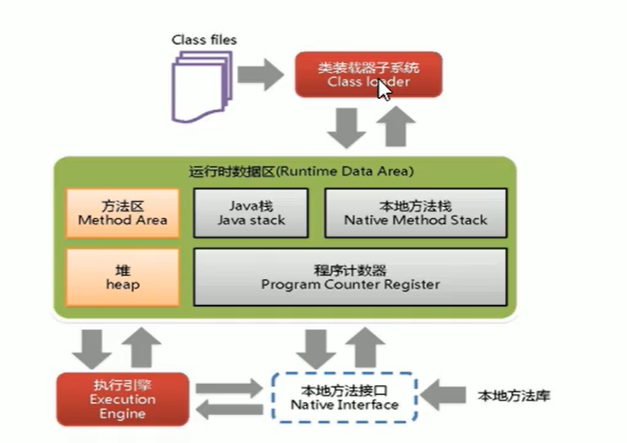

## JVM垃圾判定

如何判断一个对象是否可以被回收

1、引用计数法（JVM不是）

2、可达性分析    ”GC roots“或者说是tracing GC的根集合就是一组必须活跃的引用，通过GC Roots对象开始搜索，可达则判定存活，没有被遍历到就自然判定死亡。


哪些对象可以作为GC Root

1、虚拟机栈（栈帧中的局部变量区，也叫局部变量表）中引用的对象。

2、方法区中的类静态属性引用的对象

3、方法区中常量引用的对象

4、本地方法栈JNI引用的对象

## JVM调优和参数配置

JVM参数类型：标配参数、X参数、**XX参数**

jps可以查看当前运行的java程序

jinfo -flag 配置项 线程编号             可查看某具体参数 

jinfo  -flags 线程编号  查看当前线程所有配置

#### XX参数

Boolean类型 

公式：-XX:+或者-某个属性值    其中+或-表示开启或关闭


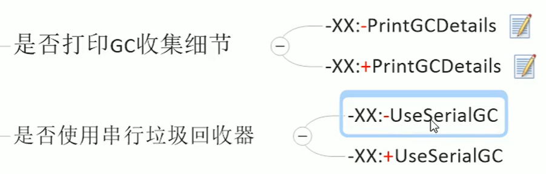

#### KV设置类型

公式：-XX:属性key=属性值value

case: -XX:MetaSpaceSize=128m

#### 查看JVM默认值

-XX:+PrintFlagsInitial

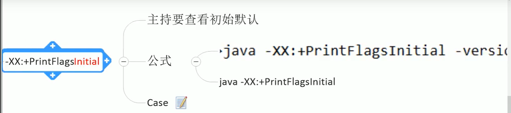

-XX:+PrintFlagsFinal

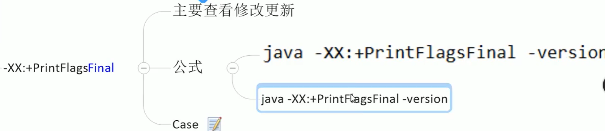


java -XX:+PrintCommandLineFlags -version

## JVM常用基本配置参数

-Xms：初始大小内存，默认为物理内存的1/64，等价于-XX：InitialHeapSize

-Xmx：最大分配内存，默认为物理内存的1/4	等价于-XX：MaxHeapSize

-Xss：设置单个线程栈的大小，一般默认为512k~1024k	等价于-XX：ThreadStackSize

-Xmn：设置年轻代参数

-XX:MetaspaceSize：元空间并不在虚拟机，而是使用本地内存。

-XX:SurvivorRatio：设置新生代中eden和S0/S1空间的比例

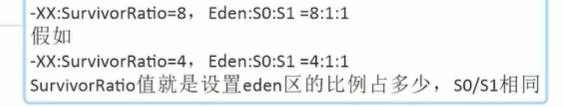

-XX:NewRatio：设置年轻代与老年代在堆结构的占比

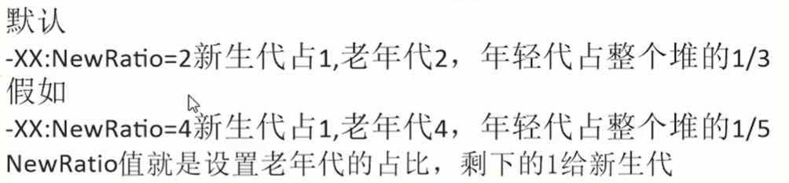

-XX：MaxTenuringThreshold：设置垃圾最大年龄 默认15

## 强软弱虚引用

整体架构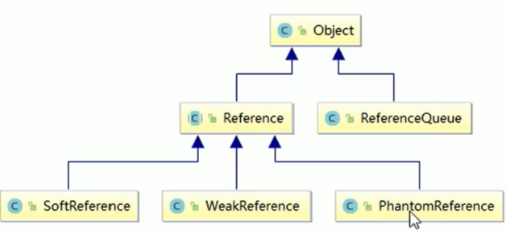

### 强引用（默认）

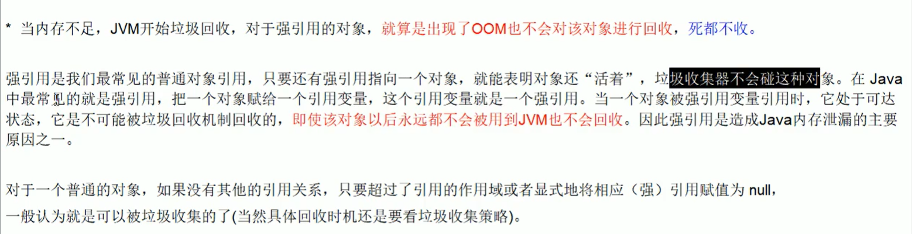

### 软引用

内存够用保留，不够用就回收

### 弱引用

GC过程直接回收

### 虚引用

仅存在于ReferenceQueue（引用队列）中，GC回收之前会被放入其中。

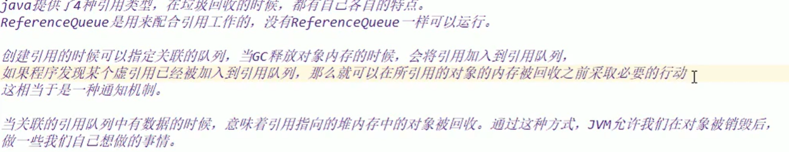

#### 总结

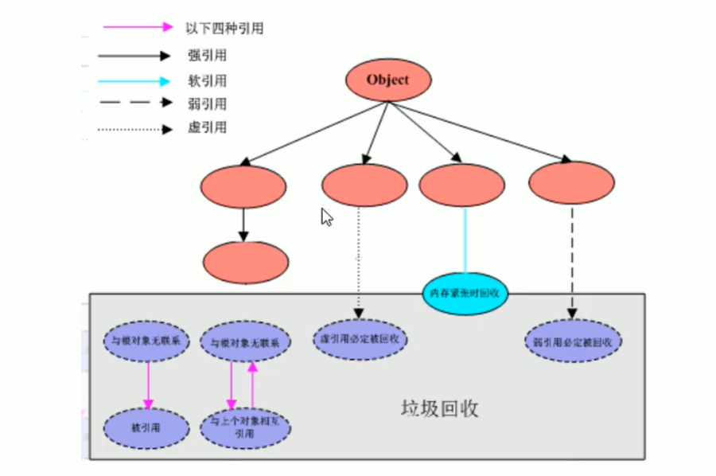

# OOM

StackOverFlowError:栈空间异常

Java heap Space:堆空间异常

GC overhead limit exceeded:GC回收时间过长会抛出此异常，过长的定义是超过98%的时间用来GC并且回收了不到2%的堆内存。

Direct buffer memory: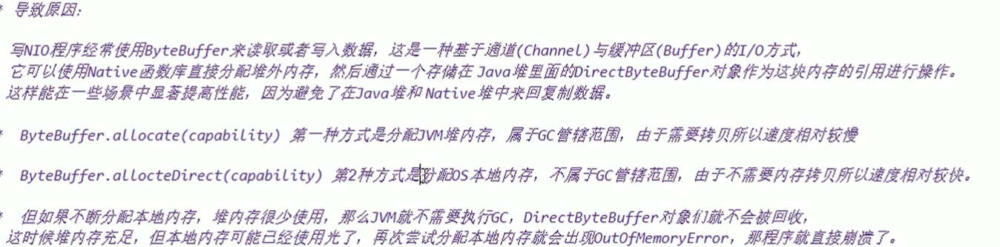

unable to create new native thread:

MetaSpace:元空间溢出

# 垃圾收集器

## 思想

### 串行垃圾回收器（Serial）

它为单线程环境设计且只使用一个线程进行垃圾回收，会暂停所有的用户线程，不适合服务器环境

### 并行垃圾回收器（Parallel）

多个垃圾收集线程并行工作，此时用户线程也是暂停的

### 并发垃圾回收器（CMS）

用户线程和垃圾收集线程同时执行（不一定是并行，可能交替执行），不需要停顿用户线程。

### G1

## 查看默认垃圾回收器

java -XX:PrintCommandLineFlags -version

## 默认垃圾收集器分类

UseSerialGC,UseParallelGC,UseConcMarkSweepGC,UseParNewGC,UseParallelOldGC,UseG1GC

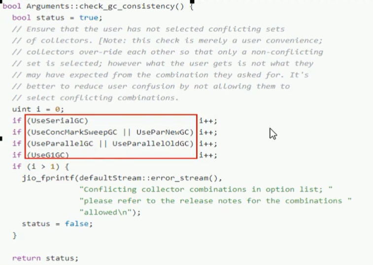

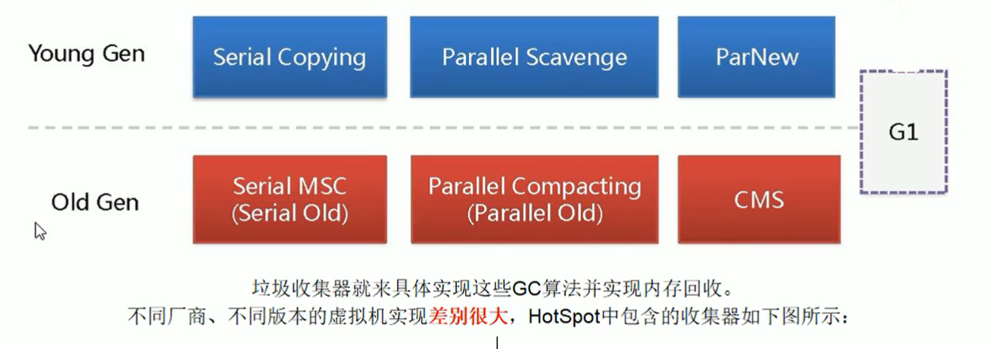

### 新生代

#### 串行GC（Serial）/（Serial copying）

单线程GC，在进行垃圾收集时，必须暂停其它所有工作线程直到它收集结束。

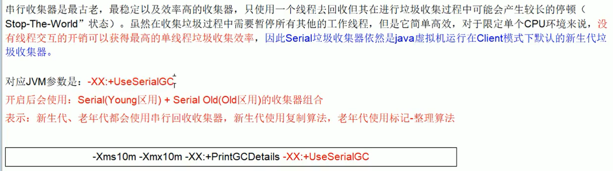

#### 并行GC（ParNew）

多线程进行垃圾回收，垃圾收集时，会暂停其它所有的工作线程直到它收集结束。

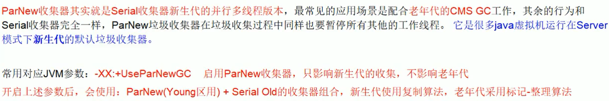

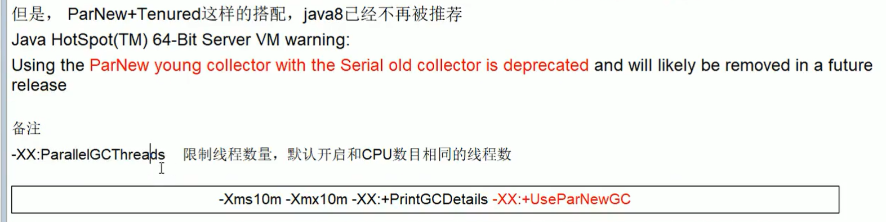

#### 并行回收GC（Parallel Scavenge）

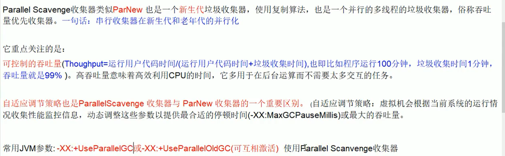

### 老年代

#### Parallel Old GC

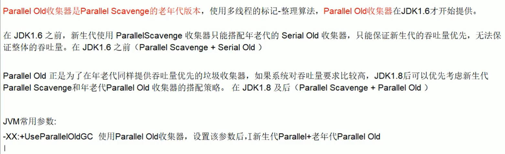

#### CMS

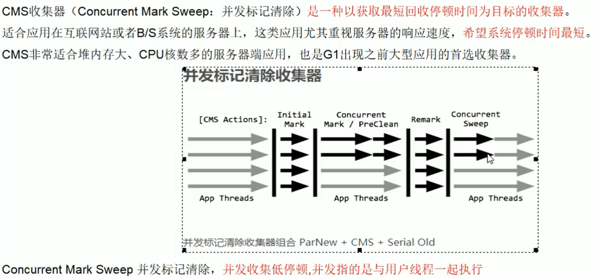

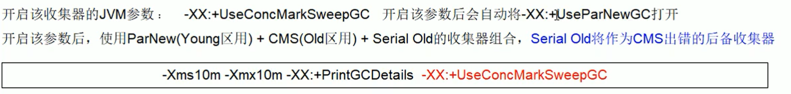

四部过程

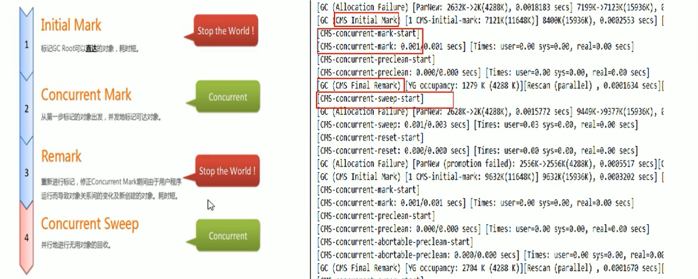

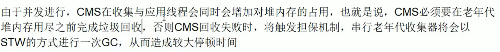

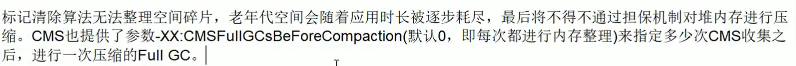

#### Serial old

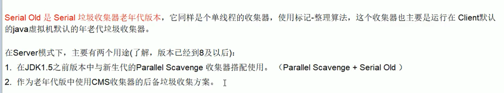

## 垃圾收集器的选择

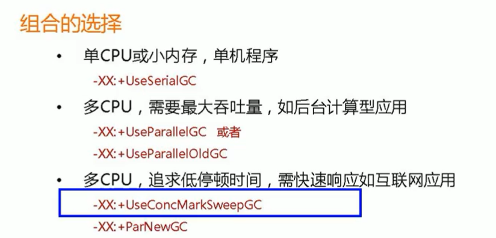

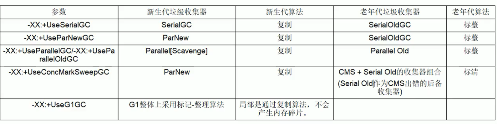

### G1收集器

#### 以前收集器的特点：

1、年轻代和老年代是各自独立且连续的内存块

2、年轻代收集使用单Eden+S0+S1进行复制算法

3、老年代收集必须扫描整个老年代区域

4、都是以尽可能少而快速地执行GC为设计原则

#### G1是什么？

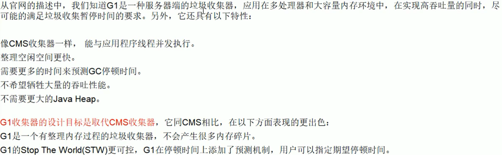

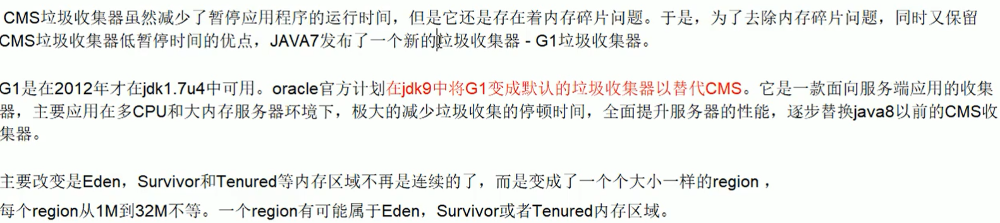

#### G1特点

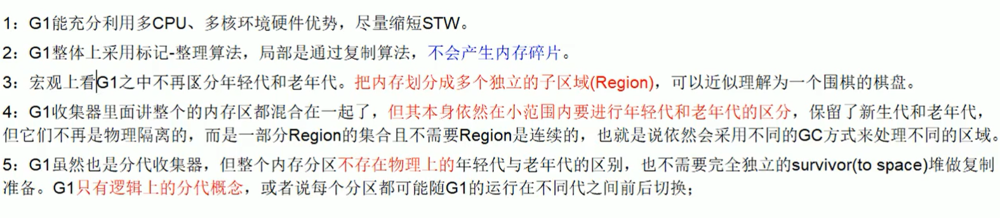

#### Region区域化垃圾收集器

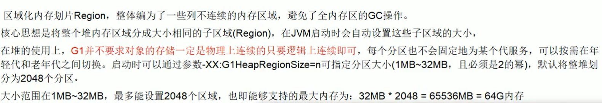


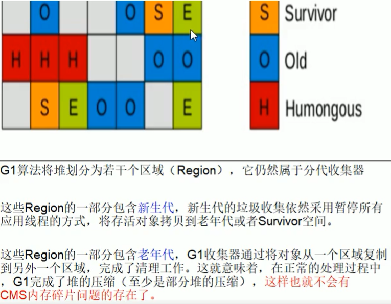

#### 常用配置参数


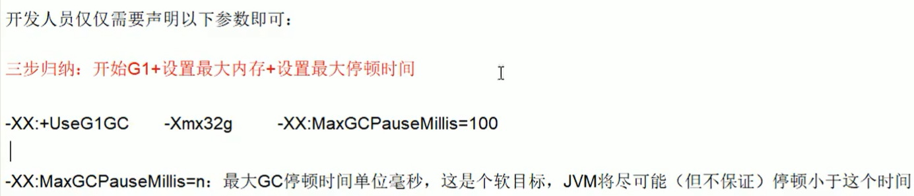