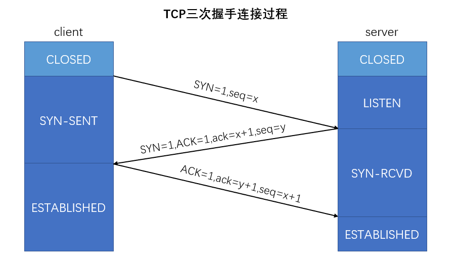
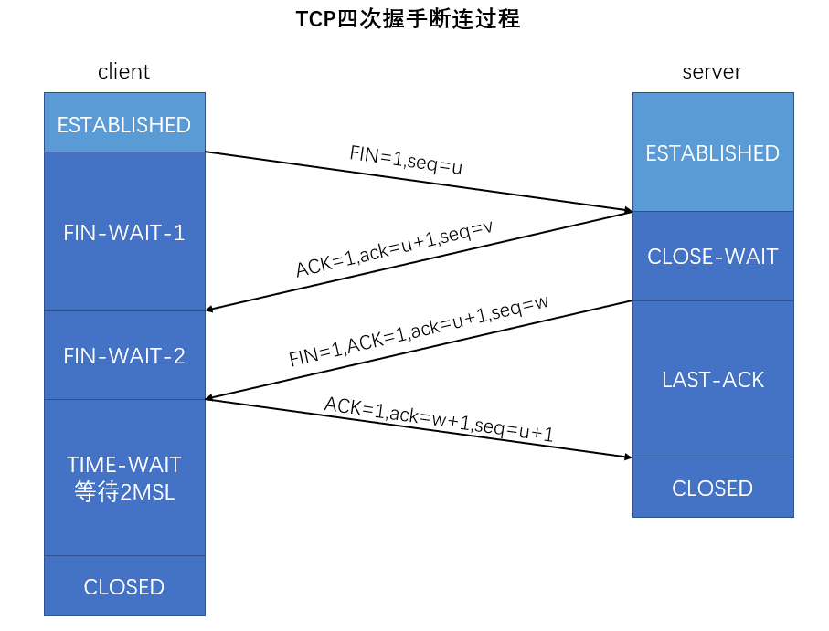

# Java基础

## 1、内存泄露的原因，举例子，如何排查，OOM异常？

原因：内存泄露是指无用对象（不再使用的对象）持续占有内存或无用对象的内存得不到及时释放，从而造成内存空间的浪费成为内存泄露。内存泄露有不严重且不易排查，有时也会严重，会出现OOM异常

例子：

1、长生命周期的对象持有短生命周期的对象的引用，尽管短生命周期的对象不再使用，不能被GC回收。如静态的集合类，HashMap，LinkedList等等，如果这些容器是静态的，那么他们的生命周期与程序一致。

2、各种连接，数据库连接、网络连接、IO连接等，当不再使用时需要显示关闭，否则无法被GC回收

3、变量的作用域不合理

4、内部类持有外部类的引用

5、改变哈希值，如果一个对象被存入HashSet中，再后来又修改了参与哈希值计算的字段，则该对象在集合中无法被删除也无法被找到，造成内存泄露

排查：

查看GC状况

生成堆内存快照进行分析，看哪个对象占用内存大，对该对象代码段进行排查。

OOM异常共分为：

1、java堆溢出（Java heap space）

2、栈溢出（即栈容量无法容纳新的栈帧StackOverflowError，hotspot不允许动态扩展栈容量）

3、方法区和运行时常量池溢出（元空间溢出）

## 2、内部类会被编译成几个class？为什么内部类可以访问外部类的private方法？

会被分别编译，如果A为B的静态内部类，则A会被编译为B$A.class，内部类在创建时会传递一个外部类的引用，通过这个引用可以访问到外部类的private方法或属性，静态内部类则只能访问静态属性或方法，不能访问非静态属性或方法。

## 3、fail-safe和fail-fast

### fail-fast

**fail-fast：**使用迭代器遍历一个线程不安全的集合类时，在遍历过程中对集合对象的结构进行了修改（增加、删除），会直接抛出ConcurrentModifiedException

原理：迭代器在遍历时直接访问集合中的内容，并且在遍历过程中使用一个 modCount 变量。集合在被遍历期间如果结构发生变化，就会改变modCount的值。每当迭代器使用hashNext()/next()遍历下一个元素之前，都会检测modCount变量是否为expectedmodCount值，是的话就返回遍历；否则抛出异常，终止遍历。

注意：这里异常的抛出条件是检测到 modCount！=expectedmodCount 这个条件。如果集合发生变化时修改modCount值刚好又设置为了expectedmodCount值，则异常不会抛出。因此，不能依赖于这个异常是否抛出而进行并发操作的编程，这个异常只建议用于检测并发修改的bug。

场景：java.util包下的集合类都是快速失败的，不能在多线程下发生并发修改（迭代过程中被修改）。

### fail-safe

**fail-safe：**采用安全失败机制的集合容器，在遍历时不是直接在集合内容上访问的，而是先复制原有集合内容，在拷贝的集合上进行遍历。

原理：由于迭代时是对原集合的拷贝进行遍历，所以在遍历过程中对原集合所作的修改并不能被迭代器检测到，所以不会触发Concurrent Modification Exception。

缺点：基于拷贝内容的优点是避免了Concurrent Modification Exception，但同样地，迭代器并不能访问到修改后的内容，即：迭代器遍历的是开始遍历那一刻拿到的集合拷贝，在遍历期间原集合发生的修改迭代器是不知道的。

场景：java.util.concurrent包下的容器都是安全失败，可以在多线程下并发使用，并发修改。

## 4、线程池的作用？各个参数的意义，工作原理以及拒绝策略

特点：线程复用，控制最大并发数，管理线程

好处：降低资源消耗，提高响应速度，提高线程的可管理性

线程池参数

~~~java
    public ThreadPoolExecutor(int corePoolSize,
                              int maximumPoolSize,
                              long keepAliveTime,
                              TimeUnit unit,
                              BlockingQueue<Runnable> workQueue,
                              ThreadFactory threadFactory,
                              RejectedExecutionHandler handler) {
        if (corePoolSize < 0 ||
            maximumPoolSize <= 0 ||
            maximumPoolSize < corePoolSize ||
            keepAliveTime < 0)
            throw new IllegalArgumentException();
        if (workQueue == null || threadFactory == null || handler == null)
            throw new NullPointerException();
        this.corePoolSize = corePoolSize;
        this.maximumPoolSize = maximumPoolSize;
        this.workQueue = workQueue;
        this.keepAliveTime = unit.toNanos(keepAliveTime);
        this.threadFactory = threadFactory;
        this.handler = handler;
    }
~~~

1、corePoolSize：线程池的常驻核心线程数

2、maximumPoolSize：线程池中能容纳同时执行的最大线程数，必须大于1

3、keepAliveTime：多余的空闲线程的存活时间。即线程数大于核心线程数且空闲时间达到该值最自动销毁多余线程。

4、unit：keepAliveTime的单位

5、workQueue：任务队列，被提交但尚未执行的任务。

6、threadFactory：创建线程的工厂，**一般用默认的即可**

7、handler：拒绝策略，表示当队列满了，并且工作线程等于线程池中能容纳的最大线程数时如何来拒绝请求执行的runable的策略

工作原理？

1、线程池创建后等待请求

2、当调用execute()方法添加一个请求任务时，线程池会做出如下判断：
  2.1如果正在运行的线程数量小于corePoolSize，那么马上创建线程运行这个任务；
  2.2如果正在运行的线程数量大于或等于corePoolSize，那么将这个任务放入队列；
  2.3如果这个时候队列满了且正在运行的线程数量还小于maximumPoolSize，那么还是要创建非核心线程立刻运行这个任务；
  2.4如果队列满了且正在运行的线程数量大于或等于maximumPoolSize，那么线程池会启动饱和拒绝策略来执行。
3、当一个线程完成任务时，它会从队列中取下一个任务来执行。
4、当一个线程无事可做超过一定的时间（keepAliveTime）时，线程会判断，如果当前运行的线程数大于corePoolSize，那么这个线程就被停掉。所以线程池的所有任务完成后，它最终会收缩到corePoolSize的大小。

拒绝策略？

四种拒绝策略

1、AbortPolicy（默认）：直接抛出RejectExecutionException异常

2、CallerRunsPolicy：该策略既不会抛弃任务也不会抛出异常，而是将任务退回

3、DiscardPolicy：该策略默默地丢弃无法处理的任务，不予处理也不抛任何异常。

4、DiscardOldestPolicy：抛弃队列中等待最久的任务，然后把当前任务加入队列中尝试再次提交当前任务。

## 5、谈谈你对AQS的理解

AQS（AbstractQueueSynchronizer)，抽象队列同步器，通过内置的FIFO队列来完成线程获取资源的排队工作，尽可能的避免线程阻塞引起的不必要的开销。（模板设计模式），子类只需实现特定的接口即可使用。（如ReentrantLock、ReentrantReadWriteLock和CountDownLatch等）

以ReentrantLock为例

~~~java
//获取锁的过程（非公平队列）
final void lock() {
    //首先进行CAS设置，即多线程如果交替持有同步状态，不需要入队等显示同步
    if (compareAndSetState(0, 1))
        setExclusiveOwnerThread(Thread.currentThread());
    else
        //同步过程
        acquire(1);
}

//释放锁的过程
public void unlock() {
    sync.release(1);
}

//AQS的方法
public final void acquire(int arg) {
    //tryAcquire（子类实现）再次进行获取锁，或者该线程以持有锁获取再重入
    //调用AQS的方法acquireQueued(addWaiter(Node.EXCLUSIVE),args)
    if (!tryAcquire(arg) &&acquireQueued(addWaiter(Node.EXCLUSIVE), arg))
        selfInterrupt();
}

//ReentrantLock的tryAcquire调用
final boolean nonfairTryAcquire(int acquires) {
    final Thread current = Thread.currentThread();
    //获取当前队列的同步状态
    int c = getState()；
    //再次尝试CAS
    if (c == 0) {
        if (compareAndSetState(0, acquires)) {
            setExclusiveOwnerThread(current);
            return true;
        }
    }
    //可重入判定
    else if (current == getExclusiveOwnerThread()) {
        int nextc = c + acquires;
        if (nextc < 0) // overflow
            throw new Error("Maximum lock count exceeded");
        setState(nextc);
        return true;
    }
   	//获取失败
    return false;
}

//AQS方法
private Node addWaiter(Node mode) {
    //根据节点状态创建节点
    Node node = new Node(Thread.currentThread(), mode);
    // Try the fast path of enq; backup to full enq on failure
    Node pred = tail;
    //加入队列尾部，如果成功，直接返回
    if (pred != null) {
        node.prev = pred;
        if (compareAndSetTail(pred, node)) {
            pred.next = node;
            return node;
        }
    }
    //循环CAS加入队列中，直到加入成功为止
    enq(node);
    return node;
}
private Node enq(final Node node) {
    for (;;) {
        Node t = tail;
        if (t == null) { // Must initialize
            if (compareAndSetHead(new Node()))
                tail = head;
        } else {
            node.prev = t;
            if (compareAndSetTail(t, node)) {
                t.next = node;
                return t;
            }
        }
    }
}
//AQS方法
final boolean acquireQueued(final Node node, int arg) {
    boolean failed = true;
    try {
        boolean interrupted = false;
        //死循环获取锁
        for (;;) {
            //获取前一个节点
            final Node p = node.predecessor();
            //前一个为头结点并且当前节点获取同步状态成功，进行相关操作，返回
            if (p == head && tryAcquire(arg)) {
                setHead(node);
                p.next = null; // help GC
                failed = false;
                return interrupted;
            }
            //判断当前节点是否要阻塞，如果前面为true，根据短路原理才会将当前线程阻塞
            if (shouldParkAfterFailedAcquire(p, node) &&
                parkAndCheckInterrupt())
                interrupted = true;
        }
    } finally {
        if (failed)
            cancelAcquire(node);
    }
}

//释放锁的过程
public final boolean release(int arg) {
    if (tryRelease(arg)) {
        Node h = head;
        //唤醒队列的下一个节点
        if (h != null && h.waitStatus != 0)
            unparkSuccessor(h);
        return true;
    }
    return false;
}

~~~

## 6、Synchronized相关

## 7、手写双重检查单例模式

~~~java
public class Singleton{
    private static volatile Singleton instance;
    private Singleton(){
        
    }
    public static Singleton getInstance(){
        if(instance==null){
            synchronized(Singleton.class){
                if(instance==null)
                    instance=new Singleton();
                
            }
        }
        return instance;
    }
}
~~~

## 8、抽象类和接口的区别

抽象类体现的是一种is-a关系，类似于设计模式的模板设计模式，子类与父类具有相同的特性，即在概念上应该是相同的，强调所属关系，而接口是一种行为型的实现方式，更多的是表达出实现某种行为，一种like-a关系，强调特定功能的实现，抽象类是对一组具有相同属性和方法的逻辑上有关系的事物的一种抽象，而接口则是对一组具有相同属性和方法的逻辑上不相关的事物的一种抽象

抽象类只可以单继承，而接口可以多实现。

接口成员变量默认为public static final，必须赋初值，不能更改。抽象类中所有成员默认为default，可以在子类中重新定义，也可被重新赋值。

接口方法默认都是public、abstract的，可以有默认实现，抽象类的抽象方法被abstrct修饰，可以为public，也可以为protected。

## 9、访问限定符

| 访问修饰符 | 本类 | 本包 | 非本包子类 | 不同包非子类 |
| :--------: | :--: | :--: | :--------: | :----------: |
|   public   |  √   |  √   |     √      |      √       |
| protected  |  √   |  √   |     √      |              |
|  default   |  √   |  √   |            |              |
|  private   |  √   |      |            |              |

## 10、字节流和字符流的区别

字节流一次操作一个字节的大小，字符流一次操作两个字节的大小。

字节流在操作的时候本身是不会用到缓冲区（内存）的，是与文件本身直接操作的，而字符流在操作的时候是使用到缓冲区的

字节流在操作文件时，即使不关闭资源（close方法），文件也能输出，但是如果字符流不实用close（）方法的话，则不会输出任何内容，说明字符流用的是缓冲区，并且可以使用flush方法强制进行刷新缓冲区，这时才能在不close的情况下输出内容。

## 11、Java NIO相关

jdk1.4开始提供了一系列改进的输入/输出新特性，被统称为NIO（同步非阻塞IO），三大核心组件：Channel、Buffer、Selector

NIO面向缓冲区、以块的方式编程，而传统BIO是面向流的。

BIO基于字节流或字符流进行操作，而NIO基于Channel（通道）和Buffer（缓冲区）进行操作，数据总是由通道读取到缓冲区中，或者从缓冲区写入到通道中。Selector（选择器）用于监听多个通道的事件（比如：连接请求、数据到达等），因此使用单个线程就可以监听多个客户端通道

Selector：

1、Java的NIO，用非阻塞的IO方式，可以用一个线程处理多个的客户端连接，就会使用到Selector（选择器）

2、Selector能够检测多个注册的通道上是否有事件发生（注意：多个Channel以事件的方式可以注册到同一个Selector），如果有事件发生，便获取事件然后针对每个事件进行相应的处理。这样就可以只使用一个单线程来管理多个通道，也就是管理多个连接和请求。

3、只有在连接/通道真正有读写事件发生时，才会进行读写，就大大地减少了系统开销，并且不必为每个连接都创建一个线程，不用去维护多个线程

Channel：

类似于流，但有些区别：

1、通道可以同时进行读写，而流只能读或只能写

2、通道可以实现异步读写数据

3、通道可以从缓冲区读取数据，也可以写数据到缓冲区

Buffer：

缓冲区本质上是一个可以读写数据的内存块，可以理解成是一个容器对象（含数组），该对象提供了一组方法，可以更轻松地使用内存块，缓冲区对象内置了一些机制，能够跟踪和记录缓冲区的状态变化情况。Channel提供从文件、网络读取数据的渠道，但是读取或写入数据都必须经由Buffer

select、poll、epoll的区别  <https://www.cnblogs.com/cainingning/p/9556642.html>

select,poll,epoll都是IO多路复用的机制，I/O多路复用就是通过一种机制，可以监视多个描述符，一个某个描述符就绪（一般是读就绪或者写就绪），能够通知应用程序进行相应的读写操作。但select,poll,epoll本质上都是同步I/O，因为他们都需要在读写事件就绪后自己负责读写，也就是说这个读写过程是阻塞的，而异步I/O则不需自己负责读写，异步I/O的实现会负责把数据从内核拷贝到用户空间。

select的缺点：

1、每次调用select都需要把fd集合（代表文件描述符的位数组）从用户态拷贝到内核态，这个开销在fd很多时会很大

2、同时每次调用select都需要在内核遍历传递过来的所有fd，同样在fd很多时开销大

3、select支持的文件描述符数量太小了，默认是1024

poll与select类似，不过没有文件描述符数量的限制，同样需要全部遍历

epoll：

epoll可以同时支持水平触发和边缘触发（Edge，Triggered，只告诉进程哪些文件描述符刚刚变为就绪状态，它只说一遍，如果我们没有采取行动，那么它将不会再次告知，这种方式称为边缘触发）。epoll中当我们调用epoll_wait()获得就绪文件描述符时，返回的不是实际的描述符，而是代表一个就绪描述符数量的值，只需要epoll指定的一个数组中依次取得相应数量的文件即可，这里也使用了内存映射(mmap)技术，这样便彻底省掉了这些文件描述符在系统调用时复制的开销

总结：

1、select、poll实现需要自己不断轮询所有fd集合，直到设备就绪，期间可能要睡眠和唤醒多次交替，而epoll其实也需要调用epoll_wait不断轮询就绪链表，期间也可能多次睡眠和唤醒交替，不同的是select和poll在醒着的时候需要遍历整个fd集合，而epoll在“醒着”的时候只需要遍历一下就绪链表是否为空就行了，节省了大量CPU的时间。

2、select、poll每次调用都要把fd集合从用户态往内核态拷贝一次，并且要把current往设备等待队列中挂一次，而epoll只要一次拷贝，而且把current往等待队列上挂也只挂一次（在epoll_wait的开始，注意这里的等待队列并不是设备等待队列，只是一个epoll内部定义的等待队列），这也能节省不少开销。

## 12、双亲委派机制？什么时候会失效？

失效情况<https://blog.csdn.net/yangcheng33/article/details/52631940>

个人理解：Java中的SPI的接口是Java核心库的一部分，由启动类加载器加载的，无法扫描到SPI的实现类，需要使用应用类加载器对其进行加载，即采用TCCL来进行加载。

# 计算机网络

## 1、在浏览器的url栏里输入一个https的请求会发生什么？

1、DNS解析

2、TCP连接

3、发送HTTP请求

4、服务器处理请求并返回HTTP报文

5、浏览器解析

6、连接结束

## 2、UDP相关问题

面向报文、无连接、尽最大努力交付，首部开销小

首部16位源端口、16位目的端口、16位长度、16位检验和。

## 3、TCP相关问题

1、面向连接、面向字节流、全双工通信、只有两个端点，端对端

### TCP头部

16位源端口号、16位目的端口号、32位序号、32位确认号、4位头部长度、6位保留、6个控制位（URG、ACK、PSH、RST、SYN、FIN），16位窗口、16位检验和、16位紧急指针

手绘3次握手连接、4次握手关闭过程

**连接为什么需要三次握手？两次握手的问题在哪里？**

主要是为了防止已失效的连接请求报文段突然又传送到了服务器端，服务器传回SYN+ACK，若已连接，客户端根据目前状态会自动丢弃该报文段，不会重新建立连接。

**为什么客户端最后还需要等待2MSL？**

1、保证客户端发送的最后一个ACK报文段能够顺利到达服务器，因为这个ACK报文段可能会丢失，若服务器收不到，则服务器会进行重传，客户端在这个2MSL时间段收到这个重传的报文，接着给出回应报文，重启2MSL计时器

2、防止已失效的连接请求报文段出现在本连接中。等待2MSL过程会将连接过程中产生的所有报文段都从网络中消失。使新的连接过程中不会出现旧的连接请求报文段。

**如果已经建立连接，客户端出现故障如何？**

TCP设有一个保活计时器，服务器每收到一次客户端数据，就会重新激活保活计时器，若时间达到，则会发送探测报文，若连续10次没有相应，服务器就认为客户端出了故障，接着就关闭这个连接。

### TCP如何保证可靠传输

1、以字节为单位的滑动窗口技术，发送端的窗口大小由接收端窗口大小决定

2、确认和重传机制

3、数据校验

4、累计确认以及选择确认机制

### TCP如何进行流量控制

TCP采用滑动窗口进行流量控制，在建立连接时，接受方会提供其当前能接受的窗口(rwnd)大小，当前客户端根据该窗口大小动态的调整窗口大小进行流量控制。

TCP连接的乙方收到对方的零窗口通知，就启动持续计时器，若好次需计时器设置的时间到期，就发送一个零窗口探测报文段。

### TCP如何进行拥塞控制

1、慢开始和拥塞避免

2、快重传和快恢复

拥塞窗口（cwnd）在达到慢开始门限之前指数增长，到达慢开始门限后，采用拥塞避免算法，加法增大，若出现网络拥塞，调整慢开始门限为当前拥塞窗口大小的一半，将cwnd调整为1重新开始慢开始算法增长。

快重传指的是发送方连续收到3个冗余ACK来检测丢包的发生，同时冗余ACK也用于网络拥塞的检测，快恢复即连续收到3个冗余ACK时，就执行“乘法减小”算法，把慢开始闷笑ssthresh设置为出现拥塞发送方cwnd的一般，与慢开始不同的是它把cwnd的值设置为慢开始的门限sshresh改变后的数值，然后开始执行拥塞避免算法，使拥塞窗口缓慢地线性增大。

# 数据库相关

## 一条SQL执行很慢的原因

分两种情况

1、偶尔执行很慢

​	（1）、数据库刷新脏页

​			①redo被写满，数据库在进行同步数据

​			②内存不够，一次查询的太多，又恰好碰到查询的内容不在内存中，需要申请内存，且内存不足，需要进行换页操作，如果是脏页还得先刷新再换出。

​	（2）、拿不到锁

​		当前SQL语句涉及到的锁被别人使用，只能等待别人释放锁

2、一直执行很慢

​	（1）、没有用到索引

​		没有建索引，建了索引没有被用上，索引要符合最左匹配原则，对索引列进行函数操作或运算操作等会另索引失效，从而导致全表扫描

## 间隙锁是什么？解决了什么问题？

事务中使用范围条件而不是相等条件检索数据，会对符合条件的已有记录的索引项加锁；对于键值在条件范围内但并不存在的记录，叫做“间隙”，InnoDB也会对这个“间隙加锁”，即使当前索引的记录不存在。

主要解决了事务中的幻读问题

## 数据库三范式

第一范式：每个字段都是原子的，不能再分解

第二范式：表必须有主键，主键可以是单个属性或几个属性的组合，非主属性必须完全依赖主键而不能部分依赖主键

第三范式：没有传递依赖；非主属性必须直接依赖主键，而不能间接依赖主键。

# Spring相关

## 声明式事务

# 智力题

## 一个5L桶、一个3L桶，怎样得到4L桶

BFS遍历搜索，无向图求最短路径

~~~java
public class WaterPuzzle {

    boolean[] visited;
    int[] pre;
    int end=-1;
    public WaterPuzzle(){
        visited=new boolean[100];
        pre=new int[100];
        Queue<Integer> queue=new LinkedList<>();
        queue.offer(0);
        visited[0]=true;
        while(!queue.isEmpty()){
            int curr=queue.poll();
            int a=curr/10,b=curr%10;
            List<Integer> nexts=new ArrayList<>();
            //给5L的桶装满
            nexts.add(5*10+b);
            //给3L的桶装满
            nexts.add(a*10+3);
            //倒掉5L桶里的水
            nexts.add(b);
            //倒掉3L桶里的水
            nexts.add(a*10);
            //a最多能向b桶中倒多少水
            int x=Math.min(a,3-b);
            nexts.add((a-x)*10+(b+x));
            //b最多能向a桶中倒多少水
            int y=Math.min(5-a,b);
            nexts.add((a+y)*10+(b-y));
            for(int next:nexts){
                if(!visited[next]){
                    queue.add(next);
                    visited[next]=true;
                    pre[next]=curr;
                    if(next%10==4||next/10==4) {
                        end=next;
                        return;
                    }
                }
            }
            if(end!=-1) break;
        }
    }

    public Iterable<Integer> result(){
        List<Integer> res=new ArrayList<>();
        if(end==-1) return res;
        int curr=end;
        while(curr!=0){
            res.add(0,curr);
            curr=pre[curr];
        }
        return res;
    }
~~~

## 64匹马、8个跑道、多少轮选出最快的8匹

前8轮：首先分成8组分别赛8轮，每组淘汰最后的4匹马，目前共剩8组，每组4匹马；

第9轮：8组的第一再进行一次比较，选出最快的4组来，目前剩16匹马；

第9轮的第一一定是最快的那匹马，且该马所在的组中剩余3匹马都有可能是剩下最快的3匹，第二名所在的组只有前3名可能是剩下最快的3匹，第三名所在的组只有前2名可能是最快的，而第四名所在的组只有第一名可能是最快的，此时共剩9匹马；

第10轮：选择第一名所在组的前2匹马和其余6匹马进行比较，如果第一名所在组的前2匹马不是第一第二，则最快的4匹马被确定，结束，如果第一名所在组的前两匹马是第一第二，此时还需要再进行一次比较。

第11轮：排除第10轮最快的那匹，剩余8匹再进行一次比较，取前2名，即可得到最快的8匹。

综上所述，最少需要10轮，最多需要11轮。

​	